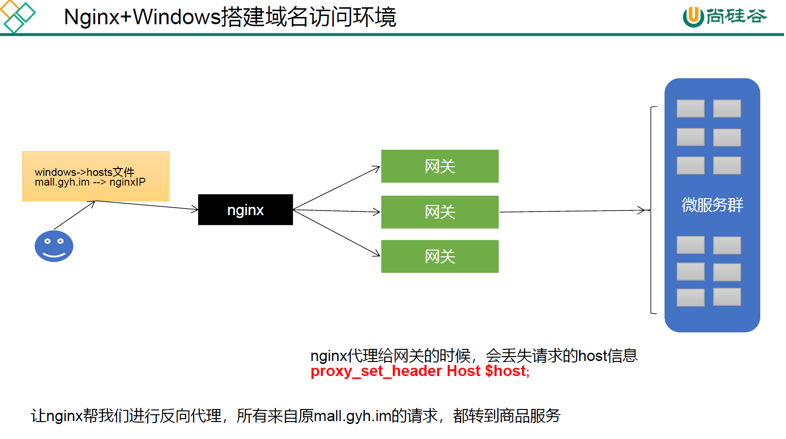
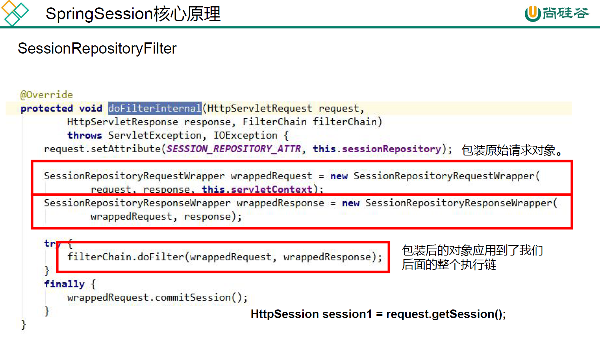

# 版本说明

版本选择参考: https://github.com/alibaba/spring-cloud-alibaba/wiki/%E7%89%88%E6%9C%AC%E8%AF%B4%E6%98%8E

Spring Cloud Alibaba: https://spring-cloud-alibaba-group.github.io/github-pages/2021/zh-cn/index.html

最终使用版本:

|         组件         |    版本    |
| :------------------: | :--------: |
| Spring Cloud Alibaba | 2021.0.1.0 |
|     Spring Cloud     |  2021.0.1  |
|     Spring Boot      |   2.6.3    |
|       Sentinel       |   1.8.3    |
|        Nacos         |   1.4.2    |
|        Seata         |   1.4.2    |


下面的版本从最开始使用到引入阿里云oss时使用，因为使用阿里云oss时，出现错误，上网搜索后需要降低版本

|         组件         |    版本    |
| :------------------: | :--------: |
| Spring Cloud Alibaba | 2021.0.4.0 |
|     Spring Cloud     |  2021.0.4  |
|     Spring Boot      |   2.6.11   |
|        Nacos         |   2.0.4    |


# [Nacos](https://nacos.io/zh-cn/docs/quick-start.html)作为服务注册中心

1. 下载[Nacos Server](https://github.com/alibaba/nacos/releases)并运行, Nacos Server 启动后，进入 http://ip:8848 查看控制台(默认账号名/密码为 nacos/nacos)
2. POM

   ```
   <dependency>
       <groupId>com.alibaba.cloud</groupId>
       <artifactId>spring-cloud-starter-alibaba-nacos-discovery</artifactId>
   </dependency>
   ```
   
3. YML--application.yml

   ```
   # 应用服务 WEB 访问端口
   server:
     port: 8040
   
   spring:
     application:
       # 应用名称
       name: product
     cloud:
       nacos:
         discovery:
           server-addr: 127.0.0.1:8848 # nacos地址
   
   management:
     endpoints:
       web:
         exposure:
           include: '*' # 一定要加引号，不然解析YML会出错
   ```
   
4. 主启动

   ```
   @SpringBootApplication
   // 服务注册
   @EnableDiscoveryClient
   public class Application {}
   ```

# [OpenFeign](https://docs.spring.io/spring-cloud-openfeign/docs/3.1.4/reference/html/)远程调用

在保证服务注册的前提下, 进行服务远程调用

1. POM

   ```
   <dependency>
       <groupId>org.springframework.cloud</groupId>
       <artifactId>spring-cloud-starter-openfeign</artifactId>
   </dependency>
   ```
   
2. 主启动

   ```
   @SpringBootApplication
   // 服务注册
   @EnableDiscoveryClient
   // Feign
   @EnableFeignClients
   public class Application {}
   ```
   
3. 业务类--调用者 MembertestController 调用 ProducttestController

   ```
   @RestController
   public class MembertestController {
       @Resource
       ProductFeignService productFeignService;
   
       @GetMapping("/test")
       String member(){
           return productFeignService.product();
       }
   
   }
   
   // product 为调用者的 spring.application.name
   @FeignClient("product")
   // 交给 Bean 容器 管理
   @Component
   public interface ProductFeignService {
       @GetMapping("/product")
       String product();
   }
   ```
   
4. 业务类--被调用者

   ```
   @RestController
   public class ProducttestController {
       @GetMapping("/product")
       String product(){
           return "product";
       }
   }
   ```

5. 报错提示使用loadbalancer, openfeign取消依赖Ribbon, 需要手动添加loadbalancer或者Ribbon. 据说Ribbon已经被弃用了, 许多组件都不依赖Ribbon, Nacos也没依赖Ribbon, 建议使用loadbalancer

   ```
   <!-- 负载均衡 -->
   <dependency>
       <groupId>org.springframework.cloud</groupId>
       <artifactId>spring-cloud-loadbalancer</artifactId>
   </dependency>
   ```

6. YML--application.yml, 开启loadbalancer

   ```
   # 应用服务 WEB 访问端口
   server:
     port: 8020
   
   spring:
     application:
       # 应用名称
       name: member
     cloud:
       nacos:
         discovery:
           server-addr: 127.0.0.1:8848 # nacos地址
       loadbalancer:
         nacos:
           enabled: true # 开启loadbalancer
   
   management:
     endpoints:
       web:
         exposure:
           include: '*'
   ```

7. 报错Server check fail, please check server localhost ,port 9848 is available , error ={}, 但是服务正常. 

# Nacos作为配置中心

相关概念:

**命名空间: **
用于进行租户粒度的配置隔离。不同的命名空间下，可以存在相同的 Group 或 Data ID 的配置。Namespace 的常用场景之一是不同环境的配置的区分隔离，例如开发测试环境和生产环境的资源（如配置、服务）隔离等。

**配置集:** 

一组相关或者不相关的配置项的集合称为配置集。在系统中，一个配置文件通常就是一个配置集，包含了系统各个方面的配置。例如，一个配置集可能包含了数据源、线程池、日志级别等配置项。

**配置集ID：**
Nacos 中的某个配置集的 ID。配置集 ID 是组织划分配置的维度之一。Data ID 通常用于组织划分系统的配置集。一个系统或者应用可以包含多个配置集，每个配置集都可以被一个有意义的名称标识。Data ID 通常采用类 Java 包（如 com.taobao.tc.refund.log.level）的命名规则保证全局唯一性。此命名规则非强制。

**配置分组:**

Nacos 中的一组配置集，是组织配置的维度之一。通过一个有意义的字符串（如 Buy 或 Trade ）对配置集进行分组，从而区分 Data ID 相同的配置集。当您在 Nacos 上创建一个配置时，如果未填写配置分组的名称，则配置分组的名称默认采用 DEFAULT_GROUP 。配置分组的常见场景：不同的应用或组件使用了相同的配置类型，如 database_url 配置和 MQ_topic 配置。


1. POM

   ```
   <dependency>
       <groupId>com.alibaba.cloud</groupId>
       <artifactId>spring-cloud-starter-alibaba-nacos-config</artifactId>
   </dependency>
   ```

2. YML--bootstrap.yml, 只需要将下面的两个配置写进bootstrap.yml, 其余的可以写在bootstrap.yml或者application.yml

   ```
   # DataId 默认使用 `spring.application.name` 配置跟文件扩展名结合(配置格式默认使用 properties), GROUP 不配置默认使用 DEFAULT_GROUP。因此该配置文件对应的 Nacos Config 配置的 DataId 为 product.properties, GROUP 为 DEFAULT_GROUP
   spring:
     application:
       # 应用名称
       name: product
     cloud:
       nacos:
         config:
           server-addr: 127.0.0.1:8848 # nacos地址
   ```

3. 报错No spring.config.import property has been defined, 导入spring-cloud-starter-bootstrap

   ```
   <dependency>
       <groupId>org.springframework.cloud</groupId>
       <artifactId>spring-cloud-starter-bootstrap</artifactId>
   </dependency>
   ```

4. 更多设置, 作为配置中心时, 每个微服务创建自己的namespace 进行隔离，group 来区分dev，beta，prod 等环境, 同样的在服务发现中也可以设置namespace 和group, 但是服务注册的时候每个微服务设置不同的 namespace或者不同的group 就不能相互调用，所以要相互调用就应该放在同一个namespace和同一个group下, 所以不建议设置, 使用默认就好.

   dataID：
   在Nacos Config Starter 中，dataId 的拼接格式如下

   - ${prefix} - ${spring.profiles.active} . ${file-extension}. prefix 默认为spring.application.name
     的值, 也可以通过配置项spring.cloud.nacos.config.prefix 来配置. 
   - spring.profiles.active 即为当前环境对应的profile. 注意，当activeprofile 为空时，对应的连接符- 也将不存在，dataId 的拼接格式变成 ${prefix}.${file-extension}. file-extension 为配置内容的数据格式，可以通过配置项 spring.cloud.nacos.config.file-extension 来配置。

   Group：
   Group 默认为DEFAULT_GROUP，可以通过spring.cloud.nacos.config.group 配置。

   ```
   # 该配置文件对应的 Nacos Config 配置的 DataId 为 product.yml, GROUP 为 dev
   spring:
     cloud:
         config:
           file-extension: yml # 声明 DataId 文件扩展名
           namespace: 22df9f01-f9f8-4c71-8819-87e2e0fbc80e # 区分每个微服务
           group: dev # 区分开发环境
   ```

5. 使用在Controller类上使用 @RefreshScope 动态刷新配置文件, 可以获取实时修改配置文件后内容. 使用@Value("${键}")获取配置值

   ```
   @RestController
   @RefreshScope
   public class CoupontestController {
       @Value("${profilename}")
       String profilename;
   
       @GetMapping("/profilename")
       String getProfileName(){
           return profilename;
       }
   }
   ```

6. YML--bootstrap.yml. 服务注册与发现、配置中心、远程调用的配置. 这里将这三个有关的统一写在了bootstrap.yml

   ```
   # 应用服务 WEB 访问端口
   server:
     port: 8040
   
   spring:
     application:
       # 应用名称
       name: product
     cloud:
       nacos:
         discovery:
           server-addr: 127.0.0.1:8848 # nacos地址
         config:
           server-addr: 127.0.0.1:8848 # nacos地址
           file-extension: yml # 声明 DataId 文件扩展名
           namespace: 2dab789d-8527-444a-8e67-9d5970b9a573 # 区分每个微服务
           group: dev # 区分开发环境
       loadbalancer:
         nacos:
           enabled: true # 开启loadbalancer
   
   management:
     endpoints:
       web:
         exposure:
           include: '*' # 一定要加引号，不然解析YML会出错
   ```

7. POM. 服务注册与发现、配置中心、远程调用的配置POM. 

   ```
   <!-- nacos 服务注册 -->
   <dependency>
       <groupId>com.alibaba.cloud</groupId>
       <artifactId>spring-cloud-starter-alibaba-nacos-discovery</artifactId>
   </dependency>
   <!-- 远程调用 -->
   <dependency>
       <groupId>org.springframework.cloud</groupId>
       <artifactId>spring-cloud-starter-openfeign</artifactId>
   </dependency>
   <!-- 负载均衡 -->
   <dependency>
       <groupId>org.springframework.cloud</groupId>
       <artifactId>spring-cloud-loadbalancer</artifactId>
   </dependency>
   
   <!-- nacos 配置中心 -->
   <dependency>
       <groupId>com.alibaba.cloud</groupId>
       <artifactId>spring-cloud-starter-alibaba-nacos-config</artifactId>
   </dependency>
   
   <dependency>
       <groupId>org.springframework.cloud</groupId>
       <artifactId>spring-cloud-starter-bootstrap</artifactId>
   </dependency>
   ```

# Nacos使用MySQL作为数据源

https://nacos.io/zh-cn/docs/v2/guide/admin/deployment.html

- 1.安装数据库，版本要求：5.6.5+
  
- 2.建立数据库名字为nacos, 初始化mysql数据库，数据库初始化文件：nacos-mysql.sql
  
- 3.修改conf/application.properties文件，增加支持mysql数据源配置（目前只支持mysql），添加mysql数据源的url、用户名和密码。
  
   ```
   spring.datasource.platform=mysql
     
   db.num=1
   db.url.0=jdbc:mysql://127.0.0.1:3306/nacos_devtest?characterEncoding=utf8&connectTimeout=1000&socketTimeout=3000&autoReconnect=true
   db.user.0=root
   db.password.0=123456
   ```

# Gateway网关

网关也要接入nacos进行注册与配置, 不需要远程调用openFeign

1. POM

   ```
   <!-- nacos 服务注册 -->
   <dependency>
       <groupId>com.alibaba.cloud</groupId>
       <artifactId>spring-cloud-starter-alibaba-nacos-discovery</artifactId>
   </dependency>
   
   <!-- nacos 配置中心 -->
   <dependency>
       <groupId>com.alibaba.cloud</groupId>
       <artifactId>spring-cloud-starter-alibaba-nacos-config</artifactId>
   </dependency>
   
   <dependency>
       <groupId>org.springframework.cloud</groupId>
       <artifactId>spring-cloud-starter-bootstrap</artifactId>
   </dependency>
   
   <!-- 网关 -->
   <dependency>
       <groupId>org.springframework.cloud</groupId>
       <artifactId>spring-cloud-starter-gateway</artifactId>
   </dependency>
   
   ```

2. YML--bootstrap.yml

   ```
   # 应用服务 WEB 访问端口
   server:
     port: 88
   
   spring:
     application:
       # 应用名称
       name: gateway
     cloud:
       nacos:
         discovery:
           server-addr: 127.0.0.1:8848 # nacos地址
         config:
           server-addr: 127.0.0.1:8848 # nacos地址
           file-extension: yml # 声明 DataId 文件扩展名
           namespace: dff25d3e-c187-42d6-b6dc-a3c7afae1264 # 区分每个微服务
           group: dev # 区分开发环境
   
   management:
     endpoints:
       web:
         exposure:
           include: '*' # 一定要加引号，不然解析YML会出错
   ```

3. YML--application.yml gateway的简单使用

   ```
   spring:
     cloud:
       gateway:
         routes:
           - id: query_route_test
             uri: https://www.imgyh.com
             predicates:
               - Query=blog # 网址中带有blog参数就跳到
   ```

   

# 引入阿里云OSS

版本：SpringBoot2.6.11 SpringCloud2021.0.4 SpringCloudAlibaba2021.0.4.0 Nacos2.0.4 报错

```
Error starting ApplicationContext. To display the conditions report re-run your application with 'debug' enabled.
2022-09-17 18:18:30.993  INFO 21168 --- [           main] c.a.alicloud.oss.OssApplicationListener  : 0 OSSClients will be shutdown soon
2022-09-17 18:18:31.042 ERROR 21168 --- [           main] o.s.b.d.LoggingFailureAnalysisReporter   : 

***************************
APPLICATION FAILED TO START
***************************

Description:

Parameter 0 of method inetIPv6Util in com.alibaba.cloud.nacos.utils.UtilIPv6AutoConfiguration required a single bean, but 2 were found:
	- spring.cloud.inetutils-org.springframework.cloud.commons.util.InetUtilsProperties: defined in null
	- inetUtilsProperties: defined by method 'inetUtilsProperties' in class path resource [org/springframework/cloud/commons/util/UtilAutoConfiguration.class]


Action:

Consider marking one of the beans as @Primary, updating the consumer to accept multiple beans, or using @Qualifier to identify the bean that should be consumed
```

spring-cloud-commons 和 spring-cloud-alicloud-context 两个包中的配置类冲突导致
从上面给的依赖来看 是spring-cloud-starter-alicloud-oss 依赖了 spring-cloud-alicloud-context

解决办法: https://github.com/alibaba/spring-cloud-alibaba/issues/2789

使用SpringBoot2.6.3+SpringCloud2021.0.1+SpringCloudAlibaba2021.0.1.0+Nacos1.4.2时没有出现这个问题

更改版本:

|         组件         |    版本    |
| :------------------: | :--------: |
| Spring Cloud Alibaba | 2021.0.1.0 |
|     Spring Cloud     |  2021.0.1  |
|     Spring Boot      |   2.6.3    |
|       Sentinel       |   1.8.3    |
|        Nacos         |   1.4.2    |
|        Seata         |   1.4.2    |

pom:

```
<!-- 阿里云oss -->
<dependency>
    <groupId>com.alibaba.cloud</groupId>
    <artifactId>spring-cloud-starter-alicloud-oss</artifactId>
    <version>2.2.0.RELEASE</version>
</dependency>
```


yml:

```
spring:
  cloud:
    alicloud:
      access-key: xxxx
      secret-key: xxxx
      oss:
        endpoint: oss-cn-chengdu.aliyuncs.com
        bucket: mall9527
```

业务类:

```
package com.imgyh.mall.thirdparty.controller;

import com.aliyun.oss.OSS;
import com.aliyun.oss.common.utils.BinaryUtil;
import com.aliyun.oss.model.MatchMode;
import com.aliyun.oss.model.PolicyConditions;
import com.imgyh.mall.common.utils.R;
import org.springframework.beans.factory.annotation.Autowired;
import org.springframework.beans.factory.annotation.Value;
import org.springframework.cloud.context.config.annotation.RefreshScope;
import org.springframework.web.bind.annotation.RequestMapping;
import org.springframework.web.bind.annotation.RestController;

import java.text.SimpleDateFormat;
import java.util.Date;
import java.util.LinkedHashMap;
import java.util.Map;

/**
 * @ClassName : OssController
 * @Package : com.imgyh.mall.thirdparty.controller
 * @Description :
 * @Author : imgyh
 * @Mail : admin@imgyh.com
 * @Github : https://github.com/imgyh
 * @Site : https://www.imgyh.com
 * @Date : 2023/2/22 19:46
 * @Version : v1.0
 * @ChangeLog * * * * * * * * * * * * * * * * * * * * * * *
 * <p>
 * * * * * * * * * * * * * * * * * * * * * * * *
 **/
@RequestMapping("/thirdparty/oss")
@RefreshScope
@RestController
public class OssController {

    @Autowired
    OSS ossClient;

    @Value("${spring.cloud.alicloud.oss.endpoint}")
    private String endpoint;
    @Value("${spring.cloud.alicloud.oss.bucket}")
    private String bucket;

    @Value("${spring.cloud.alicloud.access-key}")
    private String accessId;

    @RequestMapping("/policy")
    public R policy() {

        String host = "https://" + bucket + "." + endpoint; // host的格式为 bucketname.endpoint
        // callbackUrl为 上传回调服务器的URL，请将下面的IP和Port配置为您自己的真实信息。
//        String callbackUrl = "http://88.88.88.88:8888";
        String format = new SimpleDateFormat("yyyy-MM-dd").format(new Date());
        String dir = format + "/"; // 用户上传文件时指定的前缀。

        Map<String, String> respMap = null;
        try {
            long expireTime = 30;
            long expireEndTime = System.currentTimeMillis() + expireTime * 1000;
            Date expiration = new Date(expireEndTime);
            PolicyConditions policyConds = new PolicyConditions();
            policyConds.addConditionItem(PolicyConditions.COND_CONTENT_LENGTH_RANGE, 0, 1048576000);
            policyConds.addConditionItem(MatchMode.StartWith, PolicyConditions.COND_KEY, dir);

            String postPolicy = ossClient.generatePostPolicy(expiration, policyConds);
            byte[] binaryData = postPolicy.getBytes("utf-8");
            String encodedPolicy = BinaryUtil.toBase64String(binaryData);
            String postSignature = ossClient.calculatePostSignature(postPolicy);

            respMap = new LinkedHashMap<String, String>();
            respMap.put("accessId", accessId);
            respMap.put("policy", encodedPolicy);
            respMap.put("signature", postSignature);
            respMap.put("dir", dir);
            respMap.put("host", host);
            respMap.put("expire", String.valueOf(expireEndTime / 1000));
            // respMap.put("expire", formatISO8601Date(expiration));

        } catch (Exception e) {
            // Assert.fail(e.getMessage());
            System.out.println(e.getMessage());
        }
        return R.ok().put("data", respMap);
    }
}

```

# 整合ElasticSearch

https://www.elastic.co/guide/en/elasticsearch/client/java-rest/7.4/java-rest-high-getting-started.html

pom

```
<!--es客户端-->
<dependency>
	<groupId>org.elasticsearch.client</groupId>
	<artifactId>elasticsearch-rest-high-level-client</artifactId>
	<version>7.4.2</version>
	<exclusions>
		<exclusion>
			<groupId>org.elasticsearch</groupId>
			<artifactId>elasticsearch</artifactId>
		</exclusion>
		<exclusion>
			<groupId>org.elasticsearch.client</groupId>
			<artifactId>elasticsearch-rest-client</artifactId>
		</exclusion>
	</exclusions>
</dependency>
<dependency>
	<groupId>org.elasticsearch.client</groupId>
	<artifactId>elasticsearch-rest-client</artifactId>
	<version>7.4.2</version>
</dependency>
<dependency>
	<groupId>org.elasticsearch</groupId>
	<artifactId>elasticsearch</artifactId>
	<version>7.4.2</version>
</dependency>
```

config:

https://www.elastic.co/guide/en/elasticsearch/client/java-rest/7.4/java-rest-high-getting-started-initialization.html

https://www.elastic.co/guide/en/elasticsearch/client/java-rest/7.4/java-rest-low-usage-requests.html#java-rest-low-usage-request-options

```
package com.imgyh.mall.search.config;

import org.apache.http.HttpHost;
import org.elasticsearch.client.*;
import org.springframework.context.annotation.Bean;
import org.springframework.context.annotation.Configuration;

/**
 * @ClassName : ElasticSearchConfig
 * @Package : com.imgyh.mall.search.config
 * @Description :
 * @Author : imgyh
 * @Mail : admin@imgyh.com
 * @Github : https://github.com/imgyh
 * @Site : https://www.imgyh.com
 * @Date : 2023/3/13 19:44
 * @Version : v1.0
 * @ChangeLog :
 * * * * * * * * * * * * * * * * * * * * * * * *
 * <p>
 * * * * * * * * * * * * * * * * * * * * * * * *
 **/
@Configuration
public class ElasticSearchConfig {
    public static final RequestOptions COMMON_OPTIONS;
    static {
        RequestOptions.Builder builder = RequestOptions.DEFAULT.toBuilder();
        // builder.addHeader("Authorization", "Bearer " + TOKEN);
        // builder.setHttpAsyncResponseConsumerFactory(
        //         new HttpAsyncResponseConsumerFactory
        //                 .HeapBufferedResponseConsumerFactory(30 * 1024 * 1024 * 1024));
        COMMON_OPTIONS = builder.build();
    }
    @Bean
    public RestHighLevelClient restHighLevelClient(){
        RestClientBuilder builder = RestClient.builder(
                new HttpHost("localhost", 9200, "http"));
        RestHighLevelClient client = new RestHighLevelClient(builder);

        return client;
    }
}

```

# 整合thymeleaf

pom:

```xml
<!-- 模板引擎 -->
<dependency>
    <groupId>org.springframework.boot</groupId>
    <artifactId>spring-boot-starter-thymeleaf</artifactId>
</dependency>
```

yaml:

```
spring:
  thymeleaf:
    cache: false # 关闭缓存, 调试用
```

# Nginx配置域名访问

域名: mall.gyh.im --> nginx的IP

• 请求接口 mall.gyh.im
• 请求页面 mall.gyh.im
• nginx直接代理给网关，网关判断
• 如果/api/....，转交给对应的服务器
• 如果是 满足域名，转交给对应的服务



nginx配置: conf.d/mall.conf

```nginx
upstream mall{
    server  172.20.128.1:88; # gateway集群IP, 可配置多个实现负载均衡
}
server {
    listen       80;
    server_name  mall.gyh.im; # 自定义的域名

    #charset koi8-r;
    #access_log  /var/log/nginx/log/host.access.log  main;

    location / {
        # root   /usr/share/nginx/html;
        # index  index.html index.htm;
        proxy_set_header Host $host; # 将host这个header传给gateway, gateway才能根据这个host路由
        proxy_pass http://mall; # upstream 的名字, 负载均衡
    }

    #error_page  404              /404.html;

    # redirect server error pages to the static page /50x.html
    #
    error_page   500 502 503 504  /50x.html;
    location = /50x.html {
        root   /usr/share/nginx/html;
    }

    # proxy the PHP scripts to Apache listening on 127.0.0.1:80
    #
    #location ~ \.php$ {
    #    proxy_pass   http://127.0.0.1;
    #}

    # pass the PHP scripts to FastCGI server listening on 127.0.0.1:9000
    #
    #location ~ \.php$ {
    #    root           html;
    #    fastcgi_pass   127.0.0.1:9000;
    #    fastcgi_index  index.php;
    #    fastcgi_param  SCRIPT_FILENAME  /scripts$fastcgi_script_name;
    #    include        fastcgi_params;
    #}

    # deny access to .htaccess files, if Apache's document root
    # concurs with nginx's one
    #
    #location ~ /\.ht {
    #    deny  all;
    #}
}
```

gateway网关路由配置: 

```yaml
spring:
  cloud:
    gateway:
      routes: # id 越靠前越先匹配
       - id: host_route # 配置首页路由, 首页html写在product微服务中
          uri: lb://product # lb 负载均衡 需要添加 spring-cloud-loadbalancer
          predicates:
            - Host=mall.gyh.im
```

需要将域名的路由条件写在最后, 不然使用域名访问api接口时(http://mall.gyh.im/api/....)直接就匹配到这条路由上了

全部gateway配置: 

```yaml
spring:
  cloud:
    gateway:
      #跨域处理，需要关闭具体微服务上的跨域设置，否则此设置无效
      globalcors: # 全局的跨域配置
        add-to-simple-url-handler-mapping: true # 解决options请求被拦截问题
        # options请求 就是一种询问服务器是否浏览器可以跨域的请求
        # 如果每次跨域都有询问服务器是否浏览器可以跨域对性能也是损耗
        # 可以配置本次跨域检测的有效期maxAge
        # 在maxAge设置的时间范围内，不去询问，统统允许跨域
        corsConfigurations:
          '[/**]':
            allowedOriginPatterns: # 允许哪些网站的跨域请求
              - "*"
            allowedMethods: # 允许的跨域ajax的请求方式
              - "GET"
              - "POST"
              - "DELETE"
              - "PUT"
              - "OPTIONS"
            allowedHeaders: "*"    # 允许在请求中携带的头信息
            allowCredentials: true    # 允许在请求中携带cookie
            maxAge: 360000            # 本次跨域检测的有效期(单位毫秒)
            # 有效期内，跨域请求不会一直发option请求去增大服务器压力
      routes: # id 越靠前越先匹配
        - id: product
          uri: lb://product # lb 负载均衡 需要添加 spring-cloud-loadbalancer
          predicates:
            - Path=/api/product/**
          filters:
            - RewritePath=/api/?(?<segment>.*), /$\{segment}
        - id: thirdparty
          uri: lb://thirdparty # lb 负载均衡 需要添加 spring-cloud-loadbalancer
          predicates:
            - Path=/api/thirdparty/**
          filters:
            - RewritePath=/api/?(?<segment>.*), /$\{segment}
        - id: member
          uri: lb://member # lb 负载均衡 需要添加 spring-cloud-loadbalancer
          predicates:
            - Path=/api/member/**
          filters:
            - RewritePath=/api/?(?<segment>.*), /$\{segment}
        - id: ware
          uri: lb://ware # lb 负载均衡 需要添加 spring-cloud-loadbalancer
          predicates:
            - Path=/api/ware/**
          filters:
            - RewritePath=/api/?(?<segment>.*), /$\{segment}
        - id: renren
          uri: lb://renren # lb 负载均衡 需要添加 spring-cloud-loadbalancer
          predicates:
            - Path=/api/**
          filters:
            - RewritePath=/api/?(?<segment>.*), /renren-fast/$\{segment}
        - id: host_route # 配置首页路由, 首页html写在product微服务中
          uri: lb://product # lb 负载均衡 需要添加 spring-cloud-loadbalancer
          predicates:
            - Host=mall.gyh.im
```

# 整合Redis

谷粒商城视频中的springboot2.1.8.RELEASE时默认使用lettuce作为操作redis的客户端，它使用netty进行网络通信. lettuce有bug会导致高并发下连接redis时导致堆外内存溢出. netty如果没有指定堆外内存, 默认使用 -Xmx的设置. 可设置：-Dio.netty.maxDirectMemory. 

解决方案：不能直接使用-Dio.netty.maxDirectMemory去调大堆外内存

1)、升级lettuce客户端。    2）、切换使用jedis

pom:

```xml
<!-- redis 并使用 jedis-->
<dependency>
    <groupId>org.springframework.boot</groupId>
    <artifactId>spring-boot-starter-data-redis</artifactId>
    <exclusions>
        <exclusion>
            <groupId>io.lettuce</groupId>
            <artifactId>lettuce-core</artifactId>
        </exclusion>
    </exclusions>
</dependency>
<dependency>
    <groupId>redis.clients</groupId>
    <artifactId>jedis</artifactId>
</dependency>
```

lettuce因为使用netty所以操作redis更快, 我们使用springboot2.6.3没出现这个问题, 还是使用lettuce

```xml
<!-- redis -->
<dependency>
    <groupId>org.springframework.boot</groupId>
    <artifactId>spring-boot-starter-data-redis</artifactId>
</dependency>
```

yaml:

```yaml
spring:
  redis:
    host: 127.0.0.1
    port: 6379
```

# 整合Redisson

Redisson 是架设在Redis 基础上的一个Java 驻内存数据网格（In-Memory Data Grid）。充分的利用了Redis 键值数据库提供的一系列优势，基于Java 实用工具包中常用接口，为使用者提供了一系列具有分布式特性的常用工具类。使得原本作为协调单机多线程并发程序的工具包获得了协调分布式多机多线程并发系统的能力，大大降低了设计和研发大规模分布式系统的难度。同时结合各富特色的分布式服务，更进一步简化了分布式环境中程序相互之间的协作。

官网: https://github.com/redisson/redisson/wiki/%E7%9B%AE%E5%BD%95

pom:

```xml
<!--  redisson -->
<dependency>
    <groupId>org.redisson</groupId>
    <artifactId>redisson</artifactId>
    <version>3.20.0</version>
</dependency>
```

RedissonConfig.java: 

```java
package com.imgyh.mall.product.config;

import org.redisson.Redisson;
import org.redisson.api.RedissonClient;
import org.redisson.config.Config;
import org.springframework.context.annotation.Bean;
import org.springframework.context.annotation.Configuration;

@Configuration
public class RedissonConfig {
    @Bean(destroyMethod="shutdown")
    public RedissonClient redissonClient(){
        //1、创建配置
        Config config = new Config();
        config.useSingleServer().setAddress("redis://127.0.0.1:6379");

        //2、根据Config创建出RedissonClient实例
        //Redis url should start with redis:// or rediss://
        RedissonClient redissonClient = Redisson.create(config);
        return redissonClient;
    }
}

```

# 整合SpringCache并使用redis作为缓存


1. 引入依赖pom: 使用redis作为缓存, springCache简化缓存开发

   ```xml
   <!-- redis -->
   <dependency>
       <groupId>org.springframework.boot</groupId>
       <artifactId>spring-boot-starter-data-redis</artifactId>
   </dependency>
   <!--  spring cache -->
   <dependency>
       <groupId>org.springframework.boot</groupId>
       <artifactId>spring-boot-starter-cache</artifactId>
   </dependency>
   ```

   

2. 配置文件yml: 配置redis的ip和端口，指定springcache的缓存类型

   ```yaml
   spring:
     redis:
       host: 127.0.0.1
       port: 6379
     cache:
       type: redis # 使用redis作为缓存
       redis:
         time-to-live: 360000 #  过期时间，毫秒
         key-prefix: Cache_ # key的前缀, 指定了前缀就用指定的前缀，没有指定就使用缓存的名字(注解中的value字段)作为前缀
         use-key-prefix: true # 是否使用前缀
         cache-null-values: true # 是否缓存空值，防止缓存穿透
   ```

   

3. 主启动: @EnableCaching

   ```java
   package com.imgyh.mall.product;
   
   import org.mybatis.spring.annotation.MapperScan;
   import org.springframework.boot.SpringApplication;
   import org.springframework.boot.autoconfigure.SpringBootApplication;
   import org.springframework.cache.annotation.EnableCaching;
   import org.springframework.cloud.client.discovery.EnableDiscoveryClient;
   import org.springframework.cloud.openfeign.EnableFeignClients;
   
   @SpringBootApplication
   // mapper扫描, dao加了@Mapper 可不配
   @MapperScan("com.imgyh.mall.product.dao")
   // 服务注册
   @EnableDiscoveryClient
   // Feign
   @EnableFeignClients
   // 缓存框架
   @EnableCaching
   public class ProductApplication {
   
       public static void main(String[] args) {
           SpringApplication.run(ProductApplication.class, args);
       }
   
   }
   ```


# 整合SpringSession

文档：https://docs.spring.io/spring-session/reference/guides/boot-redis.html

https://docs.spring.io/spring-session/reference/2.6/samples.html

1. pom

   ```xml
   <dependency>
       <groupId>org.springframework.session</groupId>
       <artifactId>spring-session-data-redis</artifactId>
   </dependency>
   ```

   

2. yaml。在底层，Spring Boot 应用相当于手动添加`@EnableRedisHttpSession`注解的配置。这将创建一个名为`springSessionRepositoryFilter`的 `Filter`。过滤器负责替换`HttpSession`由 Spring Session 支持的实现

   ```yaml
   spring:
     session:
       store-type: redis  # 会话存储类型
       redis:
         flush-mode: on_save # # 会话刷新模式
         namespace: spring:session # 用于存储会话的键的命名空间
     redis:
       host: 127.0.0.1
       port: 6379
   
   server:
     servlet:
       session:
         timeout: 30m # 会话超时 如果未指定持续时间后缀，则使用秒
   ```

   

3. 主启动加入注解

   ```java
   @EnableRedisHttpSession  //整合redis作为session存储
   ```

   

4. 配置类。默认domain作用域是当前域名，将作用域提升至父域名，实现子域session共享问题。使用JSON的序列化方式来序列化对象数据到redis中。

   https://github.com/spring-projects/spring-session/blob/2.6.3/spring-session-samples/spring-session-sample-boot-redis-json/src/main/java/sample/config/SessionConfig.java

   https://docs.spring.io/spring-session/reference/2.6/api.html#api-cookieserializer

   

   ```java
   package com.imgyh.mall.auth.config;
   
   import org.springframework.context.annotation.Bean;
   import org.springframework.context.annotation.Configuration;
   import org.springframework.data.redis.serializer.GenericJackson2JsonRedisSerializer;
   import org.springframework.data.redis.serializer.RedisSerializer;
   import org.springframework.session.web.http.CookieSerializer;
   import org.springframework.session.web.http.DefaultCookieSerializer;
   
   @Configuration
   public class SessionConfig {
       // 默认domain作用域是当前域名，将作用域提升至父域名，实现子域session共享问题
       @Bean
       public CookieSerializer cookieSerializer(){
           DefaultCookieSerializer cookieSerializer = new DefaultCookieSerializer();
   
           cookieSerializer.setDomainName("mall.gyh.im");
           cookieSerializer.setCookieName("MALLSESSION");
   
           return cookieSerializer;
       }
   
       // 使用JSON的序列化方式来序列化对象数据到redis中
       @Bean
       public RedisSerializer<Object> springSessionDefaultRedisSerializer() {
           return new GenericJackson2JsonRedisSerializer();
       }
   }
   
   ```


**SpringSession 核心原理**
@EnableRedisHttpSession导入RedisHttpSessionConfiguration配置
     1)、给容器中添加了一个组件
         SessionRepository =>【RedisOperationsSessionRepository】=> redis操作session。session的增删改查封装类
     2)、SessionRepositoryFilter => Filter： session存储过滤器；每个请求过来都必须经过filter
         (1)、创建的时候，就自动从容器中获取到了SessionRepository；
         (2)、原始的request，response都被包装。SessionRepositoryRequestWrapper，SessionRepositoryResponseWrapper
         (3)、以后获取session。request.getSession()，都是使用的包装后的request对象; //SessionRepositoryRequestWrapper
         (4)、wrappedRequest.getSession(); => SessionRepository 中获取到的。

- 装饰者模式；

- 自动延期；redis中的数据也是有过期时间。



