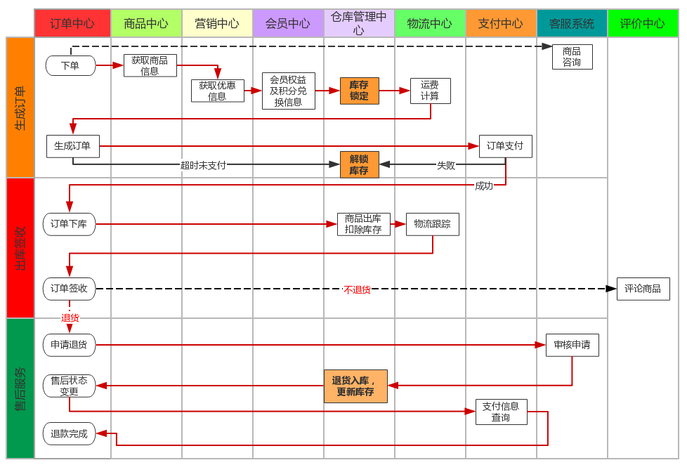
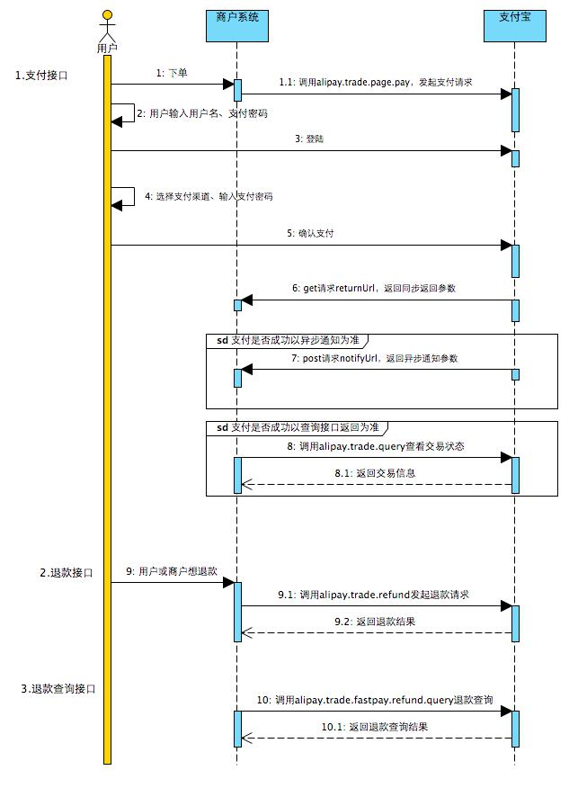

# renren-fast引入nacos报错

现象: 将renren-fast中的springboot升至2.6.11, 新增Spring Cloud Alibaba:2021.0.4.0, Spring Cloud:2021.0.4. 之后引入nacos注册中心与配置中心

```
<!-- nacos 服务注册 -->
<dependency>
    <groupId>com.alibaba.cloud</groupId>
    <artifactId>spring-cloud-starter-alibaba-nacos-discovery</artifactId>
</dependency>
<!-- nacos 配置中心 -->
<dependency>
    <groupId>com.alibaba.cloud</groupId>
    <artifactId>spring-cloud-starter-alibaba-nacos-config</artifactId>
</dependency>

<dependency>
    <groupId>org.springframework.cloud</groupId>
    <artifactId>spring-cloud-starter-bootstrap</artifactId>
</dependency>
```

报错如下:

```
java.lang.NoSuchMethodError: com.google.common.collect.Sets$SetView.iterator()Lcom/google/common/collect/UnmodifiableIterator;
```

依赖包冲突. 下载一个Maven helper插件发现guava包含在`spring-cloud-starter-alibaba-nacos-discovery`和`springfox-swagger2`中；将18版本的排除, 使用nacos依赖的guava20版本. (**问题不是在这儿**)

使用Maven helper插件发现commons-codec也冲突，将原来的commons-codec1.10升至1.15, nacos依赖了1.15版本

再次报错:

```
org.springframework.context.ApplicationContextException: Failed to start bean 'documentationPluginsBootstrapper'; nested exception is java.lang.NullPointerException
```

解决办法: https://blog.csdn.net/hadues/article/details/123753888

swagger版本从2.7.0 到 2.9.2, 2.9.2版本本身就是使用guava20版本, 上面那个排除guava20就不要了

application.yml添加

```
spring:
  mvc:
    pathmatch:
      matching-strategy: ANT_PATH_MATCHER
```


并在SwaggerConfig类中添加如下代码:

```
/**
 * Copyright (c) 2016-2019 人人开源 All rights reserved.
 *
 * https://www.renren.io
 *
 * 版权所有，侵权必究！
 */

package io.renren.config;

import io.swagger.annotations.ApiOperation;
import org.springframework.boot.actuate.autoconfigure.endpoint.web.CorsEndpointProperties;
import org.springframework.boot.actuate.autoconfigure.endpoint.web.WebEndpointProperties;
import org.springframework.boot.actuate.autoconfigure.web.server.ManagementPortType;
import org.springframework.boot.actuate.endpoint.ExposableEndpoint;
import org.springframework.boot.actuate.endpoint.web.*;
import org.springframework.boot.actuate.endpoint.web.annotation.ControllerEndpointsSupplier;
import org.springframework.boot.actuate.endpoint.web.annotation.ServletEndpointsSupplier;
import org.springframework.boot.actuate.endpoint.web.servlet.WebMvcEndpointHandlerMapping;
import org.springframework.context.annotation.Bean;
import org.springframework.context.annotation.Configuration;
import org.springframework.core.env.Environment;
import org.springframework.util.StringUtils;
import org.springframework.web.servlet.config.annotation.WebMvcConfigurer;
import springfox.documentation.builders.ApiInfoBuilder;
import springfox.documentation.builders.PathSelectors;
import springfox.documentation.builders.RequestHandlerSelectors;
import springfox.documentation.service.ApiInfo;
import springfox.documentation.service.ApiKey;
import springfox.documentation.spi.DocumentationType;
import springfox.documentation.spring.web.plugins.Docket;
import springfox.documentation.swagger2.annotations.EnableSwagger2;

import java.util.ArrayList;
import java.util.Collection;
import java.util.List;

import static com.google.common.collect.Lists.newArrayList;

@Configuration
@EnableSwagger2
public class SwaggerConfig implements WebMvcConfigurer {

    @Bean
    public Docket createRestApi() {
        return new Docket(DocumentationType.SWAGGER_2)
            .apiInfo(apiInfo())
            .select()
            //加了ApiOperation注解的类，才生成接口文档
            .apis(RequestHandlerSelectors.withMethodAnnotation(ApiOperation.class))
            //包下的类，才生成接口文档
            //.apis(RequestHandlerSelectors.basePackage("io.renren.controller"))
            .paths(PathSelectors.any())
            .build()
            .securitySchemes(security());
    }

    private ApiInfo apiInfo() {
        return new ApiInfoBuilder()
            .title("人人开源")
            .description("renren-fast文档")
            .termsOfServiceUrl("https://www.renren.io")
            .version("3.0.0")
            .build();
    }

    private List<ApiKey> security() {
        return newArrayList(
            new ApiKey("token", "token", "header")
        );
    }

    /**
     * 增加如下配置可解决Spring Boot 2.6.11 与Swagger2 2.9.2 不兼容问题
     **/
    @Bean
    public WebMvcEndpointHandlerMapping webEndpointServletHandlerMapping(WebEndpointsSupplier webEndpointsSupplier, ServletEndpointsSupplier servletEndpointsSupplier, ControllerEndpointsSupplier controllerEndpointsSupplier, EndpointMediaTypes endpointMediaTypes, CorsEndpointProperties corsProperties, WebEndpointProperties webEndpointProperties, Environment environment) {
        List<ExposableEndpoint<?>> allEndpoints = new ArrayList();
        Collection<ExposableWebEndpoint> webEndpoints = webEndpointsSupplier.getEndpoints();
        allEndpoints.addAll(webEndpoints);
        allEndpoints.addAll(servletEndpointsSupplier.getEndpoints());
        allEndpoints.addAll(controllerEndpointsSupplier.getEndpoints());
        String basePath = webEndpointProperties.getBasePath();
        EndpointMapping endpointMapping = new EndpointMapping(basePath);
        boolean shouldRegisterLinksMapping = this.shouldRegisterLinksMapping(webEndpointProperties, environment, basePath);
        return new WebMvcEndpointHandlerMapping(endpointMapping, webEndpoints, endpointMediaTypes, corsProperties.toCorsConfiguration(), new EndpointLinksResolver(allEndpoints, basePath), shouldRegisterLinksMapping, null);
    }
    private boolean shouldRegisterLinksMapping(WebEndpointProperties webEndpointProperties, Environment environment, String basePath) {
        return webEndpointProperties.getDiscovery().isEnabled() && (StringUtils.hasText(basePath) || ManagementPortType.get(environment).equals(ManagementPortType.DIFFERENT));
    }

}
```


# 后台解决跨域


我们使用gateway做网关, 所有请求发送到网关, 网关再转给各个微服务, renren-fast也作为一个微服务. 我们在网关处解决跨域, renren-fast里面有跨域配置，需要注释掉. 

跨域解决参考: https://blog.csdn.net/qq_24052051/article/details/127438027

Spring套件版本符合Spring Cloud Alibaba目前最新的版本建议要求：

- Springboot版本：2.6.11
- Sping Cloud版本：2021.0.4
- Spring Cloud Alibaba版本：2021.0.4.0
- Gateway版本：3.4.1

```
spring:
  cloud:
    gateway:
      #跨域处理，需要关闭具体微服务上的跨域设置，否则此设置无效
      globalcors: # 全局的跨域配置
        add-to-simple-url-handler-mapping: true # 解决options请求被拦截问题
        # options请求 就是一种询问服务器是否浏览器可以跨域的请求
        # 如果每次跨域都有询问服务器是否浏览器可以跨域对性能也是损耗
        # 可以配置本次跨域检测的有效期maxAge
        # 在maxAge设置的时间范围内，不去询问，统统允许跨域
        corsConfigurations:
          '[/**]':
            allowedOriginPatterns: # 允许哪些网站的跨域请求
              - "*"
            allowedMethods: # 允许的跨域ajax的请求方式
              - "GET"
              - "POST"
              - "DELETE"
              - "PUT"
              - "OPTIONS"
            allowedHeaders: "*"    # 允许在请求中携带的头信息
            allowCredentials: true    # 允许在请求中携带cookie
            maxAge: 360000            # 本次跨域检测的有效期(单位毫秒)
            # 有效期内，跨域请求不会一直发option请求去增大服务器压力
      routes:
        - id: renren
          uri: lb://renren # lb 负载均衡 需要添加 spring-cloud-loadbalancer
          predicates:
            - Path=/api/**
          filters:
            - RewritePath=/api/?(?<segment>.*), /renren-fast/$\{segment}
```


# 说明

在此之后, 我们引入阿里云oss时出错，改成了以下版本.

|         组件         |    版本    |
| :------------------: | :--------: |
| Spring Cloud Alibaba | 2021.0.1.0 |
|     Spring Cloud     |  2021.0.1  |
|     Spring Boot      |   2.6.3    |
|        Nacos         |   1.4.2    |


# 逻辑删除

步骤 1: 配置com.baomidou.mybatisplus.core.config.GlobalConfig$DbConfig

- 例: application.yml

```yaml
mybatis-plus:
  global-config:
    db-config:
      logic-delete-field: flag # 全局逻辑删除的实体字段名(since 3.3.0,配置后可以忽略不配置步骤2)
      logic-delete-value: 1 # 逻辑已删除值(默认为 1)
      logic-not-delete-value: 0 # 逻辑未删除值(默认为 0)
```

步骤 2: 实体类字段上加上`@TableLogic`注解

```java
@TableLogic
private Integer deleted;
```


#  JSR303校验

导入校验包

```
<dependency>
    <groupId>org.springframework.boot</groupId>
    <artifactId>spring-boot-starter-validation</artifactId>
</dependency>
```
1. 数据校验

  1)、给Bean添加校验注解:javax.validation.constraints，并定义自己的message提示 如：@NotBlank(message = "品牌名必须提交")

  2)、开启校验功能@Valid.  效果：校验错误以后会有默认的响应；

  3)、给校验的bean后紧跟一个BindingResult，就可以获取到校验的结果 public R save(@Valid @RequestBody BrandEntity brand,BindingResult result){}

2. 分组校验（多场景的复杂校验）

  1)、@NotBlank(message = "品牌名必须提交",groups = {AddGroup.class,UpdateGroup.class}给校验注解标注什么情况需要进行校验

  2)、使用@Validated({AddGroup.class}). public R save(@Validated(AddGroup.class) @RequestBody BrandEntity brand){}

  3)、默认没有指定分组的校验注解@NotBlank，在分组校验情况@Validated({AddGroup.class})下不生效，只会在@Validated生效；

  4)、定义空接口AddGroup.class作为groups的值，起到标记作用就行了

3. 自定义校验

   1)、编写一个自定义的校验注解

   ```
   package com.imgyh.mall.product.valid;
   
   import javax.validation.Constraint;
   import javax.validation.Payload;
   import java.lang.annotation.Documented;
   import java.lang.annotation.Retention;
   import java.lang.annotation.Target;
   
   import static java.lang.annotation.ElementType.*;
   import static java.lang.annotation.RetentionPolicy.RUNTIME;
   
   /**
    * @ClassName : ListValue
    * @Package : com.imgyh.mall.product.valid
    * @Description :
    * @Author : imgyh
    * @Mail : admin@imgyh.com
    * @Github : https://github.com/imgyh
    * @Site : https://www.imgyh.com
    * @Date : 2023/2/26 17:23
    * @Version : v1.0
    * @ChangeLog :
    * * * * * * * * * * * * * * * * * * * * * * * *
    * <p>
    * * * * * * * * * * * * * * * * * * * * * * * *
    **/
   
   @Documented
   // 使用哪些校验器校验
   @Constraint(validatedBy = { ListValueConstraintValidator.class })
   @Target({ METHOD, FIELD, ANNOTATION_TYPE, CONSTRUCTOR, PARAMETER, TYPE_USE })
   @Retention(RUNTIME)
   public @interface ListValue {
       // 校验失败的提示信息去哪儿取 需要把提示信息写到 ValidationMessages.properties
       String message() default "{com.imgyh.mall.product.valid.ListValue.message}";
   
       Class<?>[] groups() default {};
   
       Class<? extends Payload>[] payload() default {};
   
       int[] vals() default { };
   }
   
   ```

   

   2)、编写一个自定义的校验器 ConstraintValidator

   ```
   package com.imgyh.mall.product.valid;
   
   import javax.validation.ConstraintValidator;
   import javax.validation.ConstraintValidatorContext;
   import java.util.HashSet;
   
   /**
    * @ClassName : ListValueConstraintValidator
    * @Package : com.imgyh.mall.product.valid
    * @Description :
    * @Author : imgyh
    * @Mail : admin@imgyh.com
    * @Github : https://github.com/imgyh
    * @Site : https://www.imgyh.com
    * @Date : 2023/2/26 17:29
    * @Version : v1.0
    * @ChangeLog :
    * * * * * * * * * * * * * * * * * * * * * * * *
    * <p>
    * * * * * * * * * * * * * * * * * * * * * * * *
    **/
   // ConstraintValidator<A, T> A 校验的注解 T注解里面值的类型
   public class ListValueConstraintValidator implements ConstraintValidator<ListValue, Integer> {
       HashSet<Integer> set = new HashSet<>();
       // 初始化方法
       @Override
       public void initialize(ListValue constraintAnnotation) {
   
           for (int val : constraintAnnotation.vals()) {
               set.add(val);
           }
       }
   
       // 判断是否校验成功
       @Override
       public boolean isValid(Integer integer, ConstraintValidatorContext constraintValidatorContext) {
           return set.contains(integer);
       }
   }
   
   ```

   

   3)、ValidationMessages.properties

   ```
   com.imgyh.mall.product.valid.ListValue.message=必须提交指定值
   ```

   4)、使用自定义校验注解

   ```
   @ListValue(vals = {0,1}, groups = {AddGroup.class, UpdateStatusGroup.class})
   private Integer showStatus;
   ```

   

# 统一异常处理

1）、编写异常处理类，使用@ControllerAdvice、@RestControllerAdvice。

2）、使用@ExceptionHandler标注方法可以处理的异常。

```java
package com.imgyh.mall.product.exception;

import com.imgyh.mall.common.exception.BizCodeEnume;
import com.imgyh.mall.common.utils.R;
import org.springframework.web.bind.MethodArgumentNotValidException;
import org.springframework.web.bind.annotation.ExceptionHandler;
import org.springframework.web.bind.annotation.RestControllerAdvice;

import java.util.HashMap;
import java.util.Map;

/**
 * @ClassName : ProductExecptionAdvice
 * @Package : com.imgyh.mall.product.exception
 * @Description :
 * @Author : imgyh
 * @Mail : admin@imgyh.com
 * @Github : https://github.com/imgyh
 * @Site : https://www.imgyh.com
 * @Date : 2023/2/26 16:26
 * @Version : v1.0
 * @ChangeLog
 * * * * * * * * * * * * * * * * * * * * * * * *
 * <p>
 * * * * * * * * * * * * * * * * * * * * * * * *
 **/
@RestControllerAdvice(basePackages = "com.imgyh.mall.product.app")
public class ProductExceptionAdvice {

    // 使用@ExceptionHandler标注方法可以处理的异常
    @ExceptionHandler(value = MethodArgumentNotValidException.class)
    public R handleVaildException(MethodArgumentNotValidException e){
        Map<String, String> map = new HashMap<>();
        //1、获取校验的错误结果
        e.getFieldErrors().forEach((item) -> {
            //FieldError 获取到错误提示
            String message = item.getDefaultMessage();
            //获取错误的属性的名字
            String field = item.getField();
            map.put(field, message);
        });

        return R.error(BizCodeEnume.VAILD_EXCEPTION.getCode(), BizCodeEnume.VAILD_EXCEPTION.getMsg()).put("data", map);
    }

    @ExceptionHandler(value = Throwable.class)
    public R handleException(Throwable e){

        return R.error(BizCodeEnume.UNKNOW_EXCEPTION.getCode(), BizCodeEnume.UNKNOW_EXCEPTION.getMsg());
    }
}

```

# MybatisPlus分页插件

```java
package com.imgyh.mall.product.config;

import com.baomidou.mybatisplus.annotation.DbType;
import com.baomidou.mybatisplus.extension.plugins.MybatisPlusInterceptor;
import com.baomidou.mybatisplus.extension.plugins.inner.PaginationInnerInterceptor;
import org.mybatis.spring.annotation.MapperScan;
import org.springframework.context.annotation.Bean;
import org.springframework.context.annotation.Configuration;
import org.springframework.transaction.annotation.EnableTransactionManagement;

/**
 * @ClassName : MybatisPlusConfig
 * @Package : com.imgyh.mall.product.config
 * @Description :
 * @Author : imgyh
 * @Mail : admin@imgyh.com
 * @Github : https://github.com/imgyh
 * @Site : https://www.imgyh.com
 * @Date : 2023/2/27 15:51
 * @Version : v1.0
 * @ChangeLog :
 * * * * * * * * * * * * * * * * * * * * * * * *
 * <p>
 * * * * * * * * * * * * * * * * * * * * * * * *
 **/
@Configuration
@EnableTransactionManagement //开启事务
@MapperScan("com.imgyh.mall.product.dao")
public class MybatisPlusConfig {
    // 添加分页拦截器
    @Bean
    public MybatisPlusInterceptor mybatisPlusInterceptor() {
        MybatisPlusInterceptor interceptor = new MybatisPlusInterceptor();
        PaginationInnerInterceptor paginationInnerInterceptor = new PaginationInnerInterceptor();
        paginationInnerInterceptor.setDbType(DbType.MYSQL);
        paginationInnerInterceptor.setOverflow(true);
        interceptor.addInnerInterceptor(paginationInnerInterceptor);
        return interceptor;
    }
}

```

# 首页性能压测

压测环境: i7 8700 + 8G + idea (gateway+product微服务) + WSL(Nginx) + Windows (MySQL+Nacos)

jmeter压测参数: 线程50+循环次数200

默认thymeleaf无缓存, MySQL无索引, 日志级别debug

| 压测内容                            | 压测线程数 | 吞吐量/s                | 90%响应时间ms | 95%响应时间ms | 99%响应时间ms |
| ----------------------------------- | ---------- | ----------------------- | ------------- | ------------- | ------------- |
| Nginx                               | 50         | 8818                    | 1             | 1             | 3             |
| Gateway                             | 50         | 5367                    | 7             | 12            | 36            |
| 简单服务(返回hello字符串)           | 50         | 9551                    | 1             | 1             | 3             |
| 首页渲染                            | 50         | 1243(db、thymeleaf瓶颈) | 57            | 76            | 141           |
| 首页渲染(加索引)                    | 50         | 1301(thymeleaf瓶颈)     | 59            | 78            | 118           |
| 首页渲染（开缓存、加索引）          | 50         | 2663                    | 24            | 31            | 51            |
| 首页渲染（开缓存、加索引、关日志）  | 50         | 3054                    | 14            | 24            | 74            |
| 三级分类接口                        | 50         | 360                     | 252           | 309           | 450           |
| 三级分类接口（加索引、关日志）      | 50         | 467                     | 215           | 268           | 413           |
| 三级分类接口（ 使用redis 作为缓存） | 50         | 2099                    | 26            | 35            | 85            |
| 首页全量数据获取                    | 50         | 卡死、静态资源太多      |               |               |               |
| 首页全量数据获取(动静分离)          | 50         | 11                      | 240           | 400           | 2632          |
| Nginx+Gateway                       | 50         |                         |               |               |               |
| Gateway+简单服务                    | 50         | 4793                    | 10            | 13            | 23            |
| Nginx+Gateway+简单服务              | 50         | 2258                    | 25            | 29            | 40            |

# Nginx动静分离

将所有静态文件打包放入nginx的html目录中并在配置文件中添加如下配置。以后所有带有/static的请求都会到这里来找

```nginx
location /static { # 静态资源
    root   /usr/share/nginx/html;
    # index  index.html index.htm;
}
```


完整配置:

```nginx
upstream mall{
    server  192.168.16.1:88; # gateway集群IP, 可配置多个实现负载均衡
}
server {
    listen       80;
    server_name  mall.gyh.im; # 自定义的域名

    #charset koi8-r;
    #access_log  /var/log/nginx/log/host.access.log  main;

    location /static { # 静态资源
        root   /usr/share/nginx/html;
        # index  index.html index.htm;
    }

    location / {
        # root   /usr/share/nginx/html;
        # index  index.html index.htm;
        proxy_set_header Host $host; # 将host这个header传给gateway, gateway才能根据这个host路由
        proxy_pass http://mall; # upstream 的名字, 负载均衡
    }

    #error_page  404              /404.html;

    # redirect server error pages to the static page /50x.html
    #
    error_page   500 502 503 504  /50x.html;
    location = /50x.html {
        root   /usr/share/nginx/html;
    }

    # proxy the PHP scripts to Apache listening on 127.0.0.1:80
    #
    #location ~ \.php$ {
    #    proxy_pass   http://127.0.0.1;
    #}

    # pass the PHP scripts to FastCGI server listening on 127.0.0.1:9000
    #
    #location ~ \.php$ {
    #    root           html;
    #    fastcgi_pass   127.0.0.1:9000;
    #    fastcgi_index  index.php;
    #    fastcgi_param  SCRIPT_FILENAME  /scripts$fastcgi_script_name;
    #    include        fastcgi_params;
    #}

    # deny access to .htaccess files, if Apache's document root
    # concurs with nginx's one
    #
    #location ~ /\.ht {
    #    deny  all;
    #}
}
```

# Redis缓存

为了系统性能的提升，我们一般都会将部分数据放入缓存中，加速访问。而db 承担数据落盘工作。

哪些数据适合放入缓存？

- 即时性、数据一致性要求不高的
- 访问量大且更新频率不高的数据（读多，写少）

举例：电商类应用，商品分类，商品列表等适合缓存并加一个失效时间(根据数据更新频率来定)，后台如果发布一个商品，买家需要5 分钟才能看到新的商品一般还是可以接受的。

注意：在开发中，凡是放入缓存中的数据我们都应该**指定过期时间**，使其可以在系统即使没有主动更新数据也能自动触发数据加载进缓存的流程。避免业务崩溃导致的数据永久不一致问题。


## 缓存穿透

缓存穿透是指查询**一个一定不存在的数据**，由于缓存是不命中，将去查询数据库，但是数据库也无此记录，我们没有将这次查询的null 写入缓存，这将导致这个不存在的数据每次请求都要到存储层去查询，失去了缓存的意义。

在流量大时，可能DB 就挂掉了，要是有人利用不存在的key 频繁攻击我们的应用，这就是漏洞。

风险：**利用不存在的数据进行攻击**，数据库瞬时压力增大，最终导致崩溃

解决：**缓存空结果**、并且**设置短的过期时间**。


## 缓存雪崩

缓存雪崩是指在我们设置缓存时采用了**相同的过期时间**，导致缓存在**某一时刻同时失效**，请求全部转发到DB，DB 瞬时压力过重雪崩。

解决：原有的**失效时间基础上增加一个随机值**，比如1-5 分钟随机，这样每一个缓存的过期时间的重复率就会降低，就很难引发集体失效的事件。


## 缓存击穿

对于一些设置了过期时间的key，如果这些key 可能会在某些时间点被超高并发地访问，是一种非常“热点”的数据。

这个时候，需要考虑一个问题：如果**这个key 在大量请求同时进来前正好失效**，那么所有对这个key 的数据查询都落到db，我们称为缓存击穿。

解决：**加锁** ，大量并发只让一个去查，其他人等待，查到以后释放锁，其他人获取到锁，先查缓存，就会有数据，不用去db


## 锁时序问题

如果只锁到查询数据库完成, 在第一个请求查询完数据库，把数据放入缓存时会花费时间
这段时间第二个请求拿到锁, 发现缓存中还是没有数据，又会再去查询数据库，这将增加一次查询数据库


## 本地锁解决缓存击穿

分布式缓存逻辑:

```java
public Map<String, List<Catelog2Vo>> getCatalogJson() {
    /**
         * 1、空结果缓存：解决缓存穿透问题
         * 2、设置过期时间(加随机值)：解决缓存雪崩
         * 3、加锁：解决缓存击穿问题
         */
    // 1.先去redis中查有没有
    String catalogJSON = redisTemplate.opsForValue().get("catalogJSON");
    if (StringUtils.isEmpty(catalogJSON)){
        // 2. redis中没有就去数据库中查, 并存到redis中
        // 2.1. 无锁的情况
        // Map<String, List<Catelog2Vo>> catalogJsonFromDB = getCatalogJsonFromDB();
        // String s = JSON.toJSONString(catalogJsonFromDB);
        // redisTemplate.opsForValue().set("catalogJSON",s);
        // 2.2 本地锁
        // Map<String, List<Catelog2Vo>> catalogJsonFromDB = getCatalogJsonFromDBWithLocalLock();
        // 2.3 redis分布式锁
        // Map<String, List<Catelog2Vo>> catalogJsonFromDB = getCatalogJsonFromDBWithRedisLock();
        // 2.4 redisson分布式锁
        Map<String, List<Catelog2Vo>> catalogJsonFromDB = getCatalogJsonFromDBWithRedissonLock();

        return catalogJsonFromDB;
    }
    // 3. redis中有，转化为相应类型
    Map<String, List<Catelog2Vo>> map = JSON.parseObject(catalogJSON, new TypeReference<Map<String, List<Catelog2Vo>>>() {});
    return map;
}
```


本地锁逻辑:

```java
/**
 * 本地锁
 * @return
 */
private Map<String, List<Catelog2Vo>> getCatalogJsonFromDBWithLocalLock() {
    //只要是同一把锁，就能锁住这个锁的所有线程
    //synchronized (this)：SpringBoot所有的组件在容器中都是单例的。
    //本地锁：synchronized，JUC（Lock),在分布式情况下，想要锁住所有，必须使用分布式锁
    synchronized (this){
        // 1. 拿到锁后再去缓存中查一次。如果大量请求都在等待锁释放, 拿到锁后, 如果不去缓存中再拿一次, 还是有大量请求去请求数据库
        String catalogJSON = redisTemplate.opsForValue().get("catalogJSON");
        if (!StringUtils.isEmpty(catalogJSON)){
            Map<String, List<Catelog2Vo>> map = JSON.parseObject(catalogJSON, new TypeReference<Map<String, List<Catelog2Vo>>>() {});
            return map;
        }

        // 2. 查询数据库
        Map<String, List<Catelog2Vo>> catalogJsonFromDB = getCatalogJsonFromDB();

        // 3. 从数据库中查到的数据存到redis中
        // 要锁到这里, 如果只锁到查询数据库完成, 在第一个请求查询完数据库，把数据放入缓存时会花费时间
        // 这段时间第二个请求拿到锁, 发现缓存中还是没有数据，又会再去查询数据库，这将增加一次查询数据库
        String s = JSON.toJSONString(catalogJsonFromDB);
        redisTemplate.opsForValue().set("catalogJSON",s);
        return catalogJsonFromDB;
    }
}
```


查询数据库的代码:

```java
/**
 * 查询数据库, 并解析为相应的格式
 * @return
 */
private Map<String, List<Catelog2Vo>> getCatalogJsonFromDB() {
    List<CategoryEntity> categoryEntities = this.list();
    List<CategoryEntity> l1 = categoryEntities.stream().filter(categoryEntity -> {
        return categoryEntity.getCatLevel() == 1;
    }).collect(Collectors.toList());

    Map<String, List<Catelog2Vo>> map = l1.stream().collect(Collectors.toMap(k -> k.getCatId().toString(), v -> {
        List<Catelog2Vo> list = categoryEntities.stream().filter(categoryEntity2 -> {
            return categoryEntity2.getCatLevel() == 2 && categoryEntity2.getParentCid() == v.getCatId();
        }).map(categoryEntity2 -> {
            Catelog2Vo catelog2Vo = new Catelog2Vo(v.getCatId().toString(), null, categoryEntity2.getCatId().toString(), categoryEntity2.getName());
            List<Catelog2Vo.Category3Vo> collect = categoryEntities.stream().filter(categoryEntity3 -> {
                return categoryEntity3.getCatLevel() == 3 && categoryEntity3.getParentCid() == categoryEntity2.getCatId();
            }).map(categoryEntity3 -> {
                Catelog2Vo.Category3Vo category3Vo = new Catelog2Vo.Category3Vo(categoryEntity2.getCatId().toString(), categoryEntity3.getCatId().toString(), categoryEntity3.getName());
                return category3Vo;
            }).collect(Collectors.toList());
            catelog2Vo.setCatalog3List(collect);
            return catelog2Vo;
        }).collect(Collectors.toList());
        return list;
    }));
    return map;
}
```


## 分布式锁解决缓存击穿

### 本地锁的问题

本地锁只能锁住当前进程，当某个微服务是集群时，集群有多少机器就会查多少次数据库


### 分布式锁基本原理


### 分布式锁演进1--问题:锁不能释放


代码演示:

```java
/**
 * redis分布式锁
 * @return
 */
private Map<String, List<Catelog2Vo>> getCatalogJsonFromDBWithRedisLock() {
    // 1. 占分布式锁, setnx("lock","1111")
    Boolean lock = redisTemplate.opsForValue().setIfAbsent("lock", "1111");
    if (lock){
        // 2. 加锁成功...执行业务
        // 1). 拿到锁后再去缓存中查一次。如果大量请求都在等待锁释放, 拿到锁后, 如果不去缓存中再拿一次, 还是有大量请求去请求数据库
        String catalogJSON = redisTemplate.opsForValue().get("catalogJSON");
        if (!StringUtils.isEmpty(catalogJSON)){
            Map<String, List<Catelog2Vo>> map = JSON.parseObject(catalogJSON, new TypeReference<Map<String, List<Catelog2Vo>>>() {});
            return map;
        }

        // 2). 查询数据库
        Map<String, List<Catelog2Vo>> catalogJsonFromDB = getCatalogJsonFromDB();

        // 3). 从数据库中查到的数据存到redis中
        // 要锁到这里, 如果只锁到查询数据库完成, 在第一个请求查询完数据库，把数据放入缓存时会花费时间
        // 这段时间第二个请求拿到锁, 发现缓存中还是没有数据，又会再去查询数据库，这将增加一次查询数据库
        String s = JSON.toJSONString(catalogJsonFromDB);
        redisTemplate.opsForValue().set("catalogJSON",s);

        // 3. 删除锁, 由于没设置过期时间，如果正好在这之前机器断电，无法执行删除锁，会造成死锁
        redisTemplate.delete("lock");
        return catalogJsonFromDB;

    }else {
        // 4.加锁失败...重试, 休眠100ms重试
        try {
            Thread.sleep(100);
        } catch (InterruptedException e) {
            e.printStackTrace();
        }
        return getCatalogJsonFromDBWithLocalLock(); // 自旋的方式
    }
}
```

### 分布式锁演进2--问题:设置锁与设置过期时间不是原子操作


代码演示:

```java
/**
 * redis分布式锁
 * @return
 */
private Map<String, List<Catelog2Vo>> getCatalogJsonFromDBWithRedisLock() {
    // 1. 占分布式锁, setnx("lock","1111")
    Boolean lock = redisTemplate.opsForValue().setIfAbsent("lock", "1111");
    if (lock){
        // 1.1设置过期时间
        redisTemplate.expire("lock",30, TimeUnit.SECONDS);
        // 2. 加锁成功...执行业务
        // 1). 拿到锁后再去缓存中查一次。如果大量请求都在等待锁释放, 拿到锁后, 如果不去缓存中再拿一次, 还是有大量请求去请求数据库
        String catalogJSON = redisTemplate.opsForValue().get("catalogJSON");
        if (!StringUtils.isEmpty(catalogJSON)){
            Map<String, List<Catelog2Vo>> map = JSON.parseObject(catalogJSON, new TypeReference<Map<String, List<Catelog2Vo>>>() {});
            return map;
        }

        // 2). 查询数据库
        Map<String, List<Catelog2Vo>> catalogJsonFromDB = getCatalogJsonFromDB();

        // 3). 从数据库中查到的数据存到redis中
        // 要锁到这里, 如果只锁到查询数据库完成, 在第一个请求查询完数据库，把数据放入缓存时会花费时间
        // 这段时间第二个请求拿到锁, 发现缓存中还是没有数据，又会再去查询数据库，这将增加一次查询数据库
        String s = JSON.toJSONString(catalogJsonFromDB);
        redisTemplate.opsForValue().set("catalogJSON",s);

        // 3. 删除锁, 由于没设置过期时间，如果正好在这之前机器断电，无法执行删除锁，会造成死锁
        redisTemplate.delete("lock");
        return catalogJsonFromDB;

    }else {
        // 4.加锁失败...重试, 休眠100ms重试
        try {
            Thread.sleep(100);
        } catch (InterruptedException e) {
            e.printStackTrace();
        }
        return getCatalogJsonFromDBWithLocalLock(); // 自旋的方式
    }
}
```

### 分布式锁演进3--问题:删除锁时删掉别人的锁


代码演示:

```java
/**
 * redis分布式锁
 * @return
 */
private Map<String, List<Catelog2Vo>> getCatalogJsonFromDBWithRedisLock() {
    // 1. 占分布式锁, setnxex("lock","1111",30s) 设置锁并设置过期时间保证原子操作
    Boolean lock = redisTemplate.opsForValue().setIfAbsent("lock", "1111", 30 , TimeUnit.SECONDS);
    if (lock){
        // 2. 加锁成功...执行业务
        // 1). 拿到锁后再去缓存中查一次。如果大量请求都在等待锁释放, 拿到锁后, 如果不去缓存中再拿一次, 还是有大量请求去请求数据库
        String catalogJSON = redisTemplate.opsForValue().get("catalogJSON");
        if (!StringUtils.isEmpty(catalogJSON)){
            Map<String, List<Catelog2Vo>> map = JSON.parseObject(catalogJSON, new TypeReference<Map<String, List<Catelog2Vo>>>() {});
            return map;
        }

        // 2). 查询数据库
        Map<String, List<Catelog2Vo>> catalogJsonFromDB = getCatalogJsonFromDB();

        // 3). 从数据库中查到的数据存到redis中
        // 要锁到这里, 如果只锁到查询数据库完成, 在第一个请求查询完数据库，把数据放入缓存时会花费时间
        // 这段时间第二个请求拿到锁, 发现缓存中还是没有数据，又会再去查询数据库，这将增加一次查询数据库
        String s = JSON.toJSONString(catalogJsonFromDB);
        redisTemplate.opsForValue().set("catalogJSON",s);

        // 3. 删除锁, 由于没设置过期时间，如果正好在这之前机器断电，无法执行删除锁，会造成死锁
        redisTemplate.delete("lock");
        return catalogJsonFromDB;

    }else {
        // 4.加锁失败...重试, 休眠100ms重试
        try {
            Thread.sleep(100);
        } catch (InterruptedException e) {
            e.printStackTrace();
        }
        return getCatalogJsonFromDBWithLocalLock(); // 自旋的方式
    }
}
```

### 分布式锁演进4--问题:查询锁的值与删除锁不是原子操作


代码演示:

```java
/**
 * redis分布式锁
 * @return
 */
private Map<String, List<Catelog2Vo>> getCatalogJsonFromDBWithRedisLock() {
    // 1. 占分布式锁, setnxex("lock","1111",30s) 设置锁并设置过期时间保证原子操作
    String uuid = UUID.randomUUID().toString();
    Boolean lock = redisTemplate.opsForValue().setIfAbsent("lock", uuid, 30 , TimeUnit.SECONDS);
    if (lock){
        // 2. 加锁成功...执行业务
        // 1). 拿到锁后再去缓存中查一次。如果大量请求都在等待锁释放, 拿到锁后, 如果不去缓存中再拿一次, 还是有大量请求去请求数据库
        String catalogJSON = redisTemplate.opsForValue().get("catalogJSON");
        if (!StringUtils.isEmpty(catalogJSON)){
            Map<String, List<Catelog2Vo>> map = JSON.parseObject(catalogJSON, new TypeReference<Map<String, List<Catelog2Vo>>>() {});
            return map;
        }

        // 2). 查询数据库
        Map<String, List<Catelog2Vo>> catalogJsonFromDB = getCatalogJsonFromDB();

        // 3). 从数据库中查到的数据存到redis中
        // 要锁到这里, 如果只锁到查询数据库完成, 在第一个请求查询完数据库，把数据放入缓存时会花费时间
        // 这段时间第二个请求拿到锁, 发现缓存中还是没有数据，又会再去查询数据库，这将增加一次查询数据库
        String s = JSON.toJSONString(catalogJsonFromDB);
        redisTemplate.opsForValue().set("catalogJSON",s);

        // 3. 删除锁, 由于没设置过期时间，如果正好在这之前机器断电，无法执行删除锁，会造成死锁
        // 判断是自己加的锁
        String lockValue = redisTemplate.opsForValue().get("lock");
        if (uuid.equals(lockValue)) {
            // 删除自己的锁
            redisTemplate.delete("lock");
        }
        return catalogJsonFromDB;

    }else {
        // 4.加锁失败...重试, 休眠100ms重试
        try {
            Thread.sleep(100);
        } catch (InterruptedException e) {
            e.printStackTrace();
        }
        return getCatalogJsonFromDBWithLocalLock(); // 自旋的方式
    }
}
```

### 分布式锁演进5--最终方案--问题:锁没有自动续期


代码演示:

```java
/**
 * redis分布式锁
 * @return
 */
private Map<String, List<Catelog2Vo>> getCatalogJsonFromDBWithRedisLock() {
    // 1. 占分布式锁, setnxex("lock","1111",30s) 设置锁并设置过期时间保证原子操作
    String uuid = UUID.randomUUID().toString();
    Boolean lock = redisTemplate.opsForValue().setIfAbsent("lock", uuid, 30, TimeUnit.SECONDS);

    if (lock) {
        // 2. 加锁成功...执行业务
        Map<String, List<Catelog2Vo>> catalogJsonFromDB;
        try {
            // 1). 拿到锁后再去缓存中查一次。如果大量请求都在等待锁释放, 拿到锁后, 如果不去缓存中再拿一次, 还是有大量请求去请求数据库
            String catalogJSON = redisTemplate.opsForValue().get("catalogJSON");
            if (!StringUtils.isEmpty(catalogJSON)) {
                Map<String, List<Catelog2Vo>> map = JSON.parseObject(catalogJSON, new TypeReference<Map<String, List<Catelog2Vo>>>() {
                });
                return map;
            }

            // 2). 查询数据库
            catalogJsonFromDB = getCatalogJsonFromDB();

            // 3). 从数据库中查到的数据存到redis中
            // 要锁到这里, 如果只锁到查询数据库完成, 在第一个请求查询完数据库，把数据放入缓存时会花费时间
            // 这段时间第二个请求拿到锁, 发现缓存中还是没有数据，又会再去查询数据库，这将增加一次查询数据库
            String s = JSON.toJSONString(catalogJsonFromDB);
            redisTemplate.opsForValue().set("catalogJSON", s);

        } finally {
            // 3. 删除锁, 由于没设置过期时间，如果正好在这之前机器断电，无法执行删除锁，会造成死锁
            // 判断是自己加的锁 + 删除锁 要保证原子操作
            String script = "if redis.call('get', KEYS[1]) == ARGV[1] then return redis.call('del', KEYS[1]) else return 0 end";
            redisTemplate.execute(new DefaultRedisScript<Long>(script, Long.class), Arrays.asList("lock"), uuid);
        }
        return catalogJsonFromDB;
    } else {
        // 4.加锁失败...重试, 休眠100ms重试
        try {
            Thread.sleep(100);
        } catch (InterruptedException e) {
            e.printStackTrace();
        }
        return getCatalogJsonFromDBWithLocalLock(); // 自旋的方式
    }
}
```


## 分布式锁框架Redisson

### 可重入锁

如果负责储存这个分布式锁的Redisson节点宕机以后，而且这个锁正好处于锁住的状态时，这个锁会出现锁死的状态。为了避免这种情况的发生，Redisson内部提供了一个监控锁的看门狗，它的作用是在Redisson实例被关闭前，不断的延长锁的有效期。默认情况下，看门狗的检查锁的超时时间是30秒钟，也可以通过修改[Config.lockWatchdogTimeout](https://github.com/redisson/redisson/wiki/2.-配置方法#lockwatchdogtimeout监控锁的看门狗超时单位毫秒)来另行指定。

另外Redisson还通过加锁的方法提供了`leaseTime`的参数来指定加锁的时间。超过这个时间后锁便自动解开了。

```java
package com.imgyh.mall.product.test;

import org.redisson.api.RLock;
import org.redisson.api.RedissonClient;
import org.springframework.beans.factory.annotation.Autowired;
import org.springframework.web.bind.annotation.GetMapping;
import org.springframework.web.bind.annotation.ResponseBody;
import org.springframework.web.bind.annotation.RestController;

import java.util.concurrent.TimeUnit;

@RestController
public class ProducttestController {
    @Autowired
    RedissonClient redisson;
    @ResponseBody
    @GetMapping("/test/redisson/lock")
    public String testRedisson(){
        //1、获取一把锁，只要锁的名字一样，就是同一把锁
        RLock myLock = redisson.getLock("my-lock");

        //2、加锁
        myLock.lock();      //阻塞式等待。默认加的锁都是30s
        //1）、锁的自动续期，如果业务超长，运行期间自动锁上新的30s。不用担心业务时间长，锁自动过期被删掉
        //2）、加锁的业务只要运行完成，就不会给当前锁续期，即使不手动解锁，锁默认会在30s内自动过期，不会产生死锁问题

        // myLock.lock(10,TimeUnit.SECONDS);   //10秒钟自动解锁,自动解锁时间一定要大于业务执行时间
        //问题：在锁时间到了以后，不会自动续期

        //1、如果我们传递了锁的超时时间(myLock.lock(10,TimeUnit.SECONDS);)，就发送给redis执行脚本，进行占锁，默认超时就是 我们制定的时间
        //2、如果我们未指定锁的超时时间(myLock.lock(); )，就使用 lockWatchdogTimeout = 30 * 1000 【看门狗默认时间】
        //  只要占锁成功，就会启动一个定时任务【重新给锁设置过期时间，新的过期时间就是看门狗的默认时间】,每隔10秒都会自动的再次续期，续成30秒
        //  internalLockLeaseTime 【看门狗时间】 / 3， 10s

        // 推荐使用myLock.lock(10,TimeUnit.SECONDS); 省掉了续期操作。手动来解锁
        try {
            System.out.println("加锁成功，执行业务..." + Thread.currentThread().getId());
            try { TimeUnit.SECONDS.sleep(20); } catch (InterruptedException e) { e.printStackTrace(); }
        } catch (Exception ex) {
            ex.printStackTrace();
        } finally {
            //3、解锁  假设解锁代码没有运行，Redisson会不会出现死锁
            System.out.println("释放锁..." + Thread.currentThread().getId());
            myLock.unlock();
        }

        return "redisson";
    }
}

```

### 读写锁--保证一定能读到最新数据

分布式可重入读写锁允许同时有多个读锁和一个写锁处于加锁状态。

保证一定能读到最新数据，修改期间，写锁是一个排它锁（互斥锁、独享锁），读锁是一个共享锁

写锁没释放读锁必须等待

 * 读 + 读 ：相当于无锁，并发读，只会在Redis中记录好，所有当前的读锁。他们都会同时加锁成功
 * 写 + 读 ：必须等待写锁释放
 * 写 + 写 ：阻塞方式
 * 读 + 写 ：有读锁。写也需要等待

```java
package com.imgyh.mall.product.test;

import org.redisson.api.RLock;
import org.redisson.api.RReadWriteLock;
import org.redisson.api.RedissonClient;
import org.springframework.beans.factory.annotation.Autowired;
import org.springframework.data.redis.core.StringRedisTemplate;
import org.springframework.data.redis.core.ValueOperations;
import org.springframework.web.bind.annotation.GetMapping;
import org.springframework.web.bind.annotation.ResponseBody;
import org.springframework.web.bind.annotation.RestController;

import java.util.UUID;
import java.util.concurrent.TimeUnit;

@RestController
public class ProducttestController {
    @Autowired
    RedissonClient redisson;
    @Autowired
    StringRedisTemplate stringRedisTemplate;
   
    /**
     * 保证一定能读到最新数据，修改期间，写锁是一个排它锁（互斥锁、独享锁），读锁是一个共享锁
     * 写锁没释放读锁必须等待
     * 读 + 读 ：相当于无锁，并发读，只会在Redis中记录好，所有当前的读锁。他们都会同时加锁成功
     * 写 + 读 ：必须等待写锁释放
     * 写 + 写 ：阻塞方式
     * 读 + 写 ：有读锁。写也需要等待
     * @return
     */
    @GetMapping(value = "/test/redisson/write")
    @ResponseBody
    public String writeValue() {
        String s = "";
        RReadWriteLock readWriteLock = redisson.getReadWriteLock("rw-lock");
        RLock rLock = readWriteLock.writeLock();
        try {
            //1、改数据加写锁，读数据加读锁
            rLock.lock();
            s = UUID.randomUUID().toString();
            ValueOperations<String, String> ops = stringRedisTemplate.opsForValue();
            ops.set("writeValue",s);
            TimeUnit.SECONDS.sleep(10);
        } catch (InterruptedException e) {
            e.printStackTrace();
        } finally {
            rLock.unlock();
        }

        return s;
    }

    @GetMapping(value = "/test/redisson/read")
    @ResponseBody
    public String readValue() {
        String s = "";
        RReadWriteLock readWriteLock = redisson.getReadWriteLock("rw-lock");
        //加读锁
        RLock rLock = readWriteLock.readLock();
        try {
            rLock.lock();
            ValueOperations<String, String> ops = stringRedisTemplate.opsForValue();
            s = ops.get("writeValue");
            try { TimeUnit.SECONDS.sleep(10); } catch (InterruptedException e) { e.printStackTrace(); }
        } catch (Exception e) {
            e.printStackTrace();
        } finally {
            rLock.unlock();
        }

        return s;
    }

}

```

### 信号量

设置一个信号量(redis中键的名字=park), 获取一个信号表示信号量的值减1，释放一个信号量表示信号量加1。当信号量减为0或者redis中没有该信号量, 就获取不到信号，也不会执行减1操作。当redis中没有该信号量，释放一个信号会创建这个信号量并加1。

```
package com.imgyh.mall.product.test;

import org.redisson.api.RLock;
import org.redisson.api.RReadWriteLock;
import org.redisson.api.RSemaphore;
import org.redisson.api.RedissonClient;
import org.springframework.beans.factory.annotation.Autowired;
import org.springframework.data.redis.core.StringRedisTemplate;
import org.springframework.data.redis.core.ValueOperations;
import org.springframework.web.bind.annotation.GetMapping;
import org.springframework.web.bind.annotation.ResponseBody;
import org.springframework.web.bind.annotation.RestController;

import java.util.UUID;
import java.util.concurrent.TimeUnit;

@RestController
public class ProducttestController {

    @Autowired
    RedissonClient redisson;
    @Autowired
    StringRedisTemplate stringRedisTemplate;

    /**
     * 车库停车
     * 3车位
     * 信号量也可以做分布式限流
     */
    @GetMapping(value = "/test/redisson/park")
    @ResponseBody
    public String park() throws InterruptedException {

        RSemaphore park = redisson.getSemaphore("park");
        // park.acquire();     //获取一个信号、计数减少1, 阻塞式
        boolean flag = park.tryAcquire(); // 尝试获取一个信号,获取到返回true, 没获取到返回false

        if (flag) {
            //执行业务
        } else {
            return "error";
        }

        return "ok=>" + flag;
    }

    @GetMapping(value = "/test/redisson/go")
    @ResponseBody
    public String go() {
        RSemaphore park = redisson.getSemaphore("park");
        park.release();     //释放一个信号, 计数增加1
        return "ok";
    }

}
```

### 闭锁

闭锁会设置一个初始数值，当调用countDown();把数减为0后删除锁, 这就表示闭锁完成了。await();就可以放行了。

```java
package com.imgyh.mall.product.test;

import org.redisson.api.*;
import org.springframework.beans.factory.annotation.Autowired;
import org.springframework.data.redis.core.StringRedisTemplate;
import org.springframework.data.redis.core.ValueOperations;
import org.springframework.web.bind.annotation.GetMapping;
import org.springframework.web.bind.annotation.PathVariable;
import org.springframework.web.bind.annotation.ResponseBody;
import org.springframework.web.bind.annotation.RestController;

import java.util.UUID;
import java.util.concurrent.TimeUnit;

@RestController

public class ProducttestController {

    @Autowired
    RedissonClient redisson;
    @Autowired
    StringRedisTemplate stringRedisTemplate;

    /**
     * 放假、锁门
     * 1班没人了
     * 5个班，全部走完，我们才可以锁大门
     * 分布式闭锁
     */

    @GetMapping(value = "/test/redisson/lockDoor")
    @ResponseBody
    public String lockDoor() throws InterruptedException {

        RCountDownLatch door = redisson.getCountDownLatch("door");
        door.trySetCount(5); // 设置一个初始数
        door.await();       //等待闭锁完成，当调用door.countDown();把数减为0后删除锁(redis中的door),这就表示闭锁完成了

        return "放假了...";
    }

    @GetMapping(value = "/test/redisson/gogogo/{id}")
    @ResponseBody
    public String gogogo(@PathVariable("id") Long id) {
        RCountDownLatch door = redisson.getCountDownLatch("door");
        door.countDown();       //计数-1

        return id + "班的人都走了...";
    }

}

```


## 缓存一致性问题

我们系统的一致性解决方案：
1、缓存的所有数据都有过期时间，数据过期下一次查询触发主动更新
2、读写数据的时候，加上分布式的读写锁。


## 使用Redisson提供的分布式锁解决缓存击穿

我们系统的一致性解决方案：
1、缓存的所有数据都有**过期时间**，数据过期下一次查询触发主动更新
2、读写数据的时候，加上**分布式的读写锁**。

```java
/**
 * redisson分布式锁
 *
 * @return
 */
private Map<String, List<Catelog2Vo>> getCatalogJsonFromDBWithRedissonLock() {
    //1、占分布式锁。去redis占坑
    //（锁的粒度，越细越快:具体缓存的是某个数据，11号商品） product-11-lock
    //RLock catalogJsonLock = redissonClient.getLock("catalogJson-lock");
    //创建读锁
    RReadWriteLock readWriteLock = redissonClient.getReadWriteLock("catalogJson-lock");

    RLock rLock = readWriteLock.readLock();

    Map<String, List<Catelog2Vo>> catalogJsonFromDB;
    try {
        rLock.lock();
        // 2. 加锁成功...执行业务
        // 1). 拿到锁后再去缓存中查一次。如果大量请求都在等待锁释放, 拿到锁后, 如果不去缓存中再拿一次, 还是有大量请求去请求数据库
        String catalogJSON = redisTemplate.opsForValue().get("catalogJSON");
        if (!StringUtils.isEmpty(catalogJSON)) {
            Map<String, List<Catelog2Vo>> map = JSON.parseObject(catalogJSON, new TypeReference<Map<String, List<Catelog2Vo>>>() {
            });
            return map;
        }

        // 2). 查询数据库
        catalogJsonFromDB = getCatalogJsonFromDB();

        // 3). 从数据库中查到的数据存到redis中
        // 要锁到这里, 如果只锁到查询数据库完成, 在第一个请求查询完数据库，把数据放入缓存时会花费时间
        // 这段时间第二个请求拿到锁, 发现缓存中还是没有数据，又会再去查询数据库，这将增加一次查询数据库
        String s = JSON.toJSONString(catalogJsonFromDB);
        redisTemplate.opsForValue().set("catalogJSON", s);

    } finally {
        // 3. 删除锁
        rLock.unlock();
    }
    return catalogJsonFromDB;
}
```

## Spring-Cache使用

Spring 从3.1 开始定义了org.springframework.cache.Cache和org.springframework.cache.CacheManager 接口来统一不同的缓存技术；并支持使用JCache（JSR-107）注解简化我们开发；

- Cache 接口为缓存的组件规范定义，包含缓存的各种操作集合；
- Cache 接口下Spring 提供了各种xxxCache 的实现； 如RedisCache ， EhCacheCache ,ConcurrentMapCache 等；
- 每次调用需要缓存功能的方法时，Spring 会检查检查指定参数的指定的目标方法是否已经被调用过；如果有就直接从缓存中获取方法调用后的结果，如果没有就调用方法并缓存结果后返回给用户。下次调用直接从缓存中获取。
- 使用Spring 缓存抽象时我们需要关注以下两点；
  1、确定方法需要被缓存以及他们的缓存策略
  2、从缓存中读取之前缓存存储的数据


### 注解

https://docs.spring.io/spring-framework/docs/5.3.15/reference/html/integration.html#cache

```
@Cacheable：触发将数据保存到缓存的操作。

@CacheEvict: 触发将数据从缓存删除的操作。

@CachePut：在不干扰方法执行的情况下更新缓存。

@Caching：组合以上多个缓存操作。

@CacheConfig：在类级别共享一些常见的缓存相关设置。
```


### 表达式语法


### 简单使用

yml:

```yaml
spring:
  redis:
    host: 127.0.0.1
    port: 6379
  cache:
    type: redis # 使用redis作为缓存
    redis:
      time-to-live: 360000 #  过期时间，毫秒
#      key-prefix: Cache_ # key的前缀, 指定了前缀就用指定的前缀，没有指定就使用缓存的名字(注解中的value字段)作为前缀
      use-key-prefix: true # 是否使用前缀
      cache-null-values: true # 是否缓存空值，防止缓存穿透
```


#### @Cacheable

```java
@Cacheable(value = "category", key = "#root.method.name",sync = true) // 默认是无加锁的;使用sync = true来解决击穿问题 本地锁synchronized
@Override
public List<CategoryEntity> getLevel1Categorys() {
    List<CategoryEntity> categoryEntities = this.list(new QueryWrapper<CategoryEntity>().eq("parent_cid", 0));
    return categoryEntities;
}
```


1. 每一个需要缓存的数据我们都来指定要放到那个名字的缓存。【缓存的分区(按照业务类型分)】
2. 代表当前方法的结果需要缓存，如果缓存中有，方法都不用调用，如果缓存中没有，会调用方法。最后将方法的结果放入缓存
3. 默认行为
     1) 如果缓存中有，方法不再调用
     2) key是默认生成的:缓存的名字::SimpleKey::[] (自动生成key值)
     3) 缓存的value值，默认使用jdk序列化机制，将序列化的数据存到redis中
     4) 默认时间是 -1：
4. 自定义操作：key的生成
     1) 指定生成缓存的key：key属性指定，接收一个Spel表达式
     2) 指定缓存的数据的存活时间:配置文档中修改存活时间 spring.redis.time-to-live=36000 #毫秒
     3) 将数据保存为json格式

#### @CacheEvict、@Caching

@CacheEvict:失效模式
@CachePut:双写模式，需要有返回值
1、同时进行多种缓存操作：@Caching
2、指定删除某个分区下的所有数据 @CacheEvict(value = "category",allEntries = true)
3、存储同一类型的数据，都可以指定为同一分区

```java
/**
 * 级联更新所有关联的数据
 *
 * @param category
 */

// @Caching(evict = {
//         @CacheEvict(value = "category",key = "'getLevel1Categorys'"),
//         @CacheEvict(value = "category",key = "'getCatalogJson'")
// })
@CacheEvict(value = "category",allEntries = true)       //删除某个分区下的所有数据
@Transactional
@Override
public void updateAllRelatedTable(CategoryEntity category) {
    // 更新自己这张表
    this.updateById(category);
    // TODO 同步更新其他关联表中的数据
    if (!StringUtils.isEmpty(category.getName())) {
        categoryBrandRelationService.updateCatelogName(category.getCatId(), category.getName());
    }
}
```


### 将数据保存为json格式--自定义序列化

```java
package com.imgyh.mall.product.config;

import org.springframework.boot.autoconfigure.cache.CacheProperties;
import org.springframework.boot.context.properties.EnableConfigurationProperties;
import org.springframework.cache.annotation.EnableCaching;
import org.springframework.context.annotation.Bean;
import org.springframework.context.annotation.Configuration;
import org.springframework.data.redis.cache.RedisCacheConfiguration;
import org.springframework.data.redis.serializer.GenericJackson2JsonRedisSerializer;
import org.springframework.data.redis.serializer.RedisSerializationContext;
import org.springframework.data.redis.serializer.StringRedisSerializer;

@EnableConfigurationProperties(CacheProperties.class)
@Configuration
@EnableCaching
public class SpringCacheConfig {
    @Bean
    public RedisCacheConfiguration redisCacheConfiguration(CacheProperties cacheProperties) {

        RedisCacheConfiguration config = RedisCacheConfiguration.defaultCacheConfig();
        // config = config.entryTtl();
        config = config.serializeKeysWith(RedisSerializationContext.SerializationPair.fromSerializer(new StringRedisSerializer()));
        config = config.serializeValuesWith(RedisSerializationContext.SerializationPair.fromSerializer(new GenericJackson2JsonRedisSerializer()));

        CacheProperties.Redis redisProperties = cacheProperties.getRedis();
        //将配置文件中所有的配置都生效
        if (redisProperties.getTimeToLive() != null) {
            config = config.entryTtl(redisProperties.getTimeToLive());
        }
        if (redisProperties.getKeyPrefix() != null) {
            config = config.prefixKeysWith(redisProperties.getKeyPrefix());
        }
        if (!redisProperties.isCacheNullValues()) {
            config = config.disableCachingNullValues();
        }
        if (!redisProperties.isUseKeyPrefix()) {
            config = config.disableKeyPrefix();
        }

        return config;
    }

}

```


### Spring-Cache的不足之处

1. 读模式
    缓存穿透：查询一个null数据。解决方案：缓存空数据 spring.cache.redis.cache-null-values=true
    缓存击穿：大量并发进来同时查询一个正好过期的数据。解决方案：加锁 ? 默认是无加锁的;使用sync = true来解决击穿问题 本地锁synchronized，本地锁也就最多有该微服务的集群数量多个请求同时去查数据库，也不会很多
    缓存雪崩：大量的key同时过期。解决：加随机时间。解决方案：加上过期时间 spring.cache.redis.time-to-live=360000, 由于放入缓存的时间不同，设置固定的过期时间，也不会有大量key同时过期
2. 写模式：（缓存与数据库一致）
    1）、读写加锁。
    2）、引入Canal,感知到MySQL的更新去更新Redis
    3）、读多写多，直接去数据库查询就行

 总结：
     常规数据（读多写少，即时性，一致性要求不高的数据，完全可以使用Spring-Cache）：写模式(只要缓存的数据有过期时间就足够了)
     特殊数据：特殊设计

# 异步学习

## 线程初始化的四种方式

1）、继承Thread

2）、实现Runnable 接口

3）、实现Callable 接口+ FutureTask （可以拿到返回结果，可以处理异常）

4）、线程池

方式1 和方式2：主进程无法获取线程的运算结果。

方式3：主进程可以获取线程的运算结果，但是不利于控制服务器中的线程资源。可以导致服务器资源耗尽。

方式4：通过如下两种方式初始化线程池

```java
// 通过Executors创建
Executors.newFiexedThreadPool(3);
//或者自定义线程池
new ThreadPoolExecutor(corePoolSize, maximumPoolSize, keepAliveTime, TimeUnit unit, workQueue, threadFactory, handler);
```

通过线程池性能稳定，也可以获取执行结果，并捕获异常。但是，在业务复杂情况下，一个异步调用可能会依赖于另一个异步调用的执行结果。

## 线程池

```java
/*
* @param corePoolSize the number of threads to keep in the pool, even if they are idle, unless {@code allowCoreThreadTimeOut} is set
池中一直保持的线程的数量，即使线程空闲。除非设置了allowCoreThreadTimeOut
* @param maximumPoolSize the maximum number of threads to allow in the pool
池中允许的最大的线程数
* @param keepAliveTime when the number of threads is greater than the core, this is the maximum time that excess idle threads will wait for new tasks before terminating.
当线程数大于核心线程数的时候，线程在最大多长时间没有接到新任务就会终止释放，最终线程池维持在corePoolSize 大小
* @param unit the time unit for the {@code keepAliveTime} argument
时间单位
* @param workQueue the queue to use for holding tasks before they are executed. This queue will hold only the {@code Runnable} tasks submitted by the {@code execute} method.
阻塞队列，用来存储等待执行的任务，如果当前对线程的需求超过了corePoolSize大小，就会放在这里等待空闲线程执行。
* @param threadFactory the factory to use when the executor creates a new thread
创建线程的工厂，比如指定线程名等
* @param handler the handler to use when execution is blocked because the thread bounds and queue capacities are reached
拒绝策略，如果线程满了，线程池就会使用拒绝策略。运行
*/
public ThreadPoolExecutor(int corePoolSize,
                          int maximumPoolSize,
                          long keepAliveTime,
                          TimeUnit unit,
                          BlockingQueue<Runnable> workQueue,
                          ThreadFactory threadFactory,
                          RejectedExecutionHandler handler){...}
```

**运行流程**

1. 线程池创建，准备好core 数量的核心线程，准备接受任务
2. 新的任务进来，用core 准备好的空闲线程执行。
   (1) 、core 满了，就将再进来的任务放入阻塞队列中。空闲的core 就会自己去阻塞队列获取任务执行
   (2) 、阻塞队列满了，就直接开新线程执行，最大只能开到max 指定的数量
   (3) 、max 都执行好了。Max减core 数量空闲的线程会在keepAliveTime 指定的时间后自动销毁。最终保持到core 大小
   (4) 、如果线程数开到了max 的数量，还有新任务进来，就会使用reject 指定的拒绝策略进行处理
3. 所有的线程创建都是由指定的factory 创建的。

**Executors中常见的4 种线程池**

- Executors.newCachedThreadPool
  创建一个可缓存线程池，如果线程池长度超过处理需要，可灵活回收空闲线程，若无可回收，则新建线程。
- Executors.newFixedThreadPool
  创建一个定长线程池，可控制线程最大并发数，超出的线程会在队列中等待。
- Executors.newScheduledThreadPool
  创建一个定长线程池，支持定时及周期性任务执行。
- Executors.newSingleThreadExecutor
  创建一个单线程化的线程池，它只会用唯一的工作线程来执行任务，保证所有任务按照指定顺序(FIFO, LIFO, 优先级)执行。

**开发中为什么使用线程池**

- 降低资源的消耗

  通过重复利用已经创建好的线程降低线程的创建和销毁带来的损耗

- 提高响应速度
  因为线程池中的线程数没有超过线程池的最大上限时，有的线程处于等待分配任务的状态，当任务来时无需创建新的线程就能执行
- 提高线程的可管理性
  线程池会根据当前系统特点对池内的线程进行优化处理，减少创建和销毁线程带来的系统开销。无限的创建和销毁线程不仅消耗系统资源，还降低系统的稳定性，使用线程池进行统一分配

## CompletableFuture 异步编排

`Future` 是 `Java 5` 添加的类，用来描述一个异步计算的结果。你可以使用`isDone`方法检查计算是否完成，或者使用`get`阻塞住调用线程，直到计算完成返回结果，你也可以使用`cancel`方法停止任务的执行。

虽然`Future`以及相关使用方法提供了异步执行任务的能力，但是对于结果的获取却是很不方便，只能通过阻塞或者轮询的方式得到任务的结果。阻塞的方式显然和我们的异步编程的初衷相违背，轮询的方式又会耗费无谓的CPU 资源，而且也不能及时地得到计算结果，为什么不能用观察者设计模式当计算结果完成及时通知监听者呢？

很多语言，比如Node.js，采用回调的方式实现异步编程。Java 的一些框架，比如Netty，自己扩展了Java 的`Future`接口，提供了`addListener`等多个扩展方法；Google guava 也提供了通用的扩展Future；Scala 也提供了简单易用且功能强大的Future/Promise 异步编程模式。

作为正统的Java 类库，是不是应该做点什么，加强一下自身库的功能呢？

在Java 8 中, 新增加了一个包含50 个方法左右的类: CompletableFuture，提供了非常强大的Future 的扩展功能，可以帮助我们简化异步编程的复杂性，提供了函数式编程的能力，可以通过回调的方式处理计算结果，并且提供了转换和组合CompletableFuture 的方法。

CompletableFuture 类实现了Future 接口，所以你还是可以像以前一样通过`get`方法阻塞或者轮询的方式获得结果，但是这种方式不推荐使用。

CompletableFuture 和FutureTask 同属于Future 接口的实现类，都可以获取线程的执行结果。


### 0.用到的函数式接口

**Runnable**: 不接收参数，不返回值

```java
package java.lang;

/**
 * The <code>Runnable</code> interface should be implemented by any
 * class whose instances are intended to be executed by a thread. The
 * class must define a method of no arguments called <code>run</code>.
 * <p>
 * This interface is designed to provide a common protocol for objects that
 * wish to execute code while they are active. For example,
 * <code>Runnable</code> is implemented by class <code>Thread</code>.
 * Being active simply means that a thread has been started and has not
 * yet been stopped.
 * <p>
 * In addition, <code>Runnable</code> provides the means for a class to be
 * active while not subclassing <code>Thread</code>. A class that implements
 * <code>Runnable</code> can run without subclassing <code>Thread</code>
 * by instantiating a <code>Thread</code> instance and passing itself in
 * as the target.  In most cases, the <code>Runnable</code> interface should
 * be used if you are only planning to override the <code>run()</code>
 * method and no other <code>Thread</code> methods.
 * This is important because classes should not be subclassed
 * unless the programmer intends on modifying or enhancing the fundamental
 * behavior of the class.
 *
 * @author  Arthur van Hoff
 * @see     java.lang.Thread
 * @see     java.util.concurrent.Callable
 * @since   JDK1.0
 */
@FunctionalInterface
public interface Runnable {
    /**
     * When an object implementing interface <code>Runnable</code> is used
     * to create a thread, starting the thread causes the object's
     * <code>run</code> method to be called in that separately executing
     * thread.
     * <p>
     * The general contract of the method <code>run</code> is that it may
     * take any action whatsoever.
     *
     * @see     java.lang.Thread#run()
     */
    public abstract void run();
}

```

**Supplier**: 提供者, 不接收参数，返回一个值

```java
package java.util.function;

/**
 * Represents a supplier of results.
 *
 * <p>There is no requirement that a new or distinct result be returned each
 * time the supplier is invoked.
 *
 * <p>This is a <a href="package-summary.html">functional interface</a>
 * whose functional method is {@link #get()}.
 *
 * @param <T> the type of results supplied by this supplier
 *
 * @since 1.8
 */
@FunctionalInterface
public interface Supplier<T> {

    /**
     * Gets a result.
     *
     * @return a result
     */
    T get();
}

```


**Consumer**: 消费者, 接收一个参数, 不返回值

```java
package java.util.function;

import java.util.Objects;

/**
 * Represents an operation that accepts a single input argument and returns no
 * result. Unlike most other functional interfaces, {@code Consumer} is expected
 * to operate via side-effects.
 *
 * <p>This is a <a href="package-summary.html">functional interface</a>
 * whose functional method is {@link #accept(Object)}.
 *
 * @param <T> the type of the input to the operation
 *
 * @since 1.8
 */
@FunctionalInterface
public interface Consumer<T> {

    /**
     * Performs this operation on the given argument.
     *
     * @param t the input argument
     */
    void accept(T t);

    /**
     * Returns a composed {@code Consumer} that performs, in sequence, this
     * operation followed by the {@code after} operation. If performing either
     * operation throws an exception, it is relayed to the caller of the
     * composed operation.  If performing this operation throws an exception,
     * the {@code after} operation will not be performed.
     *
     * @param after the operation to perform after this operation
     * @return a composed {@code Consumer} that performs in sequence this
     * operation followed by the {@code after} operation
     * @throws NullPointerException if {@code after} is null
     */
    default Consumer<T> andThen(Consumer<? super T> after) {
        Objects.requireNonNull(after);
        return (T t) -> { accept(t); after.accept(t); };
    }
}

```


**BiConsumer**: 消费者, 接收两个参数, 不返回值

```java
package java.util.function;

import java.util.Objects;

/**
 * Represents an operation that accepts two input arguments and returns no
 * result.  This is the two-arity specialization of {@link Consumer}.
 * Unlike most other functional interfaces, {@code BiConsumer} is expected
 * to operate via side-effects.
 *
 * <p>This is a <a href="package-summary.html">functional interface</a>
 * whose functional method is {@link #accept(Object, Object)}.
 *
 * @param <T> the type of the first argument to the operation
 * @param <U> the type of the second argument to the operation
 *
 * @see Consumer
 * @since 1.8
 */
@FunctionalInterface
public interface BiConsumer<T, U> {

    /**
     * Performs this operation on the given arguments.
     *
     * @param t the first input argument
     * @param u the second input argument
     */
    void accept(T t, U u);

    /**
     * Returns a composed {@code BiConsumer} that performs, in sequence, this
     * operation followed by the {@code after} operation. If performing either
     * operation throws an exception, it is relayed to the caller of the
     * composed operation.  If performing this operation throws an exception,
     * the {@code after} operation will not be performed.
     *
     * @param after the operation to perform after this operation
     * @return a composed {@code BiConsumer} that performs in sequence this
     * operation followed by the {@code after} operation
     * @throws NullPointerException if {@code after} is null
     */
    default BiConsumer<T, U> andThen(BiConsumer<? super T, ? super U> after) {
        Objects.requireNonNull(after);

        return (l, r) -> {
            accept(l, r);
            after.accept(l, r);
        };
    }
}

```


**Function**: 函数, 接收一个参数, 返回一个值

```java
package java.util.function;

import java.util.Objects;

/**
 * Represents a function that accepts one argument and produces a result.
 *
 * <p>This is a <a href="package-summary.html">functional interface</a>
 * whose functional method is {@link #apply(Object)}.
 *
 * @param <T> the type of the input to the function
 * @param <R> the type of the result of the function
 *
 * @since 1.8
 */
@FunctionalInterface
public interface Function<T, R> {

    /**
     * Applies this function to the given argument.
     *
     * @param t the function argument
     * @return the function result
     */
    R apply(T t);

    /**
     * Returns a composed function that first applies the {@code before}
     * function to its input, and then applies this function to the result.
     * If evaluation of either function throws an exception, it is relayed to
     * the caller of the composed function.
     *
     * @param <V> the type of input to the {@code before} function, and to the
     *           composed function
     * @param before the function to apply before this function is applied
     * @return a composed function that first applies the {@code before}
     * function and then applies this function
     * @throws NullPointerException if before is null
     *
     * @see #andThen(Function)
     */
    default <V> Function<V, R> compose(Function<? super V, ? extends T> before) {
        Objects.requireNonNull(before);
        return (V v) -> apply(before.apply(v));
    }

    /**
     * Returns a composed function that first applies this function to
     * its input, and then applies the {@code after} function to the result.
     * If evaluation of either function throws an exception, it is relayed to
     * the caller of the composed function.
     *
     * @param <V> the type of output of the {@code after} function, and of the
     *           composed function
     * @param after the function to apply after this function is applied
     * @return a composed function that first applies this function and then
     * applies the {@code after} function
     * @throws NullPointerException if after is null
     *
     * @see #compose(Function)
     */
    default <V> Function<T, V> andThen(Function<? super R, ? extends V> after) {
        Objects.requireNonNull(after);
        return (T t) -> after.apply(apply(t));
    }

    /**
     * Returns a function that always returns its input argument.
     *
     * @param <T> the type of the input and output objects to the function
     * @return a function that always returns its input argument
     */
    static <T> Function<T, T> identity() {
        return t -> t;
    }
}

```


**BiFunction**: 函数, 接收两个参数, 返回一个值

```java
package java.util.function;

import java.util.Objects;

/**
 * Represents a function that accepts two arguments and produces a result.
 * This is the two-arity specialization of {@link Function}.
 *
 * <p>This is a <a href="package-summary.html">functional interface</a>
 * whose functional method is {@link #apply(Object, Object)}.
 *
 * @param <T> the type of the first argument to the function
 * @param <U> the type of the second argument to the function
 * @param <R> the type of the result of the function
 *
 * @see Function
 * @since 1.8
 */
@FunctionalInterface
public interface BiFunction<T, U, R> {

    /**
     * Applies this function to the given arguments.
     *
     * @param t the first function argument
     * @param u the second function argument
     * @return the function result
     */
    R apply(T t, U u);

    /**
     * Returns a composed function that first applies this function to
     * its input, and then applies the {@code after} function to the result.
     * If evaluation of either function throws an exception, it is relayed to
     * the caller of the composed function.
     *
     * @param <V> the type of output of the {@code after} function, and of the
     *           composed function
     * @param after the function to apply after this function is applied
     * @return a composed function that first applies this function and then
     * applies the {@code after} function
     * @throws NullPointerException if after is null
     */
    default <V> BiFunction<T, U, V> andThen(Function<? super R, ? extends V> after) {
        Objects.requireNonNull(after);
        return (T t, U u) -> after.apply(apply(t, u));
    }
}

```


### 1.创建异步对象

CompletableFuture 提供了四个静态方法来创建一个异步操作。

```java
/**
 * Returns a new CompletableFuture that is asynchronously completed
 * by a task running in the {@link ForkJoinPool#commonPool()} after
 * it runs the given action.
 *
 * @param runnable the action to run before completing the
 * returned CompletableFuture
 * @return the new CompletableFuture
 */
public static CompletableFuture<Void> runAsync(Runnable runnable) {
	return asyncRunStage(asyncPool, runnable);
}

/**
 * Returns a new CompletableFuture that is asynchronously completed
 * by a task running in the given executor after it runs the given
 * action.
 *
 * @param runnable the action to run before completing the
 * returned CompletableFuture
 * @param executor the executor to use for asynchronous execution
 * @return the new CompletableFuture
 */
public static CompletableFuture<Void> runAsync(Runnable runnable,
											   Executor executor) {
	return asyncRunStage(screenExecutor(executor), runnable);
}

/**
  * Returns a new CompletableFuture that is asynchronously completed
  * by a task running in the {@link ForkJoinPool#commonPool()} with
  * the value obtained by calling the given Supplier.
  *
  * @param supplier a function returning the value to be used
  * to complete the returned CompletableFuture
  * @param <U> the function's return type
  * @return the new CompletableFuture
  */
public static <U> CompletableFuture<U> supplyAsync(Supplier<U> supplier) {
    return asyncSupplyStage(asyncPool, supplier);
}

/**
 * Returns a new CompletableFuture that is asynchronously completed
 * by a task running in the given executor with the value obtained
 * by calling the given Supplier.
 *
 * @param supplier a function returning the value to be used
 * to complete the returned CompletableFuture
 * @param executor the executor to use for asynchronous execution
 * @param <U> the function's return type
 * @return the new CompletableFuture
 */
public static <U> CompletableFuture<U> supplyAsync(Supplier<U> supplier,
												   Executor executor) {
	return asyncSupplyStage(screenExecutor(executor), supplier);
}
```


1、runXxxx 都是没有返回结果的，supplyXxx 都是可以获取返回结果的

2、可以传入自定义的线程池，否则就用默认的线程池；

### 2.计算完成时回调方法

```java
public CompletableFuture<T> whenComplete(BiConsumer<? super T, ? super Throwable> action) {
    return uniWhenCompleteStage(null, action);
}
public CompletableFuture<T> whenCompleteAsync(BiConsumer<? super T, ? super Throwable> action) {
    return uniWhenCompleteStage(asyncPool, action);
}
public CompletableFuture<T> whenCompleteAsync(BiConsumer<? super T, ? super Throwable> action, Executor executor) {
    return uniWhenCompleteStage(screenExecutor(executor), action);
}
/**
 * Returns a new CompletableFuture that is completed when this
 * CompletableFuture completes, with the result of the given
 * function of the exception triggering this CompletableFuture's
 * completion when it completes exceptionally; otherwise, if this
 * CompletableFuture completes normally, then the returned
 * CompletableFuture also completes normally with the same value.
 * Note: More flexible versions of this functionality are
 * available using methods {@code whenComplete} and {@code handle}.
 *
 * @param fn the function to use to compute the value of the
 * returned CompletableFuture if this CompletableFuture completed
 * exceptionally
 * @return the new CompletableFuture
 */
public CompletableFuture<T> exceptionally(Function<Throwable, ? extends T> fn) {
	return uniExceptionallyStage(fn);
}
```


whenComplete 可以**处理正常和异常的计算结果**，exceptionally **处理异常情况**。

whenComplete 和whenCompleteAsync 的区别：

whenComplete：是执行当前任务的线程执行继续执行whenComplete 的任务。

whenCompleteAsync：是执行把whenCompleteAsync 这个任务继续提交给线程池来进行执行。

方法不以Async 结尾，意味着Action 使用相同的线程执行，而Async 可能会使用其他线程执行（如果是使用相同的线程池，也可能会被同一个线程选中执行）

```java
public class CompletableFutureDemo {
    public static void main(String[] args) throws ExecutionException, InterruptedException {
        CompletableFuture future = CompletableFuture.supplyAsync(new Supplier<Object>() {
            @Override
            public Object get() {
                System.out.println(Thread.currentThread().getName() + "\tcompletableFuture");
                int i = 10 / 0;
                return 1024;
            }
        }).whenComplete(new BiConsumer<Object, Throwable>() {
            @Override
            public void accept(Object o, Throwable throwable) {
                System.out.println("-------o=" + o.toString());
                System.out.println("-------throwable=" + throwable);
            }
        }).exceptionally(new Function<Throwable, Object>() {
            @Override
            public Object apply(Throwable throwable) {
                System.out.println("throwable=" + throwable);
                return 6666;
            }
        });
        System.out.println(future.get());
    }
}
```

### 3.handle 方法

```java
public <U> CompletableFuture<U> handle(BiFunction<? super T, Throwable, ? extends U> fn) {
    return uniHandleStage(null, fn);
}

public <U> CompletableFuture<U> handleAsync(BiFunction<? super T, Throwable, ? extends U> fn) {
    return uniHandleStage(asyncPool, fn);
}

public <U> CompletableFuture<U> handleAsync(BiFunction<? super T, Throwable, ? extends U> fn, Executor executor) {
    return uniHandleStage(screenExecutor(executor), fn);
}
```


和complete 一样，可对结果做最后的处理（可处理异常），可改变返回值。

### 4.线程串行化方法

```java
public <U> CompletableFuture<U> thenApply(Function<? super T,? extends U> fn) {
    return uniApplyStage(null, fn);
}

public <U> CompletableFuture<U> thenApplyAsync(Function<? super T,? extends U> fn) {
    return uniApplyStage(asyncPool, fn);
}

public <U> CompletableFuture<U> thenApplyAsync(Function<? super T,? extends U> fn, Executor executor) {
    return uniApplyStage(screenExecutor(executor), fn);
}

public CompletableFuture<Void> thenAccept(Consumer<? super T> action) {
    return uniAcceptStage(null, action);
}

public CompletableFuture<Void> thenAcceptAsync(Consumer<? super T> action) {
    return uniAcceptStage(asyncPool, action);
}

public CompletableFuture<Void> thenAcceptAsync(Consumer<? super T> action, Executor executor) {
    return uniAcceptStage(screenExecutor(executor), action);
}
public CompletableFuture<Void> thenRun(Runnable action) {
    return uniRunStage(null, action);
}

public CompletableFuture<Void> thenRunAsync(Runnable action) {
    return uniRunStage(asyncPool, action);
}

public CompletableFuture<Void> thenRunAsync(Runnable action, Executor executor) {
    return uniRunStage(screenExecutor(executor), action);
}
```

thenApply 方法：当一个线程依赖另一个线程时，**获取上一个任务返回的结果**，并**返回当前任务的返回值**。

thenAccept 方法：消费处理结果。**接收任务的处理结果**，并消费处理，**无返回结果**。

thenRun 方法：只要上面的任务执行完成，就开始执行thenRun，只是处理完任务后，执行thenRun 的后续操作

带有Async 默认是异步执行的。同之前。

以上都要前置任务成功完成。

### 5.两任务组合- 都要完成

```java
public <U,V> CompletableFuture<V> thenCombine(
    CompletionStage<? extends U> other,
    BiFunction<? super T,? super U,? extends V> fn) {
    return biApplyStage(null, other, fn);
}

public <U,V> CompletableFuture<V> thenCombineAsync(
    CompletionStage<? extends U> other,
    BiFunction<? super T,? super U,? extends V> fn) {
    return biApplyStage(asyncPool, other, fn);
}

public <U,V> CompletableFuture<V> thenCombineAsync(
    CompletionStage<? extends U> other,
    BiFunction<? super T,? super U,? extends V> fn, Executor executor) {
    return biApplyStage(screenExecutor(executor), other, fn);
}

public <U> CompletableFuture<Void> thenAcceptBoth(
    CompletionStage<? extends U> other,
    BiConsumer<? super T, ? super U> action) {
    return biAcceptStage(null, other, action);
}

public <U> CompletableFuture<Void> thenAcceptBothAsync(
    CompletionStage<? extends U> other,
    BiConsumer<? super T, ? super U> action) {
    return biAcceptStage(asyncPool, other, action);
}

public <U> CompletableFuture<Void> thenAcceptBothAsync(
    CompletionStage<? extends U> other,
    BiConsumer<? super T, ? super U> action, Executor executor) {
    return biAcceptStage(screenExecutor(executor), other, action);
}
public CompletableFuture<Void> runAfterBoth(CompletionStage<?> other,
                                            Runnable action) {
    return biRunStage(null, other, action);
}

public CompletableFuture<Void> runAfterBothAsync(CompletionStage<?> other,
                                                 Runnable action) {
    return biRunStage(asyncPool, other, action);
}

public CompletableFuture<Void> runAfterBothAsync(CompletionStage<?> other,
                                                 Runnable action,
                                                 Executor executor) {
    return biRunStage(screenExecutor(executor), other, action);
}
```


两个任务必须都完成，触发该任务。

thenCombine：组合两个future，**获取两个future 的返回结果**，并**返回当前任务的返回值**

thenAcceptBoth：组合两个future，**获取两个future 任务的返回结果**，然后处理任务，**没有返回值**

runAfterBoth：组合两个future，**不需要获取future 的结果**，只需两个future 处理完任务后，处理该任务，**没有返回值**

### 6.两任务组合- 一个完成

```java
public <U> CompletableFuture<U> applyToEither(
    CompletionStage<? extends T> other, Function<? super T, U> fn) {
    return orApplyStage(null, other, fn);
}

public <U> CompletableFuture<U> applyToEitherAsync(
    CompletionStage<? extends T> other, Function<? super T, U> fn) {
    return orApplyStage(asyncPool, other, fn);
}

public <U> CompletableFuture<U> applyToEitherAsync(
    CompletionStage<? extends T> other, Function<? super T, U> fn,
    Executor executor) {
    return orApplyStage(screenExecutor(executor), other, fn);
}

public CompletableFuture<Void> acceptEither(
    CompletionStage<? extends T> other, Consumer<? super T> action) {
    return orAcceptStage(null, other, action);
}

public CompletableFuture<Void> acceptEitherAsync(
    CompletionStage<? extends T> other, Consumer<? super T> action) {
    return orAcceptStage(asyncPool, other, action);
}

public CompletableFuture<Void> acceptEitherAsync(
    CompletionStage<? extends T> other, Consumer<? super T> action,
    Executor executor) {
    return orAcceptStage(screenExecutor(executor), other, action);
}

public CompletableFuture<Void> runAfterEither(CompletionStage<?> other,
                                              Runnable action) {
    return orRunStage(null, other, action);
}

public CompletableFuture<Void> runAfterEitherAsync(CompletionStage<?> other,
                                                   Runnable action) {
    return orRunStage(asyncPool, other, action);
}

public CompletableFuture<Void> runAfterEitherAsync(CompletionStage<?> other,
                                                   Runnable action,
                                                   Executor executor) {
    return orRunStage(screenExecutor(executor), other, action);
}
```


当两个任务中，任意一个future 任务完成的时候，执行任务。

applyToEither：两个任务有一个执行完成，**获取它的返回值**，处理任务并有**新的返回值**

acceptEither：两个任务有一个执行完成，**获取它的返回值**，处理任务，**没有新的返回值**

runAfterEither：两个任务有一个执行完成，**不需要获取future 的结果**，处理任务，**也没有返回值**

### 7.多任务组合

```java
/**
 * Returns a new CompletableFuture that is completed when all of
 * the given CompletableFutures complete.  If any of the given
 * CompletableFutures complete exceptionally, then the returned
 * CompletableFuture also does so, with a CompletionException
 * holding this exception as its cause.  Otherwise, the results,
 * if any, of the given CompletableFutures are not reflected in
 * the returned CompletableFuture, but may be obtained by
 * inspecting them individually. If no CompletableFutures are
 * provided, returns a CompletableFuture completed with the value
 * {@code null}.
 *
 * <p>Among the applications of this method is to await completion
 * of a set of independent CompletableFutures before continuing a
 * program, as in: {@code CompletableFuture.allOf(c1, c2,
 * c3).join();}.
 *
 * @param cfs the CompletableFutures
 * @return a new CompletableFuture that is completed when all of the
 * given CompletableFutures complete
 * @throws NullPointerException if the array or any of its elements are
 * {@code null}
 */
public static CompletableFuture<Void> allOf(CompletableFuture<?>... cfs) {
	return andTree(cfs, 0, cfs.length - 1);
}

/**
 * Returns a new CompletableFuture that is completed when any of
 * the given CompletableFutures complete, with the same result.
 * Otherwise, if it completed exceptionally, the returned
 * CompletableFuture also does so, with a CompletionException
 * holding this exception as its cause.  If no CompletableFutures
 * are provided, returns an incomplete CompletableFuture.
 *
 * @param cfs the CompletableFutures
 * @return a new CompletableFuture that is completed with the
 * result or exception of any of the given CompletableFutures when
 * one completes
 * @throws NullPointerException if the array or any of its elements are
 * {@code null}
 */
public static CompletableFuture<Object> anyOf(CompletableFuture<?>... cfs) {
	return orTree(cfs, 0, cfs.length - 1);
}
```


allOf：等待所有任务完成

anyOf：只要有一个任务完成


# 登录注册功能

## 发送验证码流程

1. 用户点击发送验证码-->后端接收到这个请求
2. 先去redis中查看是否存在验证码, 并且检查验证码是否过期, 有验证码没过期则不再重复发送
3. 生成随机六位数的验证码
4. 将验证码发送给用户手机
5. 将验证码存入redis. 手机作为键，验证码+当前时间作为值, 设置验证码过期时间10分钟

```java
/**
 * 获取短信验证码
 *
 * @param phone
 * @return
 */
@ResponseBody
@GetMapping("/sms/sendcode")
public R sendCode(@RequestParam("phone") String phone) {
	// TODO 接口防刷

	// 从redis中查看是否有验证码
	// 有验证码就不发送
	String redisCode = redisTemplate.opsForValue().get(AuthServerConstant.SMS_CODE_CACHE_PREFIX + phone);
	if (!StringUtils.isEmpty(redisCode)) {
		long l = Long.parseLong(redisCode.split("_")[1]);
		if (System.currentTimeMillis() - l < 60000) {
			// 60秒内不能再发
			return R.error(BizCodeEnume.SMS_CODE_EXCEPTION.getCode(), BizCodeEnume.SMS_CODE_EXCEPTION.getMsg());
		}
	}

	// 生成验证码
	StringBuilder str = new StringBuilder();
	Random random = new Random();
	for (int i = 0; i < 6; i++) {
		str.append(random.nextInt(10));
	}
	String code = str.toString();
	System.out.println("验证码是:" + code);

	// 保存到redis, 10分钟有效
	String redisValue = code + "_" + System.currentTimeMillis();
	redisTemplate.opsForValue().set(AuthServerConstant.SMS_CODE_CACHE_PREFIX + phone, redisValue, 10, TimeUnit.MINUTES);

	// 发送验证码
	thirdPartFeignService.sendSms(phone, code);

	return R.ok();
}
```


## 注册流程

1. 校验数据是否合法
2. 校验验证码, 从redis中获取验证码, 用户提交的验证码和redis中的一致就删除redis中的验证码
3. 将用户提交的数据存入数据库, 密码md5盐值加密
4. 跳转页面

```java
/**
 * //TODO 重定向携带数据，利用session原理。将数据放在session中。
 * 只要跳到下一个页面取出这个数据以后，session里面的数据就会删掉
 * <p>
 * //TODO 1、分布式下的session问题。
 * RedirectAttributes redirectAttributes：模拟重定向携带数据
 *
 * @param vo
 * @param result
 * @param redirectAttributes
 * @return
 */
@PostMapping("/regist")
public String regist(@Valid UserRegistVo vo, BindingResult result,
					 RedirectAttributes redirectAttributes,
					 HttpSession session) {
	// 参数有错, 报错误返回给前端显示
	if (result.hasErrors()) {
		Map<String, String> errors = result.getFieldErrors().stream().collect(Collectors.toMap(FieldError::getField, FieldError::getDefaultMessage));
		redirectAttributes.addFlashAttribute("errors", errors);
		// 校验出错，转发到注册页
		return "redirect:http://auth.mall.gyh.im/reg.html";
	}
	// 校验验证码
	String code = vo.getCode();
	String redisCode = redisTemplate.opsForValue().get(AuthServerConstant.SMS_CODE_CACHE_PREFIX + vo.getPhone());
	if (!StringUtils.isEmpty(redisCode) && code.equals(redisCode.split("_")[0])) {
		// 验证码通过
		// 删除验证码
		redisTemplate.delete(AuthServerConstant.SMS_CODE_CACHE_PREFIX + vo.getPhone());

		// 远程调用member微服务
		R r = memberFeignService.regist(vo);
		if (r.getCode() == 0){
			return "redirect:http://auth.mall.gyh.im/login.html";
		}else {
			Map<String, String> errors = new HashMap<>();
			errors.put("msg",r.getData("msg",new TypeReference<String>(){}));
			redirectAttributes.addFlashAttribute("errors",errors);
			return "redirect:http://auth.mall.gyh.im/reg.html";
		}

	} else {
		Map<String, String> errors = new HashMap<>();
		errors.put("code", "验证码错误");
		redirectAttributes.addFlashAttribute("errors", errors);
		// 验证码不一致，转发到注册页
		return "redirect:http://auth.mall.gyh.im/reg.html";
	}
}
```

用户提交的数据存入数据库

```java
@Override
public void regist(MemberRegistVo vo) {
	MemberEntity memberEntity = new MemberEntity();

	// 获取默认等级
	MemberLevelEntity memberLevelEntity = memberLevelService.getOne(new QueryWrapper<MemberLevelEntity>().eq("default_status", 1));
	memberEntity.setLevelId(memberLevelEntity.getId());

	//检查用户名和手机号是否唯一。为了让controller能感知异常，异常机制
	checkPhoneUnique(vo.getPhone());
	checkUsernameUnique(vo.getUserName());

	memberEntity.setMobile(vo.getPhone());
	memberEntity.setUsername(vo.getUserName());
	memberEntity.setNickname(vo.getUserName());


	// 密码要进行加密存储
	BCryptPasswordEncoder encoder = new BCryptPasswordEncoder();
	String encode = encoder.encode(vo.getPassword());
	memberEntity.setPassword(encode);

	// 其他默认信息

	// 保存
	this.save(memberEntity);

}
```


## 登录流程

1. 将用户提交的用户名密码在数据库中查询

   ```java
   @Override
   public MemberEntity login(MemberLoginVo vo) {
       // 查账户名(用户名或者手机号)是否存在
       MemberEntity memberEntity = baseMapper.selectOne(
           new QueryWrapper<MemberEntity>().eq("username", vo.getLoginacct())
           .or().eq("mobile", vo.getPassword()));
       if (memberEntity == null){
           return null;
       }else {
           // 用户名存在, 验证密码
           BCryptPasswordEncoder encoder = new BCryptPasswordEncoder();
           boolean matches = encoder.matches(vo.getPassword(), memberEntity.getPassword());
           if (matches){
               return memberEntity;
           }else {
               return null;
           }
       }
   
   }
   ```

   

2. 跳转页面

   ```java
   @PostMapping("/login")
   public String login(UserLoginVo vo, RedirectAttributes redirectAttributes, HttpSession session){
       // 调用远程服务查询数据库
       R login = memberFeignService.login(vo);
       if (login.getCode() == 0){
           MemberRespVo data = login.getData(new TypeReference<MemberRespVo>() {
           });
           // 登录成功，通过SpringSession将session放入redis
           session.setAttribute(AuthServerConstant.LOGIN_USER, data);
           return "redirect:http://mall.gyh.im";
       }else {
           Map<String, String> errors = new HashMap<>();
           errors.put("msg",login.getData("msg",new TypeReference<String>(){}));
           redirectAttributes.addFlashAttribute("errors",errors);
           return "redirect:http://auth.mall.gyh.im/login.html";
       }
   }
   ```

   

3. 登录页面渲染

   ```java
   @GetMapping("/login.html")
   public String loginPage(HttpSession session) {
       Object attribute = session.getAttribute(AuthServerConstant.LOGIN_USER);
       if(attribute == null){
           //没登录
           return "login";
       }else {
           return "redirect:http://mall.gyh.im";
       }
   }
   ```

   

## 注销

由于使用了SpringSession，removeAttribute操作就会从redis中删除这个session

```java
@GetMapping("/logout")
public String logout(HttpSession session) {
    session.removeAttribute(AuthServerConstant.LOGIN_USER);
    return "redirect:http://mall.gyh.im";
}
```


## 分布式session共享问题--SpringSession+Redis解决


## 单点登录SSO--基于cookie和session实现

sso相关博文：https://developer.aliyun.com/article/636281


上图是CAS官网上的标准流程，**具体流程如下：**

1. 用户访问app系统，app系统是需要登录的，但用户现在没有登录。
2. 跳转到CAS server，即SSO登录系统，**以后图中的CAS Server我们统一叫做SSO系统。** SSO系统也没有登录，弹出用户登录页。
3. 用户填写用户名、密码，SSO系统进行认证后，**将登录状态写入SSO的session，浏览器（Browser）中写入SSO域下的Cookie**。
4. SSO系统登录完成后会**生成一个ST（Service Ticket）**，然后跳转到app系统，同时**将ST作为参数传递给app系统**。
5. app系统拿到ST后，从后台向SSO发送请求，**验证ST是否有效**。
6. 验证通过后，**app系统将登录状态写入session并设置app域下的Cookie**。

至此，跨域单点登录就完成了。以后我们再访问app系统时，app就是登录的。接下来，我们再看看访问app2系统时的流程。

1. 用户访问app2系统，app2系统没有登录，跳转到SSO。
2. 由于SSO已经登录了，不需要重新登录认证。
3. **SSO生成ST**，浏览器跳转到app2系统，并**将ST作为参数传递给app2**。
4. app2拿到ST，后台访问SSO，**验证ST是否有效**。
5. 验证成功后，**app2将登录状态写入session，并在app2域下写入Cookie**。

这样，app2系统不需要走登录流程，就已经是登录了。SSO，app和app2在不同的域，它们之间的session不共享也是没问题的。


**实际例子：**


说明：下面的token等于上面的Service Ticket

1. 客户端访问受保护的资源的时候
    1.1 判断session中是否有LoginUser(是否登录)，如果有表示已经登录了
    1.2 判断请求路径中是否有访问令牌token，如果有表示从SSOServer认证回来了，需要拿到token去SSOServer校验该token是否是真的，如果是真的就把返回的用户信息存到client1下的session中，并写入浏览器cookie保存登录状态
    1.3 如果上述都没有的情况，跳转到登录服务器SSOServer+redirectUrl地址（带上当前网址，为了后面登录后跳转）

  return "redirect:"+ssoServer+"?redirect_url=http://client1.com:8082/employees";

2. SSOServer登录服务器
    2.1 首先判断cookie中是否有登录记录，如果cookie中有记录取出cookie对应的sso_token值，表示登录成功了，带上访问令牌重定向到 return "redirect:http://client1.com:8082/employees?token=uuid";
    2.2 没有cookie则跳转到login.html登录页面输入登录信息

  2.3 登录页面发送表单post请求登录，验证登录信息成功后

  ​	2.3.1 构造一个token=uuid作为key，userID 作为value放入redis中，客户端拿着token来验证是否是真的时，就去redis中找。

  ​			之后将SSOServer登录状态写入浏览器， 把作为key的uuid当成sso_token的值存入浏览器的cookie中

  ​			Cookie sso_token = new Cookie("sso_token",token);
  ​	2.3.2 带上token重定向回到原来的地方

  ​			return "redirect:http://client1.com:8082/employees?token=uuid";


## Cookie、Session、Token、JWT介绍

https://juejin.cn/post/6844904034181070861

http://www.ruanyifeng.com/blog/2018/07/json_web_token-tutorial.html

**JWT 的原理**

JWT 的原理是，服务器认证以后，生成一个 JSON 对象，发回给用户，就像下面这样。

```
{
  "姓名": "张三",
  "角色": "管理员",
  "到期时间": "2018年7月1日0点0分"
}
```

以后，用户与服务端通信的时候，都要发回这个 JSON 对象。服务器完全只靠这个对象认定用户身份。为了防止用户篡改数据，服务器在生成这个对象的时候，会加上签名（详见后文）。

服务器就不保存任何 session 数据了，也就是说，服务器变成无状态了，从而比较容易实现扩展。


**JWT 的数据结构**

JWT 是一个很长的字符串，中间用点（`.`）分隔成三个部分。注意，JWT 内部是没有换行的，这里只是为了便于展示，将它写成了几行。

```
Header（头部）
Payload（负载）
Signature（签名）
写成一行，就是下面的样子。
Header.Payload.Signature
```


- Header 部分是一个 JSON 对象，描述 JWT 的元数据，通常是下面的样子。

```
{
  "alg": "HS256",
  "typ": "JWT"
}
```

上面代码中，`alg`属性表示签名的算法（algorithm），默认是 HMAC SHA256（写成 HS256）；`typ`属性表示这个令牌（token）的类型（type），JWT 令牌统一写为`JWT`。

最后，将上面的 JSON 对象使用 Base64URL 算法（详见后文）转成字符串。

- Payload 部分也是一个 JSON 对象，用来存放实际需要传递的数据。JWT 规定了7个官方字段，供选用。

```
iss (issuer)：签发人
exp (expiration time)：过期时间
sub (subject)：主题
aud (audience)：受众
nbf (Not Before)：生效时间
iat (Issued At)：签发时间
jti (JWT ID)：编号
```

除了官方字段，你还可以在这个部分定义私有字段，下面就是一个例子。

```
{
  "sub": "1234567890",
  "name": "John Doe",
  "admin": true
}
```

注意，JWT 默认是不加密的，任何人都可以读到，所以不要把秘密信息放在这个部分。

这个 JSON 对象也要使用 Base64URL 算法转成字符串。

- Signature 部分是对前两部分的签名，防止数据篡改。

首先，需要指定一个密钥（secret）。这个密钥只有服务器才知道，不能泄露给用户。然后，使用 Header 里面指定的签名算法（默认是 HMAC SHA256），按照下面的公式产生签名。

```
HMACSHA256(
  base64UrlEncode(header) + "." +
  base64UrlEncode(payload),
  secret)
```

算出签名以后，把 Header、Payload、Signature 三个部分拼成一个字符串，每个部分之间用"点"（`.`）分隔，就可以返回给用户。

前面提到，Header 和 Payload 串型化的算法是 Base64URL。这个算法跟 Base64 算法基本类似，但有一些小的不同。

JWT 作为一个令牌（token），有些场合可能会放到 URL（比如 api.example.com/?token=xxx）。Base64 有三个字符`+`、`/`和`=`，在 URL 里面有特殊含义，所以要被替换掉：`=`被省略、`+`替换成`-`，`/`替换成`_` 。这就是 Base64URL 算法。


**JWT 的使用方式**

客户端收到服务器返回的 JWT，可以储存在 Cookie 里面，也可以储存在 localStorage。

此后，客户端每次与服务器通信，都要带上这个 JWT。你可以把它放在 Cookie 里面自动发送，但是这样不能跨域，所以更好的做法是放在 HTTP 请求的头信息`Authorization`字段里面。

```
Authorization: Bearer <token>
```

另一种做法是，跨域的时候，JWT 就放在 POST 请求的数据体里面。


**JWT 的几个特点**

（1）JWT 默认是不加密，但也是可以加密的。生成原始 Token 以后，可以用密钥再加密一次。

（2）JWT 不加密的情况下，不能将秘密数据写入 JWT。

（3）JWT 不仅可以用于认证，也可以用于交换信息。有效使用 JWT，可以降低服务器查询数据库的次数。

（4）JWT 的最大缺点是，由于服务器不保存 session 状态，因此无法在使用过程中废止某个 token，或者更改 token 的权限。也就是说，一旦 JWT 签发了，在到期之前就会始终有效，除非服务器部署额外的逻辑。

（5）JWT 本身包含了认证信息，一旦泄露，任何人都可以获得该令牌的所有权限。为了减少盗用，JWT 的有效期应该设置得比较短。对于一些比较重要的权限，使用时应该再次对用户进行认证。

（6）为了减少盗用，JWT 不应该使用 HTTP 协议明码传输，要使用 HTTPS 协议传输。

## Oauth2.0-Github

[OAuth 2.0 的一个简单解释](https://www.ruanyifeng.com/blog/2019/04/oauth_design.html)

[OAuth 2.0 的四种方式](https://www.ruanyifeng.com/blog/2019/04/oauth-grant-types.html)

[GitHub OAuth 第三方登录示例教程](https://www.ruanyifeng.com/blog/2019/04/github-oauth.html)

- 授权码方式，指的是第三方应用先申请一个授权码，然后再用该码获取令牌。


- 隐藏式，有些 Web 应用是纯前端应用，没有后端。这时就不能用上面的方式了，必须将令牌储存在前端。这种方式把令牌直接传给前端，是很不安全的。因此，只能用于一些安全要求不高的场景，并且令牌的有效期必须非常短，通常就是会话期间（session）有效，浏览器关掉，令牌就失效了。


- 密码式，如果你高度信任某个应用，RFC 6749 也允许用户把用户名和密码，直接告诉该应用。该应用就使用你的密码，申请令牌，这种方式称为"密码式"（password）。这种方式需要用户给出自己的用户名/密码，显然风险很大，因此只适用于其他授权方式都无法采用的情况，而且必须是用户高度信任的应用。
- 凭证式，适用于没有前端的命令行应用，即在命令行下请求令牌。这种方式给出的令牌，是针对第三方应用的，而不是针对用户的，即有可能多个用户共享同一个令牌。

- 使用令牌。A 网站拿到令牌以后，就可以向 B 网站的 API 请求数据了。此时，每个发到 API 的请求，都必须带有令牌。具体做法是在请求的头信息，加上一个Authorization字段，令牌就放在这个字段里面。
- 更新令牌。令牌的有效期到了，如果让用户重新走一遍上面的流程，再申请一个新的令牌，很可能体验不好，而且也没有必要。OAuth 2.0 允许用户自动更新令牌。具体方法是，B 网站颁发令牌的时候，一次性颁发两个令牌，一个用于获取数据，另一个用于获取新的令牌（refresh token 字段）。令牌到期前，用户使用 refresh token 发一个请求，去更新令牌。

**github实战：**

A 网站允许 GitHub 登录，背后就是下面的流程。

1. A 网站让用户跳转到 GitHub。
2. GitHub 要求用户登录，然后询问"A 网站要求获得 xx 权限，你是否同意？"
3. 用户同意，GitHub 就会重定向回 A 网站，同时发回一个授权码。
4. A 网站使用授权码，向 GitHub 请求令牌。
5. GitHub 返回令牌.
6. A 网站使用令牌，向 GitHub 请求用户数据。

实战代码: https://gitee.com/kylincw/github-oauth-demo/tree/master

**根据code码获取AccessToken**

```java
package com.imgyh.mall.auth.controller;

import com.alibaba.fastjson.JSON;
import com.alibaba.fastjson.TypeReference;
import com.fasterxml.jackson.databind.ObjectMapper;
import com.fasterxml.jackson.databind.PropertyNamingStrategy;
import com.imgyh.mall.auth.feign.MemberFeignService;
import com.imgyh.mall.auth.github.GitHubOAuthInfo;
import com.imgyh.mall.auth.github.GithubAccessToken;
import com.imgyh.mall.auth.utils.RestTemplateUtil;
import com.imgyh.mall.auth.vo.GithubUser;
import com.imgyh.mall.common.utils.R;
import com.imgyh.mall.common.vo.MemberRespVo;
import org.springframework.beans.factory.annotation.Autowired;
import org.springframework.http.HttpHeaders;
import org.springframework.http.MediaType;
import org.springframework.http.ResponseEntity;
import org.springframework.stereotype.Controller;
import org.springframework.web.bind.annotation.GetMapping;

import javax.servlet.http.HttpSession;
import java.io.IOException;
import java.util.ArrayList;
import java.util.HashMap;
import java.util.List;


@Controller
public class OAuthController {
    @Autowired
    RestTemplateUtil restTemplateUtil;

    @Autowired
    private GitHubOAuthInfo gitHubOAuthInfo;

    @Autowired
    private MemberFeignService memberFeignService;


    @GetMapping("/oauth/github/redirect")
    public String githubRedirect(String code, HttpSession session){
        String getAccessTokenUrl = "https://github.com/login/oauth/access_token";
        HttpHeaders headers = new HttpHeaders();
        List<MediaType> mediaTypes = new ArrayList<>();
        //请求头accept设置为：application/json
        mediaTypes.add(MediaType.APPLICATION_JSON);
        headers.setAccept(mediaTypes);
        HashMap<String, String> requestBody = new HashMap<>(16);
        requestBody.put("client_id",gitHubOAuthInfo.getClientId());
        requestBody.put("client_secret",gitHubOAuthInfo.getClientSecrets());
        requestBody.put("code",code);
        //请求路径，请求头，请求体，请求响应结果类型，路径参数
        ResponseEntity<String> responseEntity = restTemplateUtil.post(getAccessTokenUrl,headers, requestBody,String.class,new HashMap<>(16));
        String accessTokenJson = responseEntity.getBody();
        System.out.println("令牌Json数据："+accessTokenJson);

        ObjectMapper objectMapper = new ObjectMapper();
        //转换带下划线的属性为驼峰属性
        objectMapper.setPropertyNamingStrategy(PropertyNamingStrategy.SNAKE_CASE);
        try {
            GithubAccessToken accessToken = objectMapper.readValue(accessTokenJson, GithubAccessToken.class);
            headers.set("Authorization","token "+accessToken.getAccessToken());
            String getUserInfoUrl = "https://api.github.com/user";
            ResponseEntity<String> response = restTemplateUtil.get(getUserInfoUrl, headers, String.class, new HashMap<>(16));
            // return response.getBody();

            GithubUser githubUser = JSON.parseObject(response.getBody(), GithubUser.class);
            if (githubUser != null) {
                githubUser.setAccessToken(accessToken.getAccessToken());

                R oauthlogin = memberFeignService.oauthlogin(githubUser);
                if(oauthlogin.getCode() == 0) {
                    MemberRespVo data = oauthlogin.getData("data", new TypeReference<MemberRespVo>() {
                    });
                    //1、第一次使用session；命令浏览器保存卡号。JSESSIONID这个cookie；
                    //以后浏览器访问哪个网站就会带上这个网站的cookie；
                    //子域之间； gulimall.com  auth.gulimall.com  order.gulimall.com
                    //发卡的时候(指定域名为父域名)，即使是子域系统发的卡，也能让父域直接使用。
                    //TODO 1、默认发的令牌。session=dsajkdjl。作用域：当前域；（解决子域session共享问题）
                    //TODO 2、使用JSON的序列化方式来序列化对象数据到redis中
                    session.setAttribute("loginUser", data);
//                new Cookie("JSESSIONID","dadaa").setDomain("");
//                servletResponse.addCookie();
                    //2、登录成功就跳回首页
                    return "redirect:http://mall.gyh.im";
                }
            }

        } catch (IOException e) {
            e.printStackTrace();
        }
        return "redirect:http://auth.mall.gyh.im/login.html";
    }
}

```


**Oauth2登录注册逻辑**

```java
@Override
public MemberEntity oauthlogin(GithubUser githubUser) {
    String name = githubUser.getName();
    Long id = githubUser.getId();
    String accessToken = githubUser.getAccessToken();

    // 判断是否登陆过
    MemberEntity memberEntity = baseMapper.selectOne(new QueryWrapper<MemberEntity>().eq("github_name", name).eq("github_id",id));
    if (memberEntity != null) {
        //这个用户已经注册，更新获取到的
        MemberEntity updateMember = new MemberEntity();
        updateMember.setId(memberEntity.getId());
        updateMember.setGithubId(id);
        updateMember.setAccessToken(accessToken);
        updateMember.setGithubName(name);
        baseMapper.updateById(updateMember);

        memberEntity.setGithubName(name);
        memberEntity.setGithubId(id);
        memberEntity.setAccessToken(accessToken);

        return memberEntity;
    }else {
        //没有注册过,注册一个
        MemberEntity entity = new MemberEntity();
        // entity.setUsername("github"+name);
        entity.setNickname(name);
        entity.setGithubId(id);
        entity.setGithubName(name);
        entity.setAccessToken(accessToken);
        baseMapper.insert(entity);

        return entity;
    }

}
```


# 购物车

## 需求分析

- 用户可以在登录状态下将商品添加到购物车【用户购物车/在线购物车】。登录以后，会将临时购物车的数据全部合并过来，并清空临时购物车。
- 用户可以在未登录状态下将商品添加到购物车【游客购物车/离线购物车/临时购物车】。浏览器即使关闭，下次进入，临时购物车数据都在。

将购物车数据都放到redis中

**购物车功能：**

- 用户可以使用购物车一起结算下单
- 给购物车**添加商品**
- 用户可以**查询**自己的购物车
- 用户可以在购物车中**修改购买商品的数量**
- 用户可以在购物车中**删除商品**
- **选中不选中商品**
- 在购物车中**展示商品优惠信息**
- 提示购物车商品**价格变化**

## 购物车数据结构

每一个购物项信息，都是一个对象，基本字段包括：

```
{
    skuId: 2131241,
    check: true,
    title: "Apple iphone.....",
    defaultImage: "...",
    price: 4999,
    count: 1,
    totalPrice: 4999,
    skuSaleVO: {...}
}
```

另外，购物车中不止一条数据，因此最终会是对象的数组。即：

```
[
	{...},{...},{...}
]
```

Redis 有5 种不同数据结构，这里选择哪一种比较合适呢？hash
- 首先不同用户应该有独立的购物车，因此购物车应该以用户的作为key 来存储，Value 是用户的所有购物车信息。这样看来基本的`k-v`结构就可以了。
- 但是，我们对购物车中的商品进行增、删、改操作，基本都需要根据商品id 进行判断，为了方便后期处理，我们的购物车也应该是`k-v`结构，key 是商品id，value 才是这个商品的购物车信息。
- 综上所述，我们的购物车结构是一个双层Map：Map<String,Map<String,String>>
- 第一层Map，Key 是用户id
- 第二层Map，Key 是购物车中商品id，值是购物项数据


## 使用拦截器生成userkey

user-key 是随机生成的id，不管有没有登录都会有这个cookie 信息。


- CartInterceptor拦截器逻辑

````java
package com.imgyh.mall.cart.interceptor;

import com.imgyh.mall.cart.vo.UserInfoTo;
import com.imgyh.mall.common.constant.AuthServerConstant;
import com.imgyh.mall.common.constant.CartConstant;
import com.imgyh.mall.common.vo.MemberRespVo;
import org.springframework.util.StringUtils;
import org.springframework.web.servlet.HandlerInterceptor;
import org.springframework.web.servlet.ModelAndView;

import javax.servlet.http.Cookie;
import javax.servlet.http.HttpServletRequest;
import javax.servlet.http.HttpServletResponse;
import javax.servlet.http.HttpSession;
import java.util.UUID;

/**
 * @ClassName : CartInterceptor
 * @Package : com.imgyh.mall.cart.interceptor
 * @Description :
 * @Author : imgyh
 * @Mail : admin@imgyh.com
 * @Github : https://github.com/imgyh
 * @Site : https://www.imgyh.com
 * @Date : 2023/4/3 11:05
 * @Version : v1.0
 * @ChangeLog :
 * * * * * * * * * * * * * * * * * * * * * * * *
 * <p> 在执行目标方法之前，判断用户的登录状态。并封装传递(用户信息)给controller
 * * * * * * * * * * * * * * * * * * * * * * * *
 **/
public class CartInterceptor implements HandlerInterceptor {
    public static ThreadLocal<UserInfoTo> threadLocal = new ThreadLocal<>();

    @Override
    public boolean preHandle(HttpServletRequest request, HttpServletResponse response, Object handler) throws Exception {
        UserInfoTo userInfoTo = new UserInfoTo();

        // 1. 判断是否登录
        HttpSession session = request.getSession();
        MemberRespVo member = (MemberRespVo) session.getAttribute(AuthServerConstant.LOGIN_USER);
        if (member!=null){
            // 登陆了
            userInfoTo.setUserId(member.getId());
        }

        // 2. 判断浏览器是否有临时用户标识
        Cookie[] cookies = request.getCookies();
        if (cookies != null && cookies.length>0) {
            for (Cookie cookie : cookies) {
                String name = cookie.getName();
                if (CartConstant.TEMP_USER_COOKIE_NAME.equals(name)) {
                    // 有临时用户标识
                    userInfoTo.setUserKey(cookie.getValue());
                    userInfoTo.setTempUser(true);
                }
            }
        }

        // 3. 如果没有临时用户标识，就分配一个
        if (StringUtils.isEmpty(userInfoTo.getUserKey())){
            String uuid = UUID.randomUUID().toString();
            userInfoTo.setUserKey(uuid);
        }

        // 4. 使用ThreadLocal在一个线程中共享数据
        threadLocal.set(userInfoTo);

        return true;

    }

    @Override
    public void postHandle(HttpServletRequest request, HttpServletResponse response, Object handler, ModelAndView modelAndView) throws Exception {
        UserInfoTo userInfoTo = threadLocal.get();
        // 浏览器没有userkey,让浏览器储存userkey，并设置过期时间
        if (!userInfoTo.isTempUser()){
            Cookie cookie = new Cookie(CartConstant.TEMP_USER_COOKIE_NAME, userInfoTo.getUserKey());
            cookie.setDomain("mall.gyh.im");
            cookie.setMaxAge(CartConstant.TEMP_USER_COOKIE_TIMEOUT);
            response.addCookie(cookie);

        }
    }
}

````


- 添加拦截器并设置拦截路径

```java
package com.imgyh.mall.cart.config;

import com.imgyh.mall.cart.interceptor.CartInterceptor;
import org.springframework.context.annotation.Configuration;
import org.springframework.web.servlet.config.annotation.InterceptorRegistry;
import org.springframework.web.servlet.config.annotation.WebMvcConfigurer;

@Configuration
public class WebConfig implements WebMvcConfigurer {
    @Override
    public void addInterceptors(InterceptorRegistry registry) {
        registry.addInterceptor(new CartInterceptor()).addPathPatterns("/**");
    }
}

```

## 添加商品到购物车

新增商品：判断是否登录

- 是：则添加商品到后台Redis 中，把user 的唯一标识符id作为key。
- 否：则添加商品到后台redis 中，使用随机生成的user-key 作为key。

- controller

  ```java
  /**
    * 添加商品到购物车
    * RedirectAttributes ra
    *      ra.addFlashAttribute();将数据放在session里面可以在页面取出，但是只能取一次
    *      ra.addAttribute("skuId",skuId);将数据放在url后面
    * @return
   */
  @GetMapping("/addToCart")
  public String addToCart(@RequestParam("skuId") Long skuId,
                          @RequestParam("num") Integer num,
                          RedirectAttributes ra) throws ExecutionException, InterruptedException {
      cartService.addToCart(skuId, num);
      ra.addAttribute("skuId", skuId);
      // 添加成功后重定向到成功页面，防止刷新这个请求造成重复添加
      return "redirect:http://cart.mall.gyh.im/addToCartSuccess.html";
  }
  
  @GetMapping("/addToCartSuccess.html")
  public String addToCartSuccess(@RequestParam("skuId") Long skuId, Model model) {
      // 查询购物车，展示添加成功页面
      CartItem item = cartService.getCartItem(skuId);
      model.addAttribute("item", item);
      return "success";
  }
  ```

  

- service

  ```java
  package com.imgyh.mall.cart.service.impl;
  
  import com.alibaba.fastjson.JSON;
  import com.alibaba.fastjson.TypeReference;
  import com.imgyh.mall.cart.feign.ProductFeignService;
  import com.imgyh.mall.cart.interceptor.CartInterceptor;
  import com.imgyh.mall.cart.service.CartService;
  import com.imgyh.mall.cart.vo.Cart;
  import com.imgyh.mall.cart.vo.CartItem;
  import com.imgyh.mall.cart.vo.SkuInfoVo;
  import com.imgyh.mall.cart.vo.UserInfoTo;
  import com.imgyh.mall.common.utils.R;
  import org.springframework.beans.factory.annotation.Autowired;
  import org.springframework.data.redis.core.BoundHashOperations;
  import org.springframework.data.redis.core.StringRedisTemplate;
  import org.springframework.stereotype.Service;
  import org.springframework.util.StringUtils;
  
  import java.util.List;
  import java.util.concurrent.CompletableFuture;
  import java.util.concurrent.ExecutionException;
  import java.util.concurrent.ThreadPoolExecutor;
  import java.util.stream.Collectors;
  
  @Service
  public class CartServiceImpl implements CartService {
      private final String CART_PREFIX = "mall:cart:";
  
      @Autowired
      StringRedisTemplate redisTemplate;
      @Autowired
      ProductFeignService productFeignService;
      @Autowired
      ThreadPoolExecutor executor;
  
      /**
       * 添加商品到购物车
       *
       * @param skuId
       * @param num
       */
      @Override
      public void addToCart(Long skuId, Integer num) throws ExecutionException, InterruptedException {
          BoundHashOperations<String, Object, Object> cartOps = getCartOps();
          // 查询redis中是否有这个商品
          String res = (String) cartOps.get(skuId.toString());
  
          if (StringUtils.isEmpty(res)) {
              // redis中没有这个商品，执行添加操作
  
              CartItem cartItem = new CartItem();
              // 1. 查询sku信息
              CompletableFuture<Void> task1 = CompletableFuture.runAsync(() -> {
                  R skuinfo = productFeignService.getSkuinfo(skuId);
                  SkuInfoVo data = skuinfo.getData("skuInfo",new TypeReference<SkuInfoVo>() {
                  });
                  cartItem.setCheck(true);
                  cartItem.setCount(num);
                  cartItem.setImage(data.getSkuDefaultImg());
                  cartItem.setSkuId(skuId);
                  cartItem.setTitle(data.getSkuTitle());
                  cartItem.setPrice(data.getPrice());
              },executor);
              // 2. 查询sku销售属性信息
              CompletableFuture<Void> task2 = CompletableFuture.runAsync(() -> {
                  List<String> attrValues = productFeignService.getSkuSaleAttrValues(skuId);
                  cartItem.setSkuAttr(attrValues);
              },executor);
              
              // 3. 等待异步执行完成，保存数据到redis
              CompletableFuture.allOf(task1,task2).get();
              String s = JSON.toJSONString(cartItem);
              cartOps.put(skuId.toString(),s);
          } else {
              // redis中有这个商品，执行更新商品数量操作
              CartItem cartItem = JSON.parseObject(res, new TypeReference<CartItem>() {
              });
              cartItem.setCount(cartItem.getCount()+num);
              String s = JSON.toJSONString(cartItem);
              cartOps.put(skuId.toString(),s);
          }
      }
  
      /**
       * 查询购物车商品
       * @param skuId
       * @return
       */
      @Override
      public CartItem getCartItem(Long skuId) {
          BoundHashOperations<String, Object, Object> cartOps = getCartOps();
          String res = (String) cartOps.get(skuId.toString());
          CartItem cartItem = JSON.parseObject(res, new TypeReference<CartItem>() {
          });
          return cartItem;
      }
  
      /**
       * 获取操作hash的操作器
       * @return
       */
      private BoundHashOperations<String, Object, Object> getCartOps() {
          UserInfoTo userInfoTo = CartInterceptor.threadLocal.get();
          String cartKey = "";
          if (userInfoTo.getUserId() != null) {
              // 把user 的唯一标识符id作为key
              cartKey = CART_PREFIX + userInfoTo.getUserId();
          } else {
              // 使用随机生成的user-key 作为key
              cartKey = CART_PREFIX + userInfoTo.getUserKey();
          }
  
          BoundHashOperations<String, Object, Object> ops = redisTemplate.boundHashOps(cartKey);
  
          return ops;
      }
  }
  
  ```

  

## 查询购物车所有商品

查询购物车列表：判断是否登录

- 否：直接根据user-key 查询redis 中数据并展示
- 是：已登录，则需要先根据user-key 查询redis 是否有数据。
  - 有：需要提交到后台添加到redis，合并数据，而后查询。
  - 否：直接去后台查询redis，而后返回。
- controller

```java
/**
 *
 * 浏览器有一个cookie；user-key；标识用户身份，一个月后过期；
 * 如果第一次使用jd的购物车功能，都会给一个临时的用户身份；
 * 浏览器以后保存，每次访问都会带上这个cookie；
 *
 * 登录：session有
 * 没登录：按照cookie里面带来user-key来做。
 * 第一次：如果没有临时用户，帮忙创建一个临时用户。
 * @return
 */
@GetMapping("/cart.html")
public String cartListPage(Model model) throws ExecutionException, InterruptedException {
	//1、快速得到用户信息，id，user-key
   System.out.println(CartInterceptor.threadLocal.get());

	Cart cart = cartService.getCart();

	model.addAttribute("cart",cart);
	return "cartList";
}
```

- service

```java
package com.imgyh.mall.cart.service.impl;

import com.alibaba.fastjson.JSON;
import com.alibaba.fastjson.TypeReference;
import com.imgyh.mall.cart.feign.ProductFeignService;
import com.imgyh.mall.cart.interceptor.CartInterceptor;
import com.imgyh.mall.cart.service.CartService;
import com.imgyh.mall.cart.vo.Cart;
import com.imgyh.mall.cart.vo.CartItem;
import com.imgyh.mall.cart.vo.SkuInfoVo;
import com.imgyh.mall.cart.vo.UserInfoTo;
import com.imgyh.mall.common.utils.R;
import org.springframework.beans.factory.annotation.Autowired;
import org.springframework.data.redis.core.BoundHashOperations;
import org.springframework.data.redis.core.StringRedisTemplate;
import org.springframework.stereotype.Service;
import org.springframework.util.StringUtils;

import java.util.List;
import java.util.concurrent.CompletableFuture;
import java.util.concurrent.ExecutionException;
import java.util.concurrent.ThreadPoolExecutor;
import java.util.stream.Collectors;


@Service
public class CartServiceImpl implements CartService {
    private final String CART_PREFIX = "mall:cart:";

    @Autowired
    StringRedisTemplate redisTemplate;
    @Autowired
    ProductFeignService productFeignService;
    @Autowired
    ThreadPoolExecutor executor;

    /**
     * 查询购物车所有商品
     * @return
     * @throws ExecutionException
     * @throws InterruptedException
     */
    @Override
    public Cart getCart() throws ExecutionException, InterruptedException {
        // 1. 得到用户是否登录信息
        UserInfoTo userInfoTo = CartInterceptor.threadLocal.get();
        String userKey = userInfoTo.getUserKey();
        Long userId = userInfoTo.getUserId();
        String tempCartKey = CART_PREFIX + userKey;


        Cart cart = new Cart();

        if (userInfoTo.getUserId() != null){
            // 登录了
            // 查询userkey临时购物车下有数据没有，有的话要合并到用户购物车[合并购物车]
            // 1. 查询临时购物车中所有商品
            List<CartItem> cartItems = getCartItems(tempCartKey);
            if (cartItems != null){
                for (CartItem cartItem : cartItems) {
                    // 2. 把每个临时购物车的商品加入用户购物车
                    addToCart(cartItem.getSkuId(), cartItem.getCount());
                }
                // 3. 清除临时购物车
                clearCart(tempCartKey);
            }

            // 4. 查询用户购物车中所有商品[包含了用户以前的所有商品和合并了临时购物车中的所有商品]
            String userCartKey = CART_PREFIX + userId.toString();
            List<CartItem> userCartItems = getCartItems(userCartKey);
            cart.setItems(userCartItems);
        }else {
            // 没登录
            // 查询临时购物车中所有商品
            List<CartItem> cartItems = getCartItems(tempCartKey);
            cart.setItems(cartItems);
        }

        return cart;
    }

    /**
     * 清空购物车
     * @param cartKey
     */
    @Override
    public void clearCart(String cartKey) {
        redisTemplate.delete(cartKey);
    }

    /**
     * 获取购物车中的所有商品
     * @param cartKey
     * @return
     */
    private List<CartItem> getCartItems(String cartKey){
        BoundHashOperations<String, Object, Object> ops = redisTemplate.boundHashOps(cartKey);

        List<Object> values = ops.values();
        if (values != null && values.size()>0) {
            List<CartItem> collect = values.stream().map((val) -> {
                CartItem item = JSON.parseObject((String) val, CartItem.class);
                return item;
            }).collect(Collectors.toList());
            return collect;
        }
        return null;
    }


    /**
     * 添加商品到购物车
     *
     * @param skuId
     * @param num
     */
    @Override
    public void addToCart(Long skuId, Integer num) throws ExecutionException, InterruptedException {
        BoundHashOperations<String, Object, Object> cartOps = getCartOps();
        // 查询redis中是否有这个商品
        String res = (String) cartOps.get(skuId.toString());

        if (StringUtils.isEmpty(res)) {
            // redis中没有这个商品，执行添加操作

            CartItem cartItem = new CartItem();
            // 1. 查询sku信息
            CompletableFuture<Void> task1 = CompletableFuture.runAsync(() -> {
                R skuinfo = productFeignService.getSkuinfo(skuId);
                SkuInfoVo data = skuinfo.getData("skuInfo",new TypeReference<SkuInfoVo>() {
                });
                cartItem.setCheck(true);
                cartItem.setCount(num);
                cartItem.setImage(data.getSkuDefaultImg());
                cartItem.setSkuId(skuId);
                cartItem.setTitle(data.getSkuTitle());
                cartItem.setPrice(data.getPrice());
            },executor);
            // 2. 查询sku销售属性信息
            CompletableFuture<Void> task2 = CompletableFuture.runAsync(() -> {
                List<String> attrValues = productFeignService.getSkuSaleAttrValues(skuId);
                cartItem.setSkuAttr(attrValues);
            },executor);

            // 3. 等待异步执行完成，保存数据到redis
            CompletableFuture.allOf(task1,task2).get();
            String s = JSON.toJSONString(cartItem);
            cartOps.put(skuId.toString(),s);
        } else {
            // redis中有这个商品，执行更新商品数量操作
            CartItem cartItem = JSON.parseObject(res, new TypeReference<CartItem>() {
            });
            cartItem.setCount(cartItem.getCount()+num);
            String s = JSON.toJSONString(cartItem);
            cartOps.put(skuId.toString(),s);
        }
    }

    /**
     * 查询购物车商品
     * @param skuId
     * @return
     */
    @Override
    public CartItem getCartItem(Long skuId) {
        BoundHashOperations<String, Object, Object> cartOps = getCartOps();
        String res = (String) cartOps.get(skuId.toString());
        CartItem cartItem = JSON.parseObject(res, new TypeReference<CartItem>() {
        });
        return cartItem;
    }

    /**
     * 获取操作hash的操作器
     * @return
     */
    private BoundHashOperations<String, Object, Object> getCartOps() {
        UserInfoTo userInfoTo = CartInterceptor.threadLocal.get();
        String cartKey = "";
        if (userInfoTo.getUserId() != null) {
            // 把user 的唯一标识符id作为key
            cartKey = CART_PREFIX + userInfoTo.getUserId();
        } else {
            // 使用随机生成的user-key 作为key
            cartKey = CART_PREFIX + userInfoTo.getUserKey();
        }

        BoundHashOperations<String, Object, Object> ops = redisTemplate.boundHashOps(cartKey);

        return ops;
    }
}

```


## 勾选某个商品

- controller

  ```java
  /**
   * 选中与不选中商品
   * @param skuId
   * @param check
   * @return
   */
  @GetMapping("checkItem")
  public String checkItem(@RequestParam("skuId") Long skuId,
  						@RequestParam("check") Integer check){
  
  	cartService.checkItem(skuId, check);
  	return "redirect:http://cart.mall.gyh.im/cart.html";
  }
  ```

  

- service

  ```java
  /**
   * 改变商品选中状态
   * @param skuId
   * @param check
   */
  @Override
  public void checkItem(Long skuId, Integer check) {
      BoundHashOperations<String, Object, Object> cartOps = getCartOps();
      CartItem cartItem = getCartItem(skuId);
      if (cartItem != null) {
          cartItem.setCheck(check == 1);
          String s = JSON.toJSONString(cartItem);
          cartOps.put(skuId.toString(),s);
      }
  }
  
  /**
   * 查询购物车商品
   * @param skuId
   * @return
   */
  @Override
  public CartItem getCartItem(Long skuId) {
  	BoundHashOperations<String, Object, Object> cartOps = getCartOps();
  	String res = (String) cartOps.get(skuId.toString());
  	CartItem cartItem = JSON.parseObject(res, new TypeReference<CartItem>() {
  	});
  	return cartItem;
  }
  ```

  

## 商品数量修改

- controller

  ```java
  /**
   * 商品数量修改
   * @param skuId
   * @param num
   * @return
   */
  @GetMapping("countItem")
  public String countItem(@RequestParam("skuId") Long skuId,
  						@RequestParam("num") Integer num){
  
  	cartService.countItem(skuId, num);
  	return "redirect:http://cart.mall.gyh.im/cart.html";
  }
  ```

  

- service

  ```java
  /**
   * 改变商品数量
   * @param skuId
   * @param num
   */
  @Override
  public void countItem(Long skuId, Integer num) {
  	BoundHashOperations<String, Object, Object> cartOps = getCartOps();
  	CartItem cartItem = getCartItem(skuId);
  	if (cartItem != null) {
  		cartItem.setCount(num);
  		String s = JSON.toJSONString(cartItem);
  		cartOps.put(skuId.toString(),s);
  	}
  }
  
  /**
   * 查询购物车商品
   * @param skuId
   * @return
   */
  @Override
  public CartItem getCartItem(Long skuId) {
  	BoundHashOperations<String, Object, Object> cartOps = getCartOps();
  	String res = (String) cartOps.get(skuId.toString());
  	CartItem cartItem = JSON.parseObject(res, new TypeReference<CartItem>() {
  	});
  	return cartItem;
  }
  ```

  

## 删除购物车中商品

- controller

  ```java
  /**
   * 商品删除
   * @param skuId
   * @return
   */
  @GetMapping("deleteItem")
  public String deleteItem(@RequestParam("skuId") Long skuId){
  
  	cartService.deleteItem(skuId);
  	return "redirect:http://cart.mall.gyh.im/cart.html";
  }
  ```

  

- service

  ```java
  /**
   * 删除商品
   * @param skuId
   */
  @Override
  public void deleteItem(Long skuId) {
  	BoundHashOperations<String, Object, Object> cartOps = getCartOps();
  	cartOps.delete(skuId.toString());
  }
  ```

  

# 订单



## 拦截器获取当前请求的用户

- 拦截器

```java
package com.imgyh.mall.order.interceptor;

import com.imgyh.mall.common.constant.AuthServerConstant;
import com.imgyh.mall.common.vo.MemberRespVo;
import org.springframework.web.servlet.HandlerInterceptor;

import javax.servlet.http.HttpServletRequest;
import javax.servlet.http.HttpServletResponse;


public class OrderInterceptor implements HandlerInterceptor {
    public static ThreadLocal<MemberRespVo> loginUser = new ThreadLocal<>();

    @Override
    public boolean preHandle(HttpServletRequest request, HttpServletResponse response, Object handler) throws Exception {
		// 库存系统需要通过此接口获取订单的状态 需要放行 /order/order/status/2948294820984028420
        String uri = request.getRequestURI();
        AntPathMatcher antPathMatcher = new AntPathMatcher();
        boolean match = antPathMatcher.match("/order/order/status/**", uri);
        boolean match1 = antPathMatcher.match("/payed/notify", uri);
        if(match || match1){
            return true;
        }

        MemberRespVo attribute = (MemberRespVo) request.getSession().getAttribute(AuthServerConstant.LOGIN_USER);
        if (attribute != null) {
            loginUser.set(attribute);
            return true;
        } else {
            // 没登录就去登录
            request.getSession().setAttribute("msg", "请先进行登录");
            response.sendRedirect("http://auth.mall.gyh.im/login.html");
            return false;
        }
    }
}

```

- 添加拦截器

```java
package com.imgyh.mall.order.config;


import com.imgyh.mall.order.interceptor.OrderInterceptor;
import org.springframework.context.annotation.Configuration;
import org.springframework.web.servlet.config.annotation.InterceptorRegistry;
import org.springframework.web.servlet.config.annotation.WebMvcConfigurer;

@Configuration
public class WebConfig implements WebMvcConfigurer {
    @Override
    public void addInterceptors(InterceptorRegistry registry) {
        registry.addInterceptor(new OrderInterceptor()).addPathPatterns("/**");
    }
}

```


## Feign远程调用丢失请求头问题


- 向容器中添加RequestInterceptor

  ```java
  package com.imgyh.mall.order.config;
  
  import feign.RequestInterceptor;
  import feign.RequestTemplate;
  import org.springframework.context.annotation.Bean;
  import org.springframework.context.annotation.Configuration;
  import org.springframework.web.context.request.RequestContextHolder;
  import org.springframework.web.context.request.ServletRequestAttributes;
  
  import javax.servlet.http.HttpServletRequest;
  
  
  @Configuration
  public class FeignConfig {
  
      @Bean("requestInterceptor")
      public RequestInterceptor requestInterceptor(){
          return new RequestInterceptor(){
              @Override
              public void apply(RequestTemplate template) {
                  //1、RequestContextHolder拿到刚进来的这个请求
                  ServletRequestAttributes attributes = (ServletRequestAttributes) RequestContextHolder.getRequestAttributes();
                  if(attributes!=null){
                      System.out.println("RequestInterceptor线程...."+Thread.currentThread().getId());
                      HttpServletRequest request = attributes.getRequest(); //老请求
                      if(request != null){
                          //同步请求头数据，Cookie
                          String cookie = request.getHeader("Cookie");
                          //给新请求同步了老请求的cookie
                          template.header("Cookie",cookie);
                      }
                  }
              }
          };
      }
  }
  
  ```

  

- 子线程获取父线程的RequestAttributes

  ```java
  //获取之前的请求，用于共享给异步线程，使得feign能够获取到请求头
  RequestAttributes requestAttributes = RequestContextHolder.getRequestAttributes();
  
  CompletableFuture<Void> future = CompletableFuture.runAsync(() -> {
  
      System.out.println("member线程...." + Thread.currentThread().getId());
      //每一个线程都来共享之前的请求数据
      RequestContextHolder.setRequestAttributes(requestAttributes);
      // feign远程调用
      List<MemberAddressVo> address = memberFeignService.getAddress(memberRespVo.getId());
  
  }, executor);
  ```

  

## 订单确认页信息获取


```java
@Override
public OrderConfirmVo confirmOrder() throws ExecutionException, InterruptedException {
    OrderConfirmVo confirmVo = new OrderConfirmVo();
    // 获取当前用户的信息
    MemberRespVo memberRespVo = OrderInterceptor.loginUser.get();

    //获取之前的请求，用于共享给异步线程，使得feign能够获取到请求头
    RequestAttributes requestAttributes = RequestContextHolder.getRequestAttributes();

    // 1. 查询收货地址
    CompletableFuture<Void> future1 = CompletableFuture.runAsync(() -> {
        System.out.println("member线程...." + Thread.currentThread().getId());
        //每一个线程都来共享之前的请求数据
        RequestContextHolder.setRequestAttributes(requestAttributes);
        List<MemberAddressVo> address = memberFeignService.getAddress(memberRespVo.getId());
        confirmVo.setAddress(address);
    }, executor);

    // 2. 所有选中的购物项
    CompletableFuture<Void> future2 = CompletableFuture.runAsync(() -> {
        System.out.println("cart线程...." + Thread.currentThread().getId());
        //每一个线程都来共享之前的请求数据
        RequestContextHolder.setRequestAttributes(requestAttributes);
        List<OrderItemVo> items = cartFeignService.getCurrentUserCartItems();
        confirmVo.setItems(items);
    }, executor).thenRunAsync(()->{
        // 4. 每件商品的库存信息
        List<OrderItemVo> items = confirmVo.getItems();
        List<Long> collect = items.stream().map(item -> item.getSkuId()).collect(Collectors.toList());

        R hasStock = wareFeignService.getSkuHasStock(collect);
        List<SkuStockVo> data = hasStock.getData(new TypeReference<List<SkuStockVo>>() {
        });
        if (data != null) {
            Map<Long, Boolean> map = data.stream().collect(Collectors.toMap(SkuStockVo::getSkuId, SkuStockVo::getHasStock));
            confirmVo.setStocks(map);
        }

    },executor);

    // 3. 积分信息
    Integer integration = memberRespVo.getIntegration();
    confirmVo.setIntegration(integration);
	
    // 其他数据自动计算, 价格总价等
    
    // 5. 防重复提交令牌
    String token = UUID.randomUUID().toString().replace("-", "");
    redisTemplate.opsForValue().set(OrderConstant.USER_ORDER_TOKEN_PREFIX + memberRespVo.getId(), token, 30, TimeUnit.MINUTES);
    confirmVo.setOrderToken(token);

    CompletableFuture.allOf(future1, future2).get();

    return confirmVo;
}
```

## 接口幂等性问题

**接口幂等性就是用户对于同一操作发起的一次请求或者多次请求的结果是一致的**，不会因为多次点击而产生了副作用；比如说支付场景，用户购买了商品支付扣款成功，但是返回结果的时候网络异常，此时钱已经扣了，用户再次点击按钮，此时会进行第二次扣款，返回结果成功，用户查询余额返发现多扣钱了，流水记录也变成了两条, 这就没有保证接口的幂等性。

**接口幂等性出现情况：**

- 用户多次点击按钮
- 用户页面回退再次提交
- 微服务互相调用，由于网络问题，导致请求失败。feign 触发重试机制

**幂等解决方案**：

- **token 机制：本项目中使用的就是token机制**

  1. 服务端提供了发送token 的接口。我们在分析业务的时候，哪些业务是存在幂等问题的，就必须在执行业务前，先去获取token，服务器会把token 保存到redis 中。
  2. 然后调用业务接口请求时，把token 携带过去，一般放在请求头部。
  3. 服务器判断token 是否存在redis 中，存在表示第一次请求，然后删除token,继续执行业务。
  4. 如果判断token 不存在redis 中，就表示是重复操作，直接返回重复标记给client，这样就保证了业务代码，不被重复执行。

  **危险性：**

  1. 先删除token 还是后删除token；
     (1) 先删除可能导致，业务确实没有执行，重试还带上之前token，由于防重设计导致，请求还是不能执行。

     (2) 后删除可能导致，业务处理成功，但是服务闪断，出现超时，没有删除token，别人继续重试，导致业务被执行两遍

     (3) 我们最好设计为**先删除token，如果业务调用失败，就重新获取token 再次请求**

  2. **Token 获取、比较和删除必须是原子性**
     (1) redis.get(token) 、token.equals、redis.del(token)如果这两个操作不是原子，可能导致，高并发下，都get 到同样的数据，判断都成功，继续业务并发执行

     (2) 可以在redis 使用lua 脚本完成这个操作

     if redis.call('get', KEYS[1]) == ARGV[1] then return redis.call('del', KEYS[1]) else return 0 end

- 各种锁机制

  - 数据库悲观锁

    select * from xxxx where id = 1 for update;

    悲观锁使用时一般伴随事务一起使用，数据锁定时间可能会很长，需要根据实际情况选用。另外要注意的是，id 字段一定是主键或者唯一索引，不然可能造成锁表的结果，处理起来会非常麻烦。

  - 数据库乐观锁

    这种方法适合在更新的场景中，update t_goods set count = count -1 , version = version + 1 where good_id=2 and version = 1根据version 版本，也就是在操作库存前先获取当前商品的version 版本号，然后操作的时候带上此version 号。我们梳理下，我们第一次操作库存时，得到version 为1，调用库存服务version 变成了2；但返回给订单服务出现了问题，订单服务又一次发起调用库存服务，当订单服务传如的version 还是1，再执行上面的sql 语句时，就不会执行；因为version 已经变为2 了，where 条件就不成立。这样就保证了不管调用几次，只会真正的处理一次。乐观锁主要使用于处理读多写少的问题

  - 业务层分布式锁

    如果多个机器可能在同一时间同时处理相同的数据，比如多台机器定时任务都拿到了相同数据处理，我们就可以加分布式锁，锁定此数据，处理完成后释放锁。获取到锁的必须先判断这个数据是否被处理过。

- 各种唯一约束

  - 数据库唯一约束

    插入数据，应该按照唯一索引进行插入，比如订单号，相同的订单就不可能有两条记录插入。我们在数据库层面防止重复。这个机制是利用了数据库的主键唯一约束的特性，解决了在insert 场景时幂等问题。但主键的要求不是自增的主键，这样就需要业务生成全局唯一的主键。如果是分库分表场景下，路由规则要保证相同请求下，落地在同一个数据库和同一表中，要不然数据库主键约束就不起效果了，因为是不同的数据库和表主键不相关。

  - redis set 防重

    很多数据需要处理，只能被处理一次，比如我们可以计算数据的MD5 将其放入redis 的set，每次处理数据，先看这个MD5 是否已经存在，存在就不处理。

- 防重表

  使用订单号orderNo 做为去重表的唯一索引，把唯一索引插入去重表，再进行业务操作，且他们在同一个事务中。这个保证了重复请求时，因为去重表有唯一约束，导致请求失败，避免了幂等问题。这里要注意的是，去重表和业务表应该在同一库中，这样就保证了在同一个事务，即使业务操作失败了，也会把去重表的数据回滚。这个很好的保证了数据一致性。

- 全局请求唯一id

  调用接口时，生成一个唯一id，redis 将数据保存到集合中（去重），存在即处理过。可以使用nginx 设置每一个请求的唯一id；

  proxy_set_header X-Request-Id $request_id;

## 下单流程

- **下单流程**


- **锁库存流程**


- 下单逻辑--使用token保证接口幂等性

  ```java
  package com.imgyh.mall.order.service.impl;
  
  import com.alibaba.fastjson.TypeReference;
  import com.baomidou.mybatisplus.core.conditions.query.QueryWrapper;
  import com.baomidou.mybatisplus.core.metadata.IPage;
  import com.baomidou.mybatisplus.core.toolkit.IdWorker;
  import com.baomidou.mybatisplus.extension.service.impl.ServiceImpl;
  import com.imgyh.mall.common.exception.NoStockException;
  import com.imgyh.mall.common.utils.PageUtils;
  import com.imgyh.mall.common.utils.Query;
  import com.imgyh.mall.common.utils.R;
  import com.imgyh.mall.common.vo.MemberRespVo;
  import com.imgyh.mall.order.constant.OrderConstant;
  import com.imgyh.mall.order.dao.OrderDao;
  import com.imgyh.mall.order.entity.OrderEntity;
  import com.imgyh.mall.order.entity.OrderItemEntity;
  import com.imgyh.mall.order.enume.OrderStatusEnum;
  import com.imgyh.mall.order.feign.CartFeignService;
  import com.imgyh.mall.order.feign.MemberFeignService;
  import com.imgyh.mall.order.feign.ProductFeignService;
  import com.imgyh.mall.order.feign.WareFeignService;
  import com.imgyh.mall.order.interceptor.OrderInterceptor;
  import com.imgyh.mall.order.service.OrderItemService;
  import com.imgyh.mall.order.service.OrderService;
  import com.imgyh.mall.order.to.OrderCreateTo;
  import com.imgyh.mall.order.vo.*;
  import org.springframework.amqp.rabbit.core.RabbitTemplate;
  import org.springframework.beans.factory.annotation.Autowired;
  import org.springframework.data.redis.core.StringRedisTemplate;
  import org.springframework.data.redis.core.script.DefaultRedisScript;
  import org.springframework.stereotype.Service;
  import org.springframework.transaction.annotation.Transactional;
  import org.springframework.util.StringUtils;
  import org.springframework.web.context.request.RequestAttributes;
  import org.springframework.web.context.request.RequestContextHolder;
  
  import java.math.BigDecimal;
  import java.util.*;
  import java.util.concurrent.CompletableFuture;
  import java.util.concurrent.ExecutionException;
  import java.util.concurrent.ThreadPoolExecutor;
  import java.util.concurrent.TimeUnit;
  import java.util.stream.Collectors;
  
  
  @Service("orderService")
  public class OrderServiceImpl extends ServiceImpl<OrderDao, OrderEntity> implements OrderService {
      private ThreadLocal<OrderSubmitVo> confirmVoThreadLocal = new ThreadLocal<>();
      @Autowired
      ThreadPoolExecutor executor;
  
      @Autowired
      MemberFeignService memberFeignService;
      @Autowired
      ProductFeignService productFeignService;
      @Autowired
      CartFeignService cartFeignService;
      @Autowired
      WareFeignService wareFeignService;
  
      @Autowired
      StringRedisTemplate redisTemplate;
  
      @Autowired
      OrderItemService orderItemService;
      @Autowired
      RabbitTemplate rabbitTemplate;
  
      // 本地事务，在分布式系统，只能控制住自己的回滚，控制不了其他服务的回滚
      // 分布式事务： 最大原因。网络问题+分布式机器。
      @Transactional
      @Override
      public SubmitOrderResponseVo submitOrder(OrderSubmitVo vo) {
          // 将 OrderSubmitVo 放入threadlocal
          confirmVoThreadLocal.set(vo);
  
          SubmitOrderResponseVo response = new SubmitOrderResponseVo();
          response.setCode(0);
          MemberRespVo memberRespVo = OrderInterceptor.loginUser.get();
  
          // 0. 验证令牌。从redis中读令牌，比较令牌，删除令牌这三个操作要保证原子性
          // 0令牌失败 - 1删除成功
          String script = "if redis.call('get', KEYS[1]) == ARGV[1] then return redis.call('del', KEYS[1]) else return 0 end";
          String orderToken = vo.getOrderToken();
          Long result = redisTemplate.execute(new DefaultRedisScript<Long>(script, Long.class),
                  Arrays.asList(OrderConstant.USER_ORDER_TOKEN_PREFIX + memberRespVo.getId()),
                  orderToken);
  
          if (result == 0L){
              // 验证令牌失败
              response.setCode(1);
              return response;
          }
          // 验证令牌成功
          // 下单：去创建订单，验价格，锁库存...
          // 1. 创建订单、订单项等信息
          OrderCreateTo order = createOrder();
  
          // 2. 验价格
          BigDecimal payAmount = order.getOrder().getPayAmount();
          BigDecimal payPrice = vo.getPayPrice();
  
          if (Math.abs(payAmount.subtract(payPrice).doubleValue()) >= 0.01) {
              // 验价格失败，价格不对应
              response.setCode(2);
              return response;
          }
          // 验价格成功
          // 保存订单到数据库
          saveOrder(order);
  
          // 3. 锁库存 只要有异常回滚订单数据。
  
          // 3.1 创建锁库存数据。订单号，所有订单项（skuId，skuName，num）
          WareSkuLockVo lockVo = new WareSkuLockVo();
          lockVo.setOrderSn(order.getOrder().getOrderSn());
          List<OrderItemVo> locks = order.getOrderItems().stream().map(item -> {
              OrderItemVo itemVo = new OrderItemVo();
              itemVo.setSkuId(item.getSkuId());
              itemVo.setCount(item.getSkuQuantity());
              itemVo.setTitle(item.getSkuName());
              return itemVo;
          }).collect(Collectors.toList());
          lockVo.setLocks(locks);
  
          // 3.2 远程锁库存
          //库存成功了，但是网络原因超时了，订单回滚，库存不滚。
          //为了保证高并发。库存服务自己回滚。可以发消息给库存服务；
          //库存服务本身也可以使用自动解锁模式  消息
          R r = wareFeignService.orderLockStock(lockVo);
          if (r.getCode() == 0) {
              //锁成功了
              response.setOrder(order.getOrder());
  
              // 模拟下单异常，库存正常扣减
              // int i = 10/0; //订单回滚，库存不滚
  
              //订单创建成功发送消息给MQ
              rabbitTemplate.convertAndSend("order-event-exchange", "order.create.order", order.getOrder());
  
              return response;
          } else {
              //锁定失败
              String msg = (String) r.get("msg");
              throw new NoStockException(msg);
          }
  
      }
  
      /**
       * 保存订单和所有订单项
       * @param order
       */
      private void saveOrder(OrderCreateTo order) {
          OrderEntity orderEntity = order.getOrder();
          orderEntity.setModifyTime(new Date());
          this.save(orderEntity);
  
          List<OrderItemEntity> orderItems = order.getOrderItems();
          orderItemService.saveBatch(orderItems);
      }
  
      /**
       * 创建订单
       * @return
       */
      private OrderCreateTo createOrder() {
          OrderCreateTo createTo = new OrderCreateTo();
          // 1. 生成订单号
          String orderSn = IdWorker.getTimeId();
          // 2. 创建订单
          OrderEntity orderEntity = buildOrder(orderSn);
          // 3. 获取所有订单项
          List<OrderItemEntity> itemEntities = buildOrderItems(orderSn);
  
          // 4、计算价格、积分等相关
          computePrice(orderEntity, itemEntities);
  
          createTo.setOrder(orderEntity);
          createTo.setOrderItems(itemEntities);
  
          return createTo;
      }
  
      /**
       * 构建订单实体
       * @param orderSn
       * @return
       */
      private OrderEntity buildOrder(String orderSn) {
          MemberRespVo respVo = OrderInterceptor.loginUser.get();
          OrderEntity entity = new OrderEntity();
  
          entity.setOrderSn(orderSn);
          entity.setMemberId(respVo.getId());
  
          OrderSubmitVo submitVo = confirmVoThreadLocal.get();
          //获取收货地址信息
          R fare = wareFeignService.getFare(submitVo.getAddrId());
          FareVo fareResp = fare.getData(new TypeReference<FareVo>() {
          });
  
          //设置运费信息
          entity.setFreightAmount(fareResp.getFare());
          //设置收货人信息
          entity.setReceiverCity(fareResp.getAddress().getCity());
          entity.setReceiverDetailAddress(fareResp.getAddress().getDetailAddress());
          entity.setReceiverName(fareResp.getAddress().getName());
          entity.setReceiverPhone(fareResp.getAddress().getPhone());
          entity.setReceiverPostCode(fareResp.getAddress().getPostCode());
          entity.setReceiverProvince(fareResp.getAddress().getProvince());
          entity.setReceiverRegion(fareResp.getAddress().getRegion());
  
          //设置订单的相关状态信息
          entity.setStatus(OrderStatusEnum.CREATE_NEW.getCode());
          entity.setAutoConfirmDay(7);
  
  
          return entity;
      }
  
      /**
       * 所有订单项数据
       * @param orderSn
       * @return
       */
      private List<OrderItemEntity> buildOrderItems(String orderSn) {
          //最后确定每个购物项的价格
          List<OrderItemVo> currentUserCartItems = cartFeignService.getCurrentUserCartItems();
          if (currentUserCartItems != null && currentUserCartItems.size() > 0) {
              List<OrderItemEntity> itemEntities = currentUserCartItems.stream().map(cartItem -> {
                  OrderItemEntity itemEntity = buildOrderItem(cartItem);
                  itemEntity.setOrderSn(orderSn);
                  return itemEntity;
              }).collect(Collectors.toList());
              return itemEntities;
          }
  
          return null;
      }
  
      /**
       * 构建每一项订单项
       * @param cartItem
       * @return
       */
      private OrderItemEntity buildOrderItem(OrderItemVo cartItem) {
          OrderItemEntity itemEntity = new OrderItemEntity();
          //1、订单信息：订单号 v
          //2、商品的SPU信息  V
          Long skuId = cartItem.getSkuId();
          R r = productFeignService.getSpuInfoBySkuId(skuId);
          SpuInfoVo data = r.getData(new TypeReference<SpuInfoVo>() {
          });
          itemEntity.setSpuId(data.getId());
          itemEntity.setSpuBrand(data.getBrandId().toString());
          itemEntity.setSpuName(data.getSpuName());
          itemEntity.setCategoryId(data.getCatalogId());
          //3、商品的sku信息  v
          itemEntity.setSkuId(cartItem.getSkuId());
          itemEntity.setSkuName(cartItem.getTitle());
          itemEntity.setSkuPic(cartItem.getImage());
          itemEntity.setSkuPrice(cartItem.getPrice());
          String skuAttr = StringUtils.collectionToDelimitedString(cartItem.getSkuAttr(), ";");
          itemEntity.setSkuAttrsVals(skuAttr);
          itemEntity.setSkuQuantity(cartItem.getCount());
          //4、优惠信息[不做]
          //5、积分信息
          itemEntity.setGiftGrowth(cartItem.getPrice().multiply(new BigDecimal(cartItem.getCount().toString())).intValue());
          itemEntity.setGiftIntegration(cartItem.getPrice().multiply(new BigDecimal(cartItem.getCount().toString())).intValue());
          //6、订单项的价格信息
          itemEntity.setPromotionAmount(new BigDecimal("0"));
          itemEntity.setCouponAmount(new BigDecimal("0"));
          itemEntity.setIntegrationAmount(new BigDecimal("0"));
          //当前订单项的实际金额。 总额-各种优惠
          BigDecimal orign = itemEntity.getSkuPrice().multiply(new BigDecimal(itemEntity.getSkuQuantity().toString()));
          BigDecimal subtract = orign.subtract(itemEntity.getCouponAmount())
                  .subtract(itemEntity.getPromotionAmount())
                  .subtract(itemEntity.getIntegrationAmount());
          itemEntity.setRealAmount(subtract);
  
          return itemEntity;
      }
  
      /**
       * 计算价格
       * @param orderEntity
       * @param itemEntities
       */
      private void computePrice(OrderEntity orderEntity, List<OrderItemEntity> itemEntities) {
          BigDecimal total = new BigDecimal("0.0");
  
          BigDecimal coupon = new BigDecimal("0.0");
          BigDecimal integration = new BigDecimal("0.0");
          BigDecimal promotion = new BigDecimal("0.0");
  
          BigDecimal gift = new BigDecimal("0.0");
          BigDecimal growth = new BigDecimal("0.0");
          //订单的总额，叠加每一个订单项的总额信息
          for (OrderItemEntity entity : itemEntities) {
              coupon = coupon.add(entity.getCouponAmount());
              integration = integration.add(entity.getIntegrationAmount());
              promotion = promotion.add(entity.getPromotionAmount());
              total = total.add(entity.getRealAmount());
              gift = gift.add(new BigDecimal(entity.getGiftIntegration().toString()));
              growth = growth.add(new BigDecimal(entity.getGiftGrowth().toString()));
  
          }
          //1、订单价格相关
          orderEntity.setTotalAmount(total);
          //应付总额
          orderEntity.setPayAmount(total.add(orderEntity.getFreightAmount()));
          orderEntity.setPromotionAmount(promotion);
          orderEntity.setIntegrationAmount(integration);
          orderEntity.setCouponAmount(coupon);
  
          //设置积分等信息
          orderEntity.setIntegration(gift.intValue());
          orderEntity.setGrowth(growth.intValue());
          orderEntity.setDeleteStatus(0);//未删除
      }
  
  }
  ```

  

- 锁库存逻辑

  ```java
  package com.imgyh.mall.ware.service.impl;
  
  import com.baomidou.mybatisplus.core.conditions.query.QueryWrapper;
  import com.baomidou.mybatisplus.core.metadata.IPage;
  import com.baomidou.mybatisplus.extension.service.impl.ServiceImpl;
  import com.imgyh.mall.common.exception.NoStockException;
  import com.imgyh.mall.common.to.SkuHasStockVo;
  import com.imgyh.mall.common.to.mq.StockDetailTo;
  import com.imgyh.mall.common.to.mq.StockLockedTo;
  import com.imgyh.mall.common.utils.PageUtils;
  import com.imgyh.mall.common.utils.Query;
  import com.imgyh.mall.common.utils.R;
  import com.imgyh.mall.ware.dao.WareSkuDao;
  import com.imgyh.mall.ware.entity.WareOrderTaskDetailEntity;
  import com.imgyh.mall.ware.entity.WareOrderTaskEntity;
  import com.imgyh.mall.ware.entity.WareSkuEntity;
  import com.imgyh.mall.ware.feign.OrderFeignService;
  import com.imgyh.mall.ware.feign.ProductFeignService;
  import com.imgyh.mall.ware.service.WareOrderTaskDetailService;
  import com.imgyh.mall.ware.service.WareOrderTaskService;
  import com.imgyh.mall.ware.service.WareSkuService;
  import com.imgyh.mall.ware.vo.OrderItemVo;
  import com.imgyh.mall.ware.vo.WareSkuLockVo;
  import lombok.Data;
  import org.springframework.amqp.rabbit.core.RabbitTemplate;
  import org.springframework.beans.BeanUtils;
  import org.springframework.beans.factory.annotation.Autowired;
  import org.springframework.stereotype.Service;
  import org.springframework.transaction.annotation.Transactional;
  import org.springframework.util.StringUtils;
  
  import java.util.List;
  import java.util.Map;
  import java.util.stream.Collectors;
  
  
  @Service("wareSkuService")
  public class WareSkuServiceImpl extends ServiceImpl<WareSkuDao, WareSkuEntity> implements WareSkuService {
  
      @Autowired
      WareSkuDao wareSkuDao;
  
      @Autowired
      ProductFeignService productFeignService;
      @Autowired
      WareOrderTaskService orderTaskService;
  
      @Autowired
      WareOrderTaskDetailService orderTaskDetailService;
  
      @Autowired
      OrderFeignService orderFeignService;
  
      @Autowired
      RabbitTemplate rabbitTemplate;
  
      @Data
      class SkuWareHasStock {
          private Long skuId;
          private Integer num;
          private List<Long> wareId;
      }
      /**
       * 为某个订单锁定库存
       * <p>
       * (rollbackFor = NoStockException.class)
       * 默认只要是运行时异常都会回滚
       *
       * @param vo 库存解锁的场景
       *           1）、下订单成功，订单过期没有支付被系统自动取消、被用户手动取消。都要解锁库存
       *           2）、库存锁定成功，订单中接下来的业务调用失败，导致订单回滚。
       *           之前锁定的库存就要自动解锁。
       *
       * @return
       */
      @Transactional
      @Override
      public Boolean orderLockStock(WareSkuLockVo vo) {
  
          // 保存库存工作单以及详情 方便追溯
  
          WareOrderTaskEntity taskEntity = new WareOrderTaskEntity();
          taskEntity.setOrderSn(vo.getOrderSn());
          orderTaskService.save(taskEntity);
  
  
          //1、按照下单的收货地址，找到一个就近仓库，锁定库存。
          //1、找到每个商品在哪个仓库都有库存
          List<OrderItemVo> locks = vo.getLocks();
  
          List<SkuWareHasStock> collect = locks.stream().map(item -> {
              SkuWareHasStock stock = new SkuWareHasStock();
              Long skuId = item.getSkuId();
              stock.setSkuId(skuId);
              stock.setNum(item.getCount());
              //查询这个商品在哪里有库存
              List<Long> wareIds = wareSkuDao.listWareIdHasSkuStock(skuId);
              stock.setWareId(wareIds);
              return stock;
          }).collect(Collectors.toList());
  
          //2、锁定库存
          for (SkuWareHasStock hasStock : collect) {
              Boolean skuStocked = false;
              Long skuId = hasStock.getSkuId();
              List<Long> wareIds = hasStock.getWareId();
              if (wareIds == null || wareIds.size() == 0) {
                  //没有任何仓库有这个商品的库存
                  throw new NoStockException(skuId);
              }
              //1、如果每一个商品都锁定成功，将当前商品锁定了几件的工作单记录发给MQ
              //2、锁定失败。前面保存的工作单信息就回滚了。发送出去的消息，即使要解锁记录，由于去数据库查不到id，所以就不用解锁
              for (Long wareId : wareIds) {
                  // 锁库存 成功就返回1,否则就是0
                  Long count = wareSkuDao.lockSkuStock(skuId, wareId, hasStock.getNum());
                  if (count == 1) {
                      skuStocked = true;
                      // 告诉MQ库存锁定成功
                      WareOrderTaskDetailEntity entity = new WareOrderTaskDetailEntity(null, skuId, "", hasStock.getNum(), taskEntity.getId(), wareId, 1);
                      orderTaskDetailService.save(entity);
                      StockLockedTo lockedTo = new StockLockedTo();
                      lockedTo.setId(taskEntity.getId());
                      StockDetailTo stockDetailTo = new StockDetailTo();
                      BeanUtils.copyProperties(entity, stockDetailTo);
                      //只发id不行，防止回滚以后找不到数据
                      lockedTo.setDetail(stockDetailTo);
                      // rabbitTemplate
                      rabbitTemplate.convertAndSend("stock-event-exchange", "stock.locked", lockedTo);
                      break;
                  } else {
                      //当前仓库锁失败，重试下一个仓库
                  }
              }
              if (skuStocked == false) {
                  //当前商品所有仓库都没有锁住
                  throw new NoStockException(skuId);
              }
          }
  
  
          //3、肯定全部都是锁定成功过的
  
          return true;
  
      }
  
  }
  ```

  

## 事务

### 本地事务

**1、事务的基本性质**

数据库事务的几个特性：原子性(Atomicity )、一致性( Consistency )、隔离性或独立性( Isolation)和持久性(Durabilily)，简称就是ACID；

- 原子性：一系列的操作整体不可拆分，要么同时成功，要么同时失败
- 一致性：数据在事务的前后，业务整体一致。
  转账。A:1000；B:1000； 转200 事务成功; A：800 B：1200
-  隔离性：事务之间互相隔离。
- 持久性：一旦事务成功，数据一定会落盘在数据库。

在以往的单体应用中，我们多个业务操作使用同一条连接操作不同的数据表，一旦有异常，我们可以很容易的整体回滚；


Business：我们具体的业务代码

Storage：库存业务代码；扣库存

Order：订单业务代码；保存订单

Account：账号业务代码；减账户余额

比如买东西业务，扣库存，下订单，账户扣款，是一个整体；必须同时成功或者失败。一个事务开始，代表以下的所有操作都在同一个连接里面；

**2、事务的隔离级别**

- READ UNCOMMITTED（读未提交）该隔离级别的事务会读到其它未提交事务的数据，此现象也称之为**脏读**。
- READ COMMITTED（读已提交）一个事务可以读取另一个已提交的事务，多次读取会造成不一样的结果，此现象称为**不可重复读**问题，Oracle 和SQL Server 的默认隔离级别。
- REPEATABLE READ（可重复读）该隔离级别是MySQL 默认的隔离级别，在同一个事务里，select 的结果是事务开始时时间点的状态，因此，同样的select 操作读到的结果会是一致的，但是，会有**幻读**现象。MySQL的InnoDB 引擎可以通过next-key locks 机制（参考下文"行锁的算法"一节）来避免幻读
- SERIALIZABLE（序列化）在该隔离级别下事务都是串行顺序执行的，MySQL 数据库的InnoDB 引擎会给读操作隐式加一把读共享锁，从而避免了脏读、不可重读复读和幻读问题。

**3、事务的传播行为**

- PROPAGATION_REQUIRED：如果当前没有事务，就创建一个新事务，如果当前存在事务，就加入该事务，该设置是最常用的设置。
- PROPAGATION_SUPPORTS：支持当前事务，如果当前存在事务，就加入该事务，如果当前不存在事务，就以非事务执行。
- PROPAGATION_MANDATORY：支持当前事务，如果当前存在事务，就加入该事务，如果当前不存在事务，就抛出异常。
- PROPAGATION_REQUIRES_NEW：创建新事务，无论当前存不存在事务，都创建新事务。
- PROPAGATION_NOT_SUPPORTED：以非事务方式执行操作，如果当前存在事务，就把当前事务挂起。
- PROPAGATION_NEVER：以非事务方式执行，如果当前存在事务，则抛出异常。
- PROPAGATION_NESTED：如果当前存在事务，则在嵌套事务内执行。如果当前没有事务，则执行与PROPAGATION_REQUIRED 类似的操作。

**4、SpringBoot 事务失效问题**

同一个对象内的几个事务方法互调，被调用的方法中的事务行为默认失效，原因 绕过了代理对象，事务使用代理对象来控制的

解决：使用代理对象来调用事务方法

1）、引入aop-starter;spring-boot-starter-aop；引入了aspectj

2）、@EnableAspectJAutoProxy(exposeProxy = true)；开启 aspectj 动态代理功能。以后所有的动态代理都是aspectj创建的（即使没有接口也可以创建动态代理）。对外暴露代理对象

3）、本类互调使用代理对象

```java
OrderServiceImpl orderService = (OrderServiceImpl) AopContext.currentProxy(); // 获取代理对象

orderService.b();

orderService.c();
```


### 分布式事务


**1、CAP 定理**

CAP 原则又称CAP 定理，指的是在一个分布式系统中

- 一致性（Consistency）：在分布式系统中的所有数据备份，在同一时刻是否同样的值。（等同于所有节点访问同一份最新的数据副本）
- 可用性（Availability）在集群中一部分节点故障后，集群整体是否还能响应客户端的读写请求。（对数据更新具备高可用性）
- 分区容错性（Partition tolerance）大多数分布式系统都分布在多个子网络。每个子网络就叫做一个区（partition）。分区容错的意思是，区间通信可能失败。比如，一台服务器放在中国，另一台服务器放在美国，这就是两个区，它们之间可能无法通信。

CAP 原则指的是，这三个要素**最多只能同时实现两点，不可能三者兼顾**。一般来说，分区容错无法避免，因此可以认为CAP 的P 总是成立。CAP 定理告诉我们，剩下的C 和A 无法同时做到。

对于多数大型互联网应用的场景，主机众多、部署分散，而且现在的集群规模越来越大，所以节点故障、网络故障是常态，而且要保证服务可用性达到99.99999%（N 个9），即保证P 和A，舍弃C。

**2、BASE 理论**

是对CAP 理论的延伸，思想是即使无法做到强一致性（CAP 的一致性就是强一致性），但可以采用适当的采取弱一致性，即最终一致性。

BASE 是指

- 基本可用（Basically Available）
  - 基本可用是指分布式系统在出现故障的时候，允许损失部分可用性（例如响应时间、功能上的可用性），允许损失部分可用性。需要注意的是，基本可用绝不等价于系统不可用。
  - 响应时间上的损失：正常情况下搜索引擎需要在0.5 秒之内返回给用户相应的查询结果，但由于出现故障（比如系统部分机房发生断电或断网故障），查询结果的响应时间增加到了1~2 秒。
  - 功能上的损失：购物网站在购物高峰（如双十一）时，为了保护系统的稳定性，部分消费者可能会被引导到一个降级页面。
- 软状态（ Soft State）软状态是指允许系统存在中间状态，而该中间状态不会影响系统整体可用性。分布式存储中一般一份数据会有多个副本，允许不同副本同步的延时就是软状态的体现。mysql replication 的异步复制也是一种体现。
- 最终一致性（ Eventual Consistency）最终一致性是指系统中的所有数据副本经过一定时间后，最终能够达到一致的状态。弱一致性和强一致性相反，最终一致性是弱一致性的一种特殊情况。

从客户端角度，多进程并发访问时，更新过的数据在不同进程如何获取的不同策略，决定了不同的一致性。对于关系型数据库，**要求更新过的数据能被后续的访问都能看到**，这是**强一致性**。如果**能容忍后续的部分或者全部访问不到**，则是**弱一致性**。如果**经过一段时间后要求能访问到更新后的数据**，则是**最终一致性**

**3、分布式事务几种方案**

**1）、2PC 模式**

数据库支持的2PC【2 phase commit 二阶提交】，又叫做XA Transactions。MySQL 从5.5 版本开始支持，SQL Server 2005 开始支持，Oracle 7 开始支持。
其中，XA 是一个两阶段提交协议，该协议分为以下两个阶段：

第一阶段：事务协调器要求每个涉及到事务的数据库预提交(precommit)此操作，并反映是否可以提交.

第二阶段：事务协调器要求每个数据库提交数据。其中，如果有任何一个数据库否决此次提交，那么所有数据库都会被要求回滚它们在此事务中的那部分信息。


- XA 协议比较简单，而且一旦商业数据库实现了XA 协议，使用分布式事务的成本也比较低。
- XA 性能不理想，特别是在交易下单链路，往往并发量很高，XA 无法满足高并发场景
- XA 目前在商业数据库支持的比较理想，在mysql 数据库中支持的不太理想，mysql 的XA 实现，没有记录prepare 阶段日志，主备切换回导致主库与备库数据不一致。
- 许多nosql 也没有支持XA，这让XA 的应用场景变得非常狭隘。
- 也有3PC，引入了超时机制（无论协调者还是参与者，在向对方发送请求后，若长时间未收到回应则做出相应处理）

**2）、柔性事务-TCC 事务补偿型方案**

刚性事务：遵循ACID 原则，强一致性。

柔性事务：遵循BASE 理论，最终一致性；

与刚性事务不同，柔性事务允许一定时间内，不同节点的数据不一致，但要求最终一致。


一阶段prepare 行为：调用自定义的prepare 逻辑。

二阶段commit 行为：调用自定义的commit 逻辑。

二阶段rollback 行为：调用自定义的rollback 逻辑。

所谓TCC 模式，是指支持把自定义的分支事务纳入到全局事务的管理中。


**3）、柔性事务-最大努力通知型方案**

按规律进行通知，不保证数据一定能通知成功，但会提供可查询操作接口进行核对。这种方案主要用在与第三方系统通讯时，比如：调用微信或支付宝支付后的支付结果通知。这种方案也是结合MQ 进行实现，例如：通过MQ 发送http 请求，设置最大通知次数。达到通知次数后即不再通知。案例：银行通知、商户通知等（各大交易业务平台间的商户通知：多次通知、查询校对、对账文件），支付宝的支付成功异步回调

**4）、柔性事务-可靠消息+最终一致性方案（异步确保型）**---本系统中下单解锁库存使用的方案

实现：业务处理服务在业务事务提交之前，向实时消息服务请求发送消息，实时消息服务只记录消息数据，而不是真正的发送。业务处理服务在业务事务提交之后，向实时消息服务确认发送。只有在得到确认发送指令后，实时消息服务才会真正发送。

防止消息丢失：

- 做好消息确认机制（pulisher，consumer【手动ack】）
- 每一个发送的消息都在数据库做好记录。定期将失败的消息再次发送一遍

## 消息队列实现释放订单与库存自动解锁功能

### MQ交换机与路由创建

未付款订单，超过一定时间后，系统自动取消订单并释放占有物品。**方案：rabbitmq的消息TTL和死信Exchange结合**


- 下单场景交换机与路由绑定关系图


- 本项目所用到的所有交换机与队列关系图


- 订单微服务创建的交换机与队列

  ```java
  package com.imgyh.mall.order.config;
  
  import org.springframework.amqp.core.*;
  import org.springframework.context.annotation.Bean;
  import org.springframework.context.annotation.Configuration;
  
  import java.util.HashMap;
  import java.util.Map;
  
  @Configuration
  public class MyMQConfig {
  
  
  
      //@Bean Binding，Queue，Exchange
  
      /**
       * 容器中的 Binding，Queue，Exchange 都会自动创建（RabbitMQ没有的情况）
       * RabbitMQ 只要有。@Bean声明属性发生变化也不会覆盖
       * @return
       */
      @Bean
      public Queue orderDelayQueue() {
  
          Map<String,Object> arguments = new HashMap<>();
          /**
           * x-dead-letter-exchange: order-event-exchange
           * x-dead-letter-routing-key: order.release.order
           * x-message-ttl: 60000
           */
          arguments.put("x-dead-letter-exchange","order-event-exchange");
          arguments.put("x-dead-letter-routing-key","order.release.order");
          arguments.put("x-message-ttl",60000);
          //String name, boolean durable, boolean exclusive, boolean autoDelete, Map<String, Object> arguments
          Queue queue = new Queue("order.delay.queue", true, false, false,arguments);
          return queue;
      }
  
      @Bean
      public Queue orderReleaseOrderQueue() {
          Queue queue = new Queue("order.release.order.queue", true, false, false);
          return queue;
      }
  
      @Bean
      public Exchange orderEventExchange() {
          //String name, boolean durable, boolean autoDelete, Map<String, Object> arguments
         return new TopicExchange("order-event-exchange",true,false);
      }
  
      @Bean
      public Binding orderCreateOrderBingding() {
          //String destination, DestinationType destinationType, String exchange, String routingKey,
          //			Map<String, Object> arguments
          return new Binding("order.delay.queue",
                  Binding.DestinationType.QUEUE,
                  "order-event-exchange",
                  "order.create.order",
                  null);
  
      }
  
      @Bean
      public Binding orderReleaseOrderBingding() {
          return new Binding("order.release.order.queue",
                  Binding.DestinationType.QUEUE,
                  "order-event-exchange",
                  "order.release.order",
                  null);
      }
  
  
      /**
       * 订单释放直接和库存释放进行绑定
       * @return
       */
      @Bean
      public Binding orderReleaseOtherBingding() {
          return new Binding("stock.release.stock.queue",
                  Binding.DestinationType.QUEUE,
                  "order-event-exchange",
                  "order.release.other.#",
                  null);
      }
  
  
      @Bean
      public Queue orderSeckillOrderQueue(){
          //String name, boolean durable, boolean exclusive, boolean autoDelete, Map<String, Object> arguments
          return new Queue("order.seckill.order.queue",true,false,false);
      }
  
      @Bean
      public Binding orderSeckillOrderQueueBinding(){
          /**
           * String destination, DestinationType destinationType, String exchange, String routingKey,
           * 			Map<String, Object> arguments
           */
          return new Binding("order.seckill.order.queue",
                  Binding.DestinationType.QUEUE,
                  "order-event-exchange",
                  "order.seckill.order",
                  null);
      }
  
  }
  
  ```

  

- 库存微服务创建的交换机与队列

  ```java
  package com.imgyh.mall.ware.config;
  
  import org.springframework.amqp.core.Binding;
  import org.springframework.amqp.core.Exchange;
  import org.springframework.amqp.core.Queue;
  import org.springframework.amqp.core.TopicExchange;
  import org.springframework.amqp.support.converter.Jackson2JsonMessageConverter;
  import org.springframework.amqp.support.converter.MessageConverter;
  import org.springframework.context.annotation.Bean;
  import org.springframework.context.annotation.Configuration;
  
  import java.util.HashMap;
  import java.util.Map;
  
  @Configuration
  public class MyRabbitConfig {
  
      /**
       * 使用JSON序列化机制，进行消息转换
       */
      @Bean
      public MessageConverter messageConverter(){
          return new Jackson2JsonMessageConverter();
      }
  
  
      @Bean
      public Exchange stockEventExchange(){
          //String name, boolean durable, boolean autoDelete, Map<String, Object> arguments
          return  new TopicExchange("stock-event-exchange",true,false);
      }
  
      @Bean
      public Queue stockReleaseStockQueue(){
          //String name, boolean durable, boolean exclusive, boolean autoDelete, Map<String, Object> arguments
          return new Queue("stock.release.stock.queue",true,false,false);
      }
  
      @Bean
      public Queue stockDelayQueue(){
          /**
           * x-dead-letter-exchange: stock-event-exchange
           * x-dead-letter-routing-key: order.release.order
           * x-message-ttl: 60000
           */
          Map<String,Object> args = new HashMap<>();
          args.put("x-dead-letter-exchange","stock-event-exchange");
          args.put("x-dead-letter-routing-key","stock.release");
          args.put("x-message-ttl",120000);
          return new Queue("stock.delay.queue",true,false,false,args);
      }
  
      @Bean
      public Binding stockReleaseBinding(){
          /**
           * String destination, DestinationType destinationType, String exchange, String routingKey,
           * 			Map<String, Object> arguments
           */
          return  new Binding("stock.release.stock.queue",
                  Binding.DestinationType.QUEUE,
                  "stock-event-exchange",
                  "stock.release.#",
                  null);
      }
  
      @Bean
      public Binding stockLockedBinding(){
          /**
           * String destination, DestinationType destinationType, String exchange, String routingKey,
           * 			Map<String, Object> arguments
           */
          return  new Binding("stock.delay.queue",
                  Binding.DestinationType.QUEUE,
                  "stock-event-exchange",
                  "stock.locked",
                  null);
      }
  }
  
  ```

  

### 解锁库存

正常来说我们**先解锁订单再去解锁库存**，但是由于机器卡顿，消息延迟等原因造成了**先解锁库存再解锁订单**，解锁库存时我们发现订单状态不是取消状态，库存解锁服务会消费消息，但是没有解锁库存，所以我们需要在订单解锁后再发一次解锁库存的消息，保证解锁库存成功


- StockReleaseListener

  ```java
  package com.imgyh.mall.ware.listener;
  
  import com.imgyh.mall.common.to.mq.OrderTo;
  import com.imgyh.mall.common.to.mq.StockLockedTo;
  import com.imgyh.mall.ware.service.WareSkuService;
  import com.rabbitmq.client.Channel;
  import org.springframework.amqp.core.Message;
  import org.springframework.amqp.rabbit.annotation.RabbitHandler;
  import org.springframework.amqp.rabbit.annotation.RabbitListener;
  import org.springframework.beans.factory.annotation.Autowired;
  import org.springframework.stereotype.Component;
  
  import java.io.IOException;
  
  @Component
  @RabbitListener(queues = {"stock.release.stock.queue"})
  public class StockReleaseListener {
      @Autowired
      WareSkuService wareSkuService;
  
      // 消费 库存发出来的消息
      @RabbitHandler
      public void handleStockLockedRelease(StockLockedTo to, Message message, Channel channel) throws IOException {
          System.out.println("收到解锁库存的消息...");
          try {
              wareSkuService.unlockStock(to);
              // 应答响应，消费消息
              channel.basicAck(message.getMessageProperties().getDeliveryTag(), false);
          }catch (Exception e){
              // 不该自己解锁或者解锁失败，将消息重新加入队列
              channel.basicReject(message.getMessageProperties().getDeliveryTag(), true);
          }
      }
  
      // 消费 订单取消成功后 发的 解锁库存的消息
      @RabbitHandler
      public void handleOrderCloseRelease(OrderTo orderTo, Message message, Channel channel) throws IOException {
          System.out.println("订单关闭准备解锁库存...");
          try{
              wareSkuService.unlockStock(orderTo);
              channel.basicAck(message.getMessageProperties().getDeliveryTag(),false);
          }catch (Exception e){
              channel.basicReject(message.getMessageProperties().getDeliveryTag(),true);
          }
  
      }
  
  }
  
  ```

  

- WareSkuServiceImpl

  ```java
  package com.imgyh.mall.ware.service.impl;
  
  import com.alibaba.fastjson.TypeReference;
  import com.baomidou.mybatisplus.core.conditions.query.QueryWrapper;
  import com.baomidou.mybatisplus.core.metadata.IPage;
  import com.baomidou.mybatisplus.extension.service.impl.ServiceImpl;
  import com.imgyh.mall.common.exception.NoStockException;
  import com.imgyh.mall.common.to.SkuHasStockVo;
  import com.imgyh.mall.common.to.mq.OrderTo;
  import com.imgyh.mall.common.to.mq.StockDetailTo;
  import com.imgyh.mall.common.to.mq.StockLockedTo;
  import com.imgyh.mall.common.utils.PageUtils;
  import com.imgyh.mall.common.utils.Query;
  import com.imgyh.mall.common.utils.R;
  import com.imgyh.mall.ware.dao.WareSkuDao;
  import com.imgyh.mall.ware.entity.WareOrderTaskDetailEntity;
  import com.imgyh.mall.ware.entity.WareOrderTaskEntity;
  import com.imgyh.mall.ware.entity.WareSkuEntity;
  import com.imgyh.mall.ware.feign.OrderFeignService;
  import com.imgyh.mall.ware.feign.ProductFeignService;
  import com.imgyh.mall.ware.service.WareOrderTaskDetailService;
  import com.imgyh.mall.ware.service.WareOrderTaskService;
  import com.imgyh.mall.ware.service.WareSkuService;
  import com.imgyh.mall.ware.vo.OrderItemVo;
  import com.imgyh.mall.ware.vo.OrderVo;
  import com.imgyh.mall.ware.vo.WareSkuLockVo;
  import lombok.Data;
  import org.springframework.amqp.rabbit.core.RabbitTemplate;
  import org.springframework.beans.BeanUtils;
  import org.springframework.beans.factory.annotation.Autowired;
  import org.springframework.stereotype.Service;
  import org.springframework.transaction.annotation.Transactional;
  import org.springframework.util.StringUtils;
  
  import java.util.List;
  import java.util.Map;
  import java.util.stream.Collectors;
  
  
  @Service("wareSkuService")
  public class WareSkuServiceImpl extends ServiceImpl<WareSkuDao, WareSkuEntity> implements WareSkuService {
  
      @Autowired
      WareSkuDao wareSkuDao;
  
      @Autowired
      ProductFeignService productFeignService;
      @Autowired
      WareOrderTaskService orderTaskService;
  
      @Autowired
      WareOrderTaskDetailService orderTaskDetailService;
  
      @Autowired
      OrderFeignService orderFeignService;
  
      @Autowired
      RabbitTemplate rabbitTemplate;
  
      @Override
      public void unlockStock(StockLockedTo to) {
          StockDetailTo detail = to.getDetail();
          Long detailId = detail.getId();
  
          //解锁
          //查询数据库关于这个订单的锁定库存信息。
          //  有：证明库存锁定成功了
          //    解锁：订单情况。
          //          1、没有这个订单。必须解锁
          //          2、有这个订单。不是解锁库存。
          //                订单状态： 已取消：解锁库存
          //                          没取消：不能解锁
          //  没有：库存锁定失败了，库存回滚了。这种情况无需解锁
  
          WareOrderTaskDetailEntity byId = orderTaskDetailService.getById(detailId);
          if (byId != null){
              // 查询到了库存锁定信息，需要解锁
  
              // 获取 order_sn
              WareOrderTaskEntity orderTask = orderTaskService.getById(to.getId());
              String orderSn = orderTask.getOrderSn();
  
              // 根据 order_sn 查询订单状态
              R orderStatus = orderFeignService.getOrderStatus(orderSn);
              if (orderStatus.getCode() == 0){
                  // 订单成功返回数据
                  OrderVo data = orderStatus.getData(new TypeReference<OrderVo>() {
                  });
                  if (data == null || data.getStatus() == 4){
                      //订单不存在
                      //订单已经被取消了。才能解锁库存
                      if (byId.getLockStatus() == 1){
                          //当前库存工作单详情，状态1 已锁定但是未解锁才可以解锁
                          unLockStock(detail.getSkuId(), detail.getWareId(), detail.getSkuNum(), detailId);
                      }
                  }else {
                      // 订单是其他状态，直接消费消息，不用解锁库存
                  }
  
              }else {
                  //消息拒绝以后重新放到队列里面，让别人继续消费解锁。
                  throw new RuntimeException("远程服务失败");
              }
          }else {
              // 未查询到不需要解锁
          }
      }
  
      //防止订单服务卡顿，导致订单状态消息一直改不了，库存消息优先到期。查订单状态新建状态，什么都不做就走了。
      //导致卡顿的订单，永远不能解锁库存
      @Transactional
      @Override
      public void unlockStock(OrderTo orderTo) {
          String orderSn = orderTo.getOrderSn();
          //查一下最新库存的状态，防止重复解锁库存
          WareOrderTaskEntity task = orderTaskService.getOne(new QueryWrapper<WareOrderTaskEntity>().eq("order_sn", orderSn));
          Long id = task.getId();
          //按照工作单找到所有 没有解锁的库存，进行解锁
          List<WareOrderTaskDetailEntity> entities = orderTaskDetailService.list(
                  new QueryWrapper<WareOrderTaskDetailEntity>()
                          .eq("task_id", id)
                          .eq("lock_status", 1));
  
          //Long skuId, Long wareId, Integer num, Long taskDetailId
          for (WareOrderTaskDetailEntity entity : entities) {
              unLockStock(entity.getSkuId(),entity.getWareId(),entity.getSkuNum(),entity.getId());
          }
      }
  
      private void unLockStock(Long skuId, Long wareId, Integer num, Long taskDetailId) {
          //库存解锁
          wareSkuDao.unlockStock(skuId, wareId, num);
          //更新库存工作单的状态
          WareOrderTaskDetailEntity entity = new WareOrderTaskDetailEntity();
          entity.setId(taskDetailId);
          entity.setLockStatus(2);//变为已解锁
          orderTaskDetailService.updateById(entity);
      }
  }
  ```
  
  

### 超时自动关闭订单

- OrderCloseListener

  ```java
  package com.imgyh.mall.order.listener;
  
  import com.imgyh.mall.order.entity.OrderEntity;
  import com.imgyh.mall.order.service.OrderService;
  import com.rabbitmq.client.Channel;
  import org.springframework.amqp.core.Message;
  import org.springframework.amqp.rabbit.annotation.RabbitHandler;
  import org.springframework.amqp.rabbit.annotation.RabbitListener;
  import org.springframework.beans.factory.annotation.Autowired;
  import org.springframework.stereotype.Component;
  
  import java.io.IOException;
  
  @Component
  @RabbitListener(queues = {"order.release.order.queue"})
  public class OrderCloseListener {
      @Autowired
      OrderService orderService;
      @RabbitHandler
      public void listener(OrderEntity entity, Channel channel, Message message) throws IOException {
          System.out.println("收到过期的订单信息：准备关闭订单"+entity.getOrderSn()+"==>"+entity.getId());
          try{
              // TODO 手动调用支付宝收单api
              orderService.closeOrder(entity);
              channel.basicAck(message.getMessageProperties().getDeliveryTag(),false);
          }catch (Exception e){
              channel.basicReject(message.getMessageProperties().getDeliveryTag(),true);
          }
  
      }
  }
  
  ```

  

- OrderServiceImpl

  ```java
  package com.imgyh.mall.order.service.impl;
  
  import com.alibaba.fastjson.TypeReference;
  import com.baomidou.mybatisplus.core.conditions.query.QueryWrapper;
  import com.baomidou.mybatisplus.core.metadata.IPage;
  import com.baomidou.mybatisplus.core.toolkit.IdWorker;
  import com.baomidou.mybatisplus.extension.service.impl.ServiceImpl;
  import com.imgyh.mall.common.exception.NoStockException;
  import com.imgyh.mall.common.to.mq.OrderTo;
  import com.imgyh.mall.common.utils.PageUtils;
  import com.imgyh.mall.common.utils.Query;
  import com.imgyh.mall.common.utils.R;
  import com.imgyh.mall.common.vo.MemberRespVo;
  import com.imgyh.mall.order.constant.OrderConstant;
  import com.imgyh.mall.order.dao.OrderDao;
  import com.imgyh.mall.order.entity.OrderEntity;
  import com.imgyh.mall.order.entity.OrderItemEntity;
  import com.imgyh.mall.order.enume.OrderStatusEnum;
  import com.imgyh.mall.order.feign.CartFeignService;
  import com.imgyh.mall.order.feign.MemberFeignService;
  import com.imgyh.mall.order.feign.ProductFeignService;
  import com.imgyh.mall.order.feign.WareFeignService;
  import com.imgyh.mall.order.interceptor.OrderInterceptor;
  import com.imgyh.mall.order.service.OrderItemService;
  import com.imgyh.mall.order.service.OrderService;
  import com.imgyh.mall.order.to.OrderCreateTo;
  import com.imgyh.mall.order.vo.*;
  import org.springframework.amqp.rabbit.core.RabbitTemplate;
  import org.springframework.beans.BeanUtils;
  import org.springframework.beans.factory.annotation.Autowired;
  import org.springframework.data.redis.core.StringRedisTemplate;
  import org.springframework.data.redis.core.script.DefaultRedisScript;
  import org.springframework.stereotype.Service;
  import org.springframework.transaction.annotation.Transactional;
  import org.springframework.util.StringUtils;
  import org.springframework.web.context.request.RequestAttributes;
  import org.springframework.web.context.request.RequestContextHolder;
  
  import java.math.BigDecimal;
  import java.util.*;
  import java.util.concurrent.CompletableFuture;
  import java.util.concurrent.ExecutionException;
  import java.util.concurrent.ThreadPoolExecutor;
  import java.util.concurrent.TimeUnit;
  import java.util.stream.Collectors;
  
  
  @Service("orderService")
  public class OrderServiceImpl extends ServiceImpl<OrderDao, OrderEntity> implements OrderService {
      private ThreadLocal<OrderSubmitVo> confirmVoThreadLocal = new ThreadLocal<>();
      @Autowired
      ThreadPoolExecutor executor;
  
      @Autowired
      MemberFeignService memberFeignService;
      @Autowired
      ProductFeignService productFeignService;
      @Autowired
      CartFeignService cartFeignService;
      @Autowired
      WareFeignService wareFeignService;
  
      @Autowired
      StringRedisTemplate redisTemplate;
  
      @Autowired
      OrderItemService orderItemService;
      @Autowired
      RabbitTemplate rabbitTemplate;
  
      /**
       * 关闭订单
       * @param entity
       */
      @Override
      public void closeOrder(OrderEntity entity) {
          //查询当前这个订单的最新状态
          OrderEntity orderEntity = this.getById(entity.getId());
          if (orderEntity.getStatus() == OrderStatusEnum.CREATE_NEW.getCode()) {
              //关单
              OrderEntity update = new OrderEntity();
              update.setId(entity.getId());
              update.setStatus(OrderStatusEnum.CANCLED.getCode());
              this.updateById(update);
              OrderTo orderTo = new OrderTo();
              BeanUtils.copyProperties(orderEntity, orderTo);
              // 关闭订单后，发送消息 解锁库存
              try {
                  //TODO 保证消息一定会发送出去，每一个消息都可以做好日志记录（给数据库保存每一个消息的详细信息）。
                  //TODO 定期扫描数据库将失败的消息再发送一遍；
                  rabbitTemplate.convertAndSend("order-event-exchange", "order.release.other", orderTo);
              } catch (Exception e) {
                  //TODO 将没法送成功的消息进行重试发送。
              }
          }
      }
  
  }
  ```

  

### MQ消息可靠性

1、消息丢失

- 消息发送出去，由于网络问题没有抵达服务器
  - 做好容错方法（try-catch），发送消息可能会网络失败，失败后要有**重试机制，可记录到数据库，采用定期扫描重发的方式**
  - 做好**日志记录，每个消息状态是否都被服务器收到都应该记录**
  - 做好**定期重发**，如果消息没有发送成功，定期去数据库扫描未成功的消息进行重发
- 消息抵达Broker，Broker要将消息写入磁盘（持久化）才算成功。此时Broker尚未持久化完成，宕机。
  - publisher也必须加入确认回调机制，确认成功的消息，修改数据库消息状态。
- 自动ACK的状态下。消费者收到消息，但没来得及消息然后宕机
  - 一定开启**手动ACK**，消费成功才移除，失败或者没来得及处理就noAck并重新入队

2、消息重复

- 消息消费成功，事务已经提交，ack时，机器宕机。导致没有ack成功，Broker的消息重新由unack变为ready，并发送给其他消费者
- 消息消费失败，由于重试机制，自动又将消息发送出去
- 成功消费，ack时宕机，消息由unack变为ready，Broker又重新发送
  - 消费者的业务消费接口应该设计为**幂等性**的。比如**扣库存有工作单的状态标志，我们的保证了幂等性**
  - 使用**防重表**（redis/mysql），发送消息每一个都有业务的唯一标识，处理过就不用处理
  - rabbitMQ的每一个消息都有redelivered字段，可以获取是否是被重新投递过来的，而不是第一次投递过来的

3、消息积压

- 消费者宕机积压
- 消费者消费能力不足积压
- 发送者发送流量太大

解决方案：

- 上线更多的消费者，进行正常消费
- 上线专门的队列消费服务，将消息先批量取出来，记录数据库，离线慢慢处理


# 支付



## 调用支付宝支付

- controller

  ```java
  package com.imgyh.mall.order.web;
  
  import com.alipay.api.AlipayApiException;
  import com.imgyh.mall.order.config.AlipayTemplate;
  import com.imgyh.mall.order.service.OrderService;
  import com.imgyh.mall.order.vo.PayVo;
  import org.springframework.beans.factory.annotation.Autowired;
  import org.springframework.stereotype.Controller;
  import org.springframework.web.bind.annotation.GetMapping;
  import org.springframework.web.bind.annotation.RequestParam;
  import org.springframework.web.bind.annotation.ResponseBody;
  
  @Controller
  public class PayWebController {
      @Autowired
      AlipayTemplate alipayTemplate;
      @Autowired
      OrderService orderService;
  
      /**
       * 1、将支付页让浏览器展示。
       * 2、支付成功以后，我们要跳到用户的订单列表页
       * @param orderSn
       * @return
       * @throws AlipayApiException
       */
      @ResponseBody
      @GetMapping(value = "/payOrder",produces = "text/html")
      public String payOrder(@RequestParam("orderSn") String orderSn) throws AlipayApiException {
  
          PayVo payVo = orderService.getOrderPay(orderSn);
          //返回的是一个页面。将此页面直接交给浏览器就行
          String pay = alipayTemplate.pay(payVo);
          System.out.println(pay);
          return pay;
      }
  }
  
  ```

  

- service

  ```java
  // 订单支付页面
  @Override
  public PayVo getOrderPay(String orderSn) {
      PayVo payVo = new PayVo();
      OrderEntity order = this.getOne(new QueryWrapper<OrderEntity>().eq("order_sn", orderSn));
  
  
      BigDecimal bigDecimal = order.getPayAmount().setScale(2, BigDecimal.ROUND_UP);
      payVo.setTotal_amount(bigDecimal.toString());
      payVo.setOut_trade_no(order.getOrderSn());
  
      List<OrderItemEntity> order_sn = orderItemService.list(new QueryWrapper<OrderItemEntity>().eq("order_sn", orderSn));
      OrderItemEntity entity = order_sn.get(0);
  
  
      payVo.setSubject(entity.getSkuName());
      payVo.setBody(entity.getSkuAttrsVals());
      return payVo;
  }
  ```

  

- AlipayTemplate

  ```java
  package com.imgyh.mall.order.config;
  
  import com.alipay.api.AlipayApiException;
  import com.alipay.api.AlipayClient;
  import com.alipay.api.DefaultAlipayClient;
  import com.alipay.api.request.AlipayTradePagePayRequest;
  import com.imgyh.mall.order.vo.PayVo;
  import lombok.Data;
  import org.springframework.boot.context.properties.ConfigurationProperties;
  import org.springframework.stereotype.Component;
  
  @ConfigurationProperties(prefix = "alipay")
  @Component
  @Data
  public class AlipayTemplate {
  
      //在支付宝创建的应用的id
      private   String app_id = "2021000122682902";
  
      // 商户私钥，您的PKCS8格式RSA2私钥
      private  String merchant_private_key = "";
      // 支付宝公钥,查看地址：https://openhome.alipay.com/platform/keyManage.htm 对应APPID下的支付宝公钥。
      private  String alipay_public_key = "";
      // 服务器[异步通知]页面路径  需http://格式的完整路径，不能加?id=123这类自定义参数，必须外网可以正常访问
      // 支付宝会悄悄的给我们发送一个请求，告诉我们支付成功的信息
      private  String notify_url = "http://497n86m7k7.52http.net/payed/notify";
  
      // 页面跳转同步通知页面路径 需http://格式的完整路径，不能加?id=123这类自定义参数，必须外网可以正常访问
      //同步通知，支付成功，一般跳转到成功页
      private  String return_url = "http://order.mall.gyh.im/list.html";
  
      // 签名方式
      private  String sign_type = "RSA2";
  
      // 字符编码格式
      private  String charset = "utf-8";
  
      private String timeout = "30m";
  
      // 支付宝网关； https://openapi.alipaydev.com/gateway.do
      private  String gatewayUrl = "https://openapi.alipaydev.com/gateway.do";
  
      public  String pay(PayVo vo) throws AlipayApiException {
  
          //AlipayClient alipayClient = new DefaultAlipayClient(AlipayTemplate.gatewayUrl, AlipayTemplate.app_id, AlipayTemplate.merchant_private_key, "json", AlipayTemplate.charset, AlipayTemplate.alipay_public_key, AlipayTemplate.sign_type);
          //1、根据支付宝的配置生成一个支付客户端
          AlipayClient alipayClient = new DefaultAlipayClient(gatewayUrl,
                  app_id, merchant_private_key, "json",
                  charset, alipay_public_key, sign_type);
  
          //2、创建一个支付请求 //设置请求参数
          AlipayTradePagePayRequest alipayRequest = new AlipayTradePagePayRequest();
          alipayRequest.setReturnUrl(return_url);
          alipayRequest.setNotifyUrl(notify_url);
  
          //商户订单号，商户网站订单系统中唯一订单号，必填
          String out_trade_no = vo.getOut_trade_no();
          //付款金额，必填
          String total_amount = vo.getTotal_amount();
          //订单名称，必填
          String subject = vo.getSubject();
          //商品描述，可空
          String body = vo.getBody();
  
          alipayRequest.setBizContent("{\"out_trade_no\":\""+ out_trade_no +"\","
                  + "\"total_amount\":\""+ total_amount +"\","
                  + "\"subject\":\""+ subject +"\","
                  + "\"body\":\""+ body +"\","
                  + "\"timeout_express\":\""+timeout+"\","
                  + "\"product_code\":\"FAST_INSTANT_TRADE_PAY\"}");
  
          String result = alipayClient.pageExecute(alipayRequest).getBody();
  
          //会收到支付宝的响应，响应的是一个页面，只要浏览器显示这个页面，就会自动来到支付宝的收银台页面
          System.out.println("支付宝的响应："+result);
  
          return result;
  
      }
  }
  
  ```

  

## 展示订单页

- controller

  ```java
  package com.imgyh.mall.order.web;
  
  import com.imgyh.mall.common.exception.NoStockException;
  import com.imgyh.mall.order.service.OrderService;
  import com.imgyh.mall.order.vo.OrderConfirmVo;
  import com.imgyh.mall.order.vo.OrderSubmitVo;
  import com.imgyh.mall.order.vo.OrderwithItemVo;
  import com.imgyh.mall.order.vo.SubmitOrderResponseVo;
  import org.springframework.beans.factory.annotation.Autowired;
  import org.springframework.stereotype.Controller;
  import org.springframework.ui.Model;
  import org.springframework.web.bind.annotation.GetMapping;
  import org.springframework.web.bind.annotation.PostMapping;
  import org.springframework.web.servlet.mvc.support.RedirectAttributes;
  
  import javax.servlet.http.HttpServletRequest;
  import java.util.List;
  import java.util.concurrent.ExecutionException;
  
  @Controller
  public class OrderWebController {
  
      @Autowired
      OrderService orderService;
  
      @GetMapping("list.html")
      public String listOrder(Model model){
          List<OrderwithItemVo> res = orderService.listOrderItem();
          model.addAttribute("orders", res);
  
          return "list";
      }
  }
  
  ```

  

- service

  ```java
  @Override
  public List<OrderwithItemVo> listOrderItem() {
      List<OrderEntity> orders = this.list(new QueryWrapper<OrderEntity>().eq("member_id", OrderInterceptor.loginUser.get().getId()).orderByDesc("id"));
      List<OrderwithItemVo> list = orders.stream().map((order) -> {
          OrderwithItemVo vo = new OrderwithItemVo();
          BeanUtils.copyProperties(order, vo);
          List<OrderItemEntity> items = orderItemService.list(new QueryWrapper<OrderItemEntity>().eq("order_sn", vo.getOrderSn()));
          vo.setItems(items);
          return vo;
      }).collect(Collectors.toList());
  
      return list;
  }
  ```

  

## 支付成功支付宝异步通知修改订单状态

- controller

  ```java
  package com.imgyh.mall.order.listener;
  
  import com.alipay.api.AlipayApiException;
  import com.alipay.api.internal.util.AlipaySignature;
  import com.imgyh.mall.order.config.AlipayTemplate;
  import com.imgyh.mall.order.service.OrderService;
  import com.imgyh.mall.order.vo.PayAsyncVo;
  import org.springframework.beans.factory.annotation.Autowired;
  import org.springframework.web.bind.annotation.PostMapping;
  import org.springframework.web.bind.annotation.RestController;
  
  import javax.servlet.http.HttpServletRequest;
  import java.io.UnsupportedEncodingException;
  import java.util.HashMap;
  import java.util.Iterator;
  import java.util.Map;
  
  @RestController
  public class OrderPayedListener {
  
  
      @Autowired
      AlipayTemplate alipayTemplate;
  
      @Autowired
      OrderService orderService;
      /**
       * 支付宝成功异步通知
       * @param request
       * @return
       */
      @PostMapping("/payed/notify")
      public String handleAlipayed(PayAsyncVo vo, HttpServletRequest request) throws AlipayApiException, UnsupportedEncodingException {
          //只要我们收到了支付宝给我们异步的通知，告诉我们订单支付成功。返回success，支付宝就再也不通知
  
          //验签
          Map<String,String> params = new HashMap<>();
          Map<String,String[]> requestParams = request.getParameterMap();
          for (Iterator<String> iter = requestParams.keySet().iterator(); iter.hasNext();) {
              String name = (String) iter.next();
              String[] values = (String[]) requestParams.get(name);
              String valueStr = "";
              for (int i = 0; i < values.length; i++) {
                  valueStr = (i == values.length - 1) ? valueStr + values[i]
                          : valueStr + values[i] + ",";
              }
              //乱码解决，这段代码在出现乱码时使用
             // valueStr = new String(valueStr.getBytes("ISO-8859-1"), "utf-8");
              params.put(name, valueStr);
          }
  
          boolean signVerified = AlipaySignature.rsaCheckV1(params, alipayTemplate.getAlipay_public_key(), alipayTemplate.getCharset(), alipayTemplate.getSign_type()); //调用SDK验证签名
          if(signVerified){
              System.out.println("签名验证成功...");
              // 保存交易流水，修改订单状态
              String result = orderService.handlePayResult(vo);
              return result;
          }else {
              System.out.println("签名验证失败...");
              return "error";
          }
      }
  }
  
  ```

  

- service

  ```java
  // 处理支付宝的支付结果
  @Override
  public String handlePayResult(PayAsyncVo vo) {
      //1、保存交易流水
      PaymentInfoEntity infoEntity = new PaymentInfoEntity();
      infoEntity.setAlipayTradeNo(vo.getTrade_no());
      infoEntity.setOrderSn(vo.getOut_trade_no());
      infoEntity.setPaymentStatus(vo.getTrade_status());
      infoEntity.setCallbackTime(vo.getNotify_time());
  
      paymentInfoService.save(infoEntity);
  
      //2、修改订单的状态信息
      if (vo.getTrade_status().equals("TRADE_SUCCESS") || vo.getTrade_status().equals("TRADE_FINISHED")) {
          //支付成功状态
          String outTradeNo = vo.getOut_trade_no();
          // this.baseMapper.updateOrderStatus(outTradeNo,OrderStatusEnum.PAYED.getCode());
          OrderEntity entity = new OrderEntity();
          entity.setStatus(OrderStatusEnum.PAYED.getCode());
          this.update(entity, new UpdateWrapper<OrderEntity>().eq("order_sn", outTradeNo));
      }
      return "success";
  
  }
  ```

  

## 收单

1. 订单在支付页，不支付，一直刷新，订单过期了才支付，订单状态改为已支付了，但是库存解锁了。
   - 使用支付宝自动收单功能解决。只要一段时间不支付，就不能支付了。AlipayTemplate中已设置timeout_express为30min就关单

2. 由于时延等问题。订单解锁完成，正在解锁库存的时候，异步通知才到
   - 订单解锁之前，手动调用收单。还未做，在com.imgyh.mall.order.listener.OrderCloseListener中做

3. 网络阻塞问题，订单支付成功的异步通知一直不到达
   - 查询订单列表时，ajax获取当前未支付的订单状态，查询订单状态时，再获取一下支付宝此订单的状态
4. 其他各种问题
   - 每天晚上闲时下载支付宝对账单，一一进行对账


# 秒杀

## 秒杀商品上架


- 定时任务上架秒杀商品----需要保证幂等性，加锁+判断redis中数据的key是否存在 来实现同一时刻不重复调用

  ```java
  package com.imgyh.mall.seckill.scheduled;
  
  
  import com.imgyh.mall.seckill.service.SeckillService;
  import lombok.extern.slf4j.Slf4j;
  import org.redisson.api.RLock;
  import org.redisson.api.RedissonClient;
  import org.springframework.beans.factory.annotation.Autowired;
  import org.springframework.scheduling.annotation.Scheduled;
  import org.springframework.stereotype.Component;
  
  import java.util.concurrent.TimeUnit;
  
  @Slf4j
  @Component
  public class SeckillSkuScheduled {
  
      @Autowired
      SeckillService seckillService;
  
      @Autowired
      RedissonClient redissonClient;
  
      private  final String  upload_lock = "seckill:upload:lock";
  
      //TODO 幂等性处理
      // @Scheduled(cron = "*/3 * * * * ?")
      @Scheduled(cron = "0 * * * * ?") //每分钟执行一次吧，上线后调整为每天晚上3点执行
      // @Scheduled(cron = "0 0 3 * * ?") 线上模式
      public void uploadSeckillSkuLatest3Days(){
          //1、重复上架无需处理
          log.info("上架秒杀的商品信息...");
          // 分布式锁。锁的业务执行完成，状态已经更新完成。释放锁以后。其他人获取到就会拿到最新的状态。
          RLock lock = redissonClient.getLock(upload_lock);
          lock.lock(10, TimeUnit.SECONDS);
          try{
              seckillService.uploadSeckillSkuLatest3Days();
          }finally {
              lock.unlock();
          }
  
      }
  }
  
  ```

  

- 上架秒杀商品到redis

  ```java
  package com.imgyh.mall.seckill.service.impl;
  
  
  import com.alibaba.fastjson.JSON;
  import com.alibaba.fastjson.TypeReference;
  import com.imgyh.mall.common.utils.R;
  import com.imgyh.mall.seckill.feign.CouponFeignService;
  import com.imgyh.mall.seckill.feign.ProductFeignService;
  import com.imgyh.mall.seckill.service.SeckillService;
  import com.imgyh.mall.seckill.to.SecKillSkuRedisTo;
  import com.imgyh.mall.seckill.vo.SeckillSesssionsWithSkus;
  import com.imgyh.mall.seckill.vo.SkuInfoVo;
  import org.redisson.api.RSemaphore;
  import org.redisson.api.RedissonClient;
  import org.springframework.amqp.rabbit.core.RabbitTemplate;
  import org.springframework.beans.BeanUtils;
  import org.springframework.beans.factory.annotation.Autowired;
  import org.springframework.data.redis.core.BoundHashOperations;
  import org.springframework.data.redis.core.StringRedisTemplate;
  import org.springframework.stereotype.Service;
  
  import java.util.Date;
  import java.util.List;
  import java.util.UUID;
  import java.util.stream.Collectors;
  
  @Service
  public class SeckillServiceImpl implements SeckillService {
  
      @Autowired
      CouponFeignService couponFeignService;
  
      @Autowired
      ProductFeignService productFeignService;
  
      @Autowired
      StringRedisTemplate redisTemplate;
  
      @Autowired
      RabbitTemplate rabbitTemplate;
  
      @Autowired
      RedissonClient redissonClient;
  
      private final String SESSIONS_CACHE_PREFIX = "seckill:sessions:";
      private final String SKUKILL_CACHE_PREFIX = "seckill:skus";
  
      private final String SKU_STOCK_SEMAPHORE = "seckill:stock:";//+商品随机码
  
      @Override
      public void uploadSeckillSkuLatest3Days() {
          //1、扫描最近三天需要参与秒杀的活动
          R session = couponFeignService.getLatest3DaySession();
          if (session.getCode() == 0) {
              //上架商品
              List<SeckillSesssionsWithSkus> sessionData = session.getData(new TypeReference<List<SeckillSesssionsWithSkus>>() {
              });
              //缓存到redis
              //1、缓存活动信息
              saveSessionInfos(sessionData);
              //2、缓存活动的关联商品信息
              saveSessionSkuInfos(sessionData);
          }
      }
  
      private void saveSessionInfos(List<SeckillSesssionsWithSkus> sesssions) {
          if (sesssions != null)
              sesssions.stream().forEach(sesssion -> {
  
                  Long startTime = sesssion.getStartTime().getTime();
                  Long endTime = sesssion.getEndTime().getTime();
                  String key = SESSIONS_CACHE_PREFIX + startTime + "_" + endTime;
                  Boolean hasKey = redisTemplate.hasKey(key);
                  if (!hasKey) {
                      List<String> collect = sesssion.getRelationSkus().stream().map(item -> item.getPromotionSessionId() + "_" + item.getSkuId().toString()).collect(Collectors.toList());
                      //缓存活动信息
                      redisTemplate.opsForList().leftPushAll(key, collect);
                      //TODO 设置过期时间[已完成]
                      redisTemplate.expireAt(key, new Date(endTime));
                  }
  
  
              });
      }
  
      private void saveSessionSkuInfos(List<SeckillSesssionsWithSkus> sesssions) {
          if (sesssions != null)
              sesssions.stream().forEach(sesssion -> {
                  //准备hash操作
                  BoundHashOperations<String, Object, Object> ops = redisTemplate.boundHashOps(SKUKILL_CACHE_PREFIX);
                  sesssion.getRelationSkus().stream().forEach(seckillSkuVo -> {
                      //4、随机码？  seckill?skuId=1&key=dadlajldj；
                      String token = UUID.randomUUID().toString().replace("-", "");
  
                      if (!ops.hasKey(seckillSkuVo.getPromotionSessionId().toString() + "_" + seckillSkuVo.getSkuId().toString())) {
                          //缓存商品
                          SecKillSkuRedisTo redisTo = new SecKillSkuRedisTo();
                          //1、sku的基本数据
                          R skuInfo = productFeignService.getSkuInfo(seckillSkuVo.getSkuId());
                          if (skuInfo.getCode() == 0) {
                              SkuInfoVo info = skuInfo.getData("skuInfo", new TypeReference<SkuInfoVo>() {
                              });
                              redisTo.setSkuInfo(info);
                          }
  
                          //2、sku的秒杀信息
                          BeanUtils.copyProperties(seckillSkuVo, redisTo);
  
                          //3、设置上当前商品的秒杀时间信息
                          redisTo.setStartTime(sesssion.getStartTime().getTime());
                          redisTo.setEndTime(sesssion.getEndTime().getTime());
  
                          redisTo.setRandomCode(token);
                          String jsonString = JSON.toJSONString(redisTo);
                          //TODO 每个商品的过期时间不一样。所以，我们在获取当前商品秒杀信息的时候，做主动删除，代码在 getSkuSeckillInfo 方法里面
                          ops.put(seckillSkuVo.getPromotionSessionId().toString() + "_" + seckillSkuVo.getSkuId().toString(), jsonString);
                          //如果当前这个场次的商品的库存信息已经上架就不需要上架
                          //5、使用库存作为分布式的信号量  限流；
                          RSemaphore semaphore = redissonClient.getSemaphore(SKU_STOCK_SEMAPHORE + token);
                          //商品可以秒杀的数量作为信号量
                          semaphore.trySetPermits(seckillSkuVo.getSeckillCount());
                          //TODO 设置过期时间。
                          semaphore.expireAt(sesssion.getEndTime());
                      }
                  });
              });
      }
  
  }
  
  ```

  

- 获取最新的三天的秒杀商品

  ```java
  package com.imgyh.mall.coupon.service.impl;
  
  import com.baomidou.mybatisplus.core.conditions.query.QueryWrapper;
  import com.baomidou.mybatisplus.core.metadata.IPage;
  import com.baomidou.mybatisplus.extension.service.impl.ServiceImpl;
  import com.imgyh.mall.common.utils.PageUtils;
  import com.imgyh.mall.common.utils.Query;
  import com.imgyh.mall.coupon.dao.SeckillSessionDao;
  import com.imgyh.mall.coupon.entity.SeckillSessionEntity;
  import com.imgyh.mall.coupon.entity.SeckillSkuRelationEntity;
  import com.imgyh.mall.coupon.service.SeckillSessionService;
  import com.imgyh.mall.coupon.service.SeckillSkuRelationService;
  import org.springframework.beans.factory.annotation.Autowired;
  import org.springframework.stereotype.Service;
  
  import java.time.LocalDate;
  import java.time.LocalDateTime;
  import java.time.LocalTime;
  import java.time.format.DateTimeFormatter;
  import java.util.List;
  import java.util.Map;
  import java.util.stream.Collectors;
  
  
  @Service("seckillSessionService")
  public class SeckillSessionServiceImpl extends ServiceImpl<SeckillSessionDao, SeckillSessionEntity> implements SeckillSessionService {
      @Autowired
      SeckillSkuRelationService seckillSkuRelationService;
  
      @Override
      public List<SeckillSessionEntity> getLatest3DaySession() {
          //计算最近三天
          List<SeckillSessionEntity> list = this.list(new QueryWrapper<SeckillSessionEntity>().between("start_time", startTime(), endTime()));
  
          if(list!=null && list.size()>0){
              List<SeckillSessionEntity> collect = list.stream().map(session -> {
                  Long id = session.getId();
                  List<SeckillSkuRelationEntity> relationEntities = seckillSkuRelationService.list(new QueryWrapper<SeckillSkuRelationEntity>().eq("promotion_session_id", id));
                  session.setRelationSkus(relationEntities);
                  return session;
              }).collect(Collectors.toList());
              return collect;
          }
          return null;
      }
  
      private String startTime(){
          LocalDate now = LocalDate.now();
          LocalTime min = LocalTime.MIN;
          LocalDateTime start = LocalDateTime.of(now, min);
  
          String format = start.format(DateTimeFormatter.ofPattern("yyyy-MM-dd HH:mm:ss"));
          return format;
      }
  
      private String endTime(){
          LocalDate now = LocalDate.now();
          LocalDate localDate = now.plusDays(2);
          LocalDateTime of = LocalDateTime.of(localDate, LocalTime.MAX);
          String format = of.format(DateTimeFormatter.ofPattern("yyyy-MM-dd HH:mm:ss"));
          return format;
      }
  
  }
  ```

  

## 获取秒杀商品信息

```java
// 返回当前时间可以参与的秒杀商品信息，用于首页展示
@Override
public List<SecKillSkuRedisTo> getCurrentSeckillSkus() {
    // 1、确定当前时间属于哪个秒杀场次。
    // 1970 -
    long time = new Date().getTime();

    Set<String> keys = redisTemplate.keys(SESSIONS_CACHE_PREFIX + "*");
    for (String key : keys) {
        // seckill:sessions:1582250400000_1582254000000
        String replace = key.replace(SESSIONS_CACHE_PREFIX, "");
        String[] s = replace.split("_");
        Long start = Long.parseLong(s[0]);
        Long end = Long.parseLong(s[1]);
        if (time >= start && time <= end) {
            // 2、获取这个秒杀场次需要的所有商品信息
            List<String> range = redisTemplate.opsForList().range(key, -100, 100);
            BoundHashOperations<String, String, String> hashOps = redisTemplate.boundHashOps(SKUKILL_CACHE_PREFIX);
            List<String> list = hashOps.multiGet(range);
            if (list != null) {
                List<SecKillSkuRedisTo> collect = list.stream().map(item -> {
                    SecKillSkuRedisTo redis = JSON.parseObject((String) item, SecKillSkuRedisTo.class);
                    // 当前秒杀开始就需要随机码
                    return redis;
                }).collect(Collectors.toList());
                return collect;
            }
            break;
        }
    }


    return null;
}

// 获取当前商品的秒杀信息，用于商品详情页展示，是否在秒杀
@Override
public SecKillSkuRedisTo getSkuSeckillInfo(Long skuId) {

    // 1、找到所有需要参与秒杀的商品的key
    BoundHashOperations<String, String, String> hashOps = redisTemplate.boundHashOps(SKUKILL_CACHE_PREFIX);


    Set<String> keys = hashOps.keys();
    if (keys != null && keys.size() > 0) {
        String regx = "\\d_" + skuId;
        for (String key : keys) {
            // 6_4
            if (Pattern.matches(regx, key)) {
                String json = hashOps.get(key);
                SecKillSkuRedisTo skuRedisTo = JSON.parseObject(json, SecKillSkuRedisTo.class);
                // TODO 加入非空判断
                if (skuRedisTo == null) return null;
                // 随机码
                long current = new Date().getTime();
                if (current >= skuRedisTo.getStartTime() && current <= skuRedisTo.getEndTime()) {
                    // TODO
                } else {
                    // TODO 当前商品已经过了秒杀时间要直接删除
                    hashOps.delete(key);
                    skuRedisTo.setRandomCode(null);
                }
                return skuRedisTo;
            }
            ;
        }
    }

    return null;
}
```


## 秒杀流程


- 第一套秒杀流程方案


- 第二套秒杀流程方案(本系统采用方案)


- SeckillServiceImpl 秒杀逻辑

  ```java
  // TODO 上架秒杀商品的时候，每一个数据都有过期时间。
  // TODO 秒杀后续的流程，简化了收货地址等信息。
  @Override
  public String kill(String killId, String key, Integer num) {
  
      long s1 = System.currentTimeMillis();
      MemberRespVo respVo = SeckillInterceptor.loginUser.get();
  
      //1、获取当前秒杀商品的详细信息
      BoundHashOperations<String, String, String> hashOps = redisTemplate.boundHashOps(SKUKILL_CACHE_PREFIX);
  
      String json = hashOps.get(killId);
      if (StringUtils.isEmpty(json)) {
          return null;
      } else {
          SecKillSkuRedisTo redis = JSON.parseObject(json, SecKillSkuRedisTo.class);
          //校验合法性
          Long startTime = redis.getStartTime();
          Long endTime = redis.getEndTime();
          long time = new Date().getTime();
  
          long ttl = endTime - time;
  
          //1、校验时间的合法性
          if (time >= startTime && time <= endTime) {
              //2、校验随机码和商品id
              String randomCode = redis.getRandomCode();
              String skuId = redis.getPromotionSessionId() + "_" + redis.getSkuId();
              if (randomCode.equals(key) && killId.equals(skuId)) {
                  //3、验证购物数量是否合理
                  if (num <= redis.getSeckillLimit()) {
                      //4、验证这个人是否已经购买过。幂等性; 如果只要秒杀成功，就去占位。  userId_SessionId_skuId
                      //SETNX
                      String redisKey = respVo.getId() + "_" + skuId;
                      //自动过期
                      Boolean aBoolean = redisTemplate.opsForValue().setIfAbsent(redisKey, num.toString(), ttl, TimeUnit.MILLISECONDS);
                      if (aBoolean) {
                          //占位成功说明从来没有买过
                          RSemaphore semaphore = redissonClient.getSemaphore(SKU_STOCK_SEMAPHORE + randomCode);
                          boolean b = semaphore.tryAcquire(num);
                          if (b) {
                              //秒杀成功;
                              //快速下单。发送MQ消息 
                              String timeId = IdWorker.getTimeId();
                              SeckillOrderTo orderTo = new SeckillOrderTo();
                              orderTo.setOrderSn(timeId);
                              orderTo.setMemberId(respVo.getId());
                              orderTo.setNum(num);
                              orderTo.setPromotionSessionId(redis.getPromotionSessionId());
                              orderTo.setSkuId(redis.getSkuId());
                              orderTo.setSeckillPrice(redis.getSeckillPrice());
                              rabbitTemplate.convertAndSend("order-event-exchange", "order.seckill.order", orderTo);
                              long s2 = System.currentTimeMillis();
                              log.info("耗时...{}", (s2 - s1));
                              return timeId;
                          }
                          return null;
  
                      } else {
                          //说明已经买过了
                          return null;
                      }
  
                  }
              } else {
                  return null;
              }
  
          } else {
              return null;
          }
      }
  
      return null;
  }
  ```

  

- OrderSeckillListener 秒杀成功，发MQ消息给订单服务，订单服务创建订单

  ```java
  package com.imgyh.mall.order.listener;
  
  
  import com.imgyh.mall.common.to.mq.SeckillOrderTo;
  import com.imgyh.mall.order.service.OrderService;
  import com.rabbitmq.client.Channel;
  import lombok.extern.slf4j.Slf4j;
  import org.springframework.amqp.core.Message;
  import org.springframework.amqp.rabbit.annotation.RabbitHandler;
  import org.springframework.amqp.rabbit.annotation.RabbitListener;
  import org.springframework.beans.factory.annotation.Autowired;
  import org.springframework.stereotype.Component;
  
  import java.io.IOException;
  
  @Slf4j
  @RabbitListener(queues = "order.seckill.order.queue")
  @Component
  public class OrderSeckillListener {
  
      @Autowired
      OrderService orderService;
      @RabbitHandler
      public void listener(SeckillOrderTo seckillOrder, Channel channel, Message message) throws IOException {
  
          try{
              log.info("准备创建秒杀单的详细信息。。。");
              orderService.createSeckillOrder(seckillOrder);
              //手动调用支付宝收单；
              channel.basicAck(message.getMessageProperties().getDeliveryTag(),false);
          }catch (Exception e){
              channel.basicReject(message.getMessageProperties().getDeliveryTag(),true);
          }
  
      }
  }
  
  ```

- createSeckillOrder 创建秒杀订单

  ```java
  @Override
  public void createSeckillOrder(SeckillOrderTo seckillOrder) {
      //TODO 保存订单信息
      OrderEntity orderEntity = new OrderEntity();
      orderEntity.setOrderSn(seckillOrder.getOrderSn());
      orderEntity.setMemberId(seckillOrder.getMemberId());
  
      orderEntity.setStatus(OrderStatusEnum.CREATE_NEW.getCode());
  
      BigDecimal multiply = seckillOrder.getSeckillPrice().multiply(new BigDecimal("" + seckillOrder.getNum()));
      orderEntity.setPayAmount(multiply);
      this.save(orderEntity);
  
      //TODO 保存订单项信息
      OrderItemEntity orderItemEntity = new OrderItemEntity();
      orderItemEntity.setOrderSn(seckillOrder.getOrderSn());
      orderItemEntity.setRealAmount(multiply);
      //TODO 获取当前SKU的详细信息进行设置  productFeignService.getSpuInfoBySkuId()
      orderItemEntity.setSkuQuantity(seckillOrder.getNum());
  
      orderItemService.save(orderItemEntity);
  
  }
  ```

  
