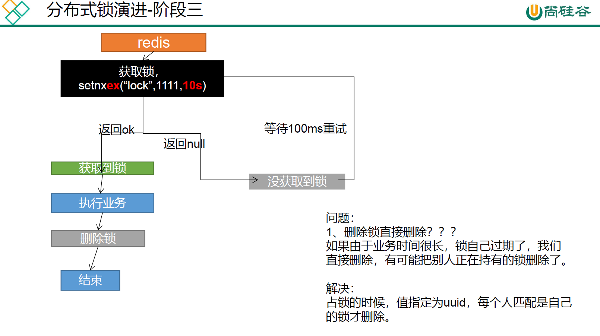

# renren-fast引入nacos报错

现象: 将renren-fast中的springboot升至2.6.11, 新增Spring Cloud Alibaba:2021.0.4.0, Spring Cloud:2021.0.4. 之后引入nacos注册中心与配置中心

```
<!-- nacos 服务注册 -->
<dependency>
    <groupId>com.alibaba.cloud</groupId>
    <artifactId>spring-cloud-starter-alibaba-nacos-discovery</artifactId>
</dependency>
<!-- nacos 配置中心 -->
<dependency>
    <groupId>com.alibaba.cloud</groupId>
    <artifactId>spring-cloud-starter-alibaba-nacos-config</artifactId>
</dependency>

<dependency>
    <groupId>org.springframework.cloud</groupId>
    <artifactId>spring-cloud-starter-bootstrap</artifactId>
</dependency>
```

报错如下:

```
java.lang.NoSuchMethodError: com.google.common.collect.Sets$SetView.iterator()Lcom/google/common/collect/UnmodifiableIterator;
```

依赖包冲突. 下载一个Maven helper插件发现guava包含在`spring-cloud-starter-alibaba-nacos-discovery`和`springfox-swagger2`中；将18版本的排除, 使用nacos依赖的guava20版本. (**问题不是在这儿**)

使用Maven helper插件发现commons-codec也冲突，将原来的commons-codec1.10升至1.15, nacos依赖了1.15版本

再次报错:

```
org.springframework.context.ApplicationContextException: Failed to start bean 'documentationPluginsBootstrapper'; nested exception is java.lang.NullPointerException
```

解决办法: https://blog.csdn.net/hadues/article/details/123753888

swagger版本从2.7.0 到 2.9.2, 2.9.2版本本身就是使用guava20版本, 上面那个排除guava20就不要了

application.yml添加

```
spring:
  mvc:
    pathmatch:
      matching-strategy: ANT_PATH_MATCHER
```


并在SwaggerConfig类中添加如下代码:

```
/**
 * Copyright (c) 2016-2019 人人开源 All rights reserved.
 *
 * https://www.renren.io
 *
 * 版权所有，侵权必究！
 */

package io.renren.config;

import io.swagger.annotations.ApiOperation;
import org.springframework.boot.actuate.autoconfigure.endpoint.web.CorsEndpointProperties;
import org.springframework.boot.actuate.autoconfigure.endpoint.web.WebEndpointProperties;
import org.springframework.boot.actuate.autoconfigure.web.server.ManagementPortType;
import org.springframework.boot.actuate.endpoint.ExposableEndpoint;
import org.springframework.boot.actuate.endpoint.web.*;
import org.springframework.boot.actuate.endpoint.web.annotation.ControllerEndpointsSupplier;
import org.springframework.boot.actuate.endpoint.web.annotation.ServletEndpointsSupplier;
import org.springframework.boot.actuate.endpoint.web.servlet.WebMvcEndpointHandlerMapping;
import org.springframework.context.annotation.Bean;
import org.springframework.context.annotation.Configuration;
import org.springframework.core.env.Environment;
import org.springframework.util.StringUtils;
import org.springframework.web.servlet.config.annotation.WebMvcConfigurer;
import springfox.documentation.builders.ApiInfoBuilder;
import springfox.documentation.builders.PathSelectors;
import springfox.documentation.builders.RequestHandlerSelectors;
import springfox.documentation.service.ApiInfo;
import springfox.documentation.service.ApiKey;
import springfox.documentation.spi.DocumentationType;
import springfox.documentation.spring.web.plugins.Docket;
import springfox.documentation.swagger2.annotations.EnableSwagger2;

import java.util.ArrayList;
import java.util.Collection;
import java.util.List;

import static com.google.common.collect.Lists.newArrayList;

@Configuration
@EnableSwagger2
public class SwaggerConfig implements WebMvcConfigurer {

    @Bean
    public Docket createRestApi() {
        return new Docket(DocumentationType.SWAGGER_2)
            .apiInfo(apiInfo())
            .select()
            //加了ApiOperation注解的类，才生成接口文档
            .apis(RequestHandlerSelectors.withMethodAnnotation(ApiOperation.class))
            //包下的类，才生成接口文档
            //.apis(RequestHandlerSelectors.basePackage("io.renren.controller"))
            .paths(PathSelectors.any())
            .build()
            .securitySchemes(security());
    }

    private ApiInfo apiInfo() {
        return new ApiInfoBuilder()
            .title("人人开源")
            .description("renren-fast文档")
            .termsOfServiceUrl("https://www.renren.io")
            .version("3.0.0")
            .build();
    }

    private List<ApiKey> security() {
        return newArrayList(
            new ApiKey("token", "token", "header")
        );
    }

    /**
     * 增加如下配置可解决Spring Boot 2.6.11 与Swagger2 2.9.2 不兼容问题
     **/
    @Bean
    public WebMvcEndpointHandlerMapping webEndpointServletHandlerMapping(WebEndpointsSupplier webEndpointsSupplier, ServletEndpointsSupplier servletEndpointsSupplier, ControllerEndpointsSupplier controllerEndpointsSupplier, EndpointMediaTypes endpointMediaTypes, CorsEndpointProperties corsProperties, WebEndpointProperties webEndpointProperties, Environment environment) {
        List<ExposableEndpoint<?>> allEndpoints = new ArrayList();
        Collection<ExposableWebEndpoint> webEndpoints = webEndpointsSupplier.getEndpoints();
        allEndpoints.addAll(webEndpoints);
        allEndpoints.addAll(servletEndpointsSupplier.getEndpoints());
        allEndpoints.addAll(controllerEndpointsSupplier.getEndpoints());
        String basePath = webEndpointProperties.getBasePath();
        EndpointMapping endpointMapping = new EndpointMapping(basePath);
        boolean shouldRegisterLinksMapping = this.shouldRegisterLinksMapping(webEndpointProperties, environment, basePath);
        return new WebMvcEndpointHandlerMapping(endpointMapping, webEndpoints, endpointMediaTypes, corsProperties.toCorsConfiguration(), new EndpointLinksResolver(allEndpoints, basePath), shouldRegisterLinksMapping, null);
    }
    private boolean shouldRegisterLinksMapping(WebEndpointProperties webEndpointProperties, Environment environment, String basePath) {
        return webEndpointProperties.getDiscovery().isEnabled() && (StringUtils.hasText(basePath) || ManagementPortType.get(environment).equals(ManagementPortType.DIFFERENT));
    }

}
```


# 后台解决跨域


我们使用gateway做网关, 所有请求发送到网关, 网关再转给各个微服务, renren-fast也作为一个微服务. 我们在网关处解决跨域, renren-fast里面有跨域配置，需要注释掉. 

跨域解决参考: https://blog.csdn.net/qq_24052051/article/details/127438027

Spring套件版本符合Spring Cloud Alibaba目前最新的版本建议要求：

- Springboot版本：2.6.11
- Sping Cloud版本：2021.0.4
- Spring Cloud Alibaba版本：2021.0.4.0
- Gateway版本：3.4.1

```
spring:
  cloud:
    gateway:
      #跨域处理，需要关闭具体微服务上的跨域设置，否则此设置无效
      globalcors: # 全局的跨域配置
        add-to-simple-url-handler-mapping: true # 解决options请求被拦截问题
        # options请求 就是一种询问服务器是否浏览器可以跨域的请求
        # 如果每次跨域都有询问服务器是否浏览器可以跨域对性能也是损耗
        # 可以配置本次跨域检测的有效期maxAge
        # 在maxAge设置的时间范围内，不去询问，统统允许跨域
        corsConfigurations:
          '[/**]':
            allowedOriginPatterns: # 允许哪些网站的跨域请求
              - "*"
            allowedMethods: # 允许的跨域ajax的请求方式
              - "GET"
              - "POST"
              - "DELETE"
              - "PUT"
              - "OPTIONS"
            allowedHeaders: "*"    # 允许在请求中携带的头信息
            allowCredentials: true    # 允许在请求中携带cookie
            maxAge: 360000            # 本次跨域检测的有效期(单位毫秒)
            # 有效期内，跨域请求不会一直发option请求去增大服务器压力
      routes:
        - id: renren
          uri: lb://renren # lb 负载均衡 需要添加 spring-cloud-loadbalancer
          predicates:
            - Path=/api/**
          filters:
            - RewritePath=/api/?(?<segment>.*), /renren-fast/$\{segment}
```


# 说明

在此之后, 我们引入阿里云oss时出错，改成了以下版本.

|         组件         |    版本    |
| :------------------: | :--------: |
| Spring Cloud Alibaba | 2021.0.1.0 |
|     Spring Cloud     |  2021.0.1  |
|     Spring Boot      |   2.6.3    |
|        Nacos         |   1.4.2    |


# 逻辑删除

步骤 1: 配置com.baomidou.mybatisplus.core.config.GlobalConfig$DbConfig

- 例: application.yml

```yaml
mybatis-plus:
  global-config:
    db-config:
      logic-delete-field: flag # 全局逻辑删除的实体字段名(since 3.3.0,配置后可以忽略不配置步骤2)
      logic-delete-value: 1 # 逻辑已删除值(默认为 1)
      logic-not-delete-value: 0 # 逻辑未删除值(默认为 0)
```

步骤 2: 实体类字段上加上`@TableLogic`注解

```java
@TableLogic
private Integer deleted;
```


#  JSR303校验

导入校验包

```
<dependency>
    <groupId>org.springframework.boot</groupId>
    <artifactId>spring-boot-starter-validation</artifactId>
</dependency>
```
1. 数据校验

  1)、给Bean添加校验注解:javax.validation.constraints，并定义自己的message提示 如：@NotBlank(message = "品牌名必须提交")

  2)、开启校验功能@Valid.  效果：校验错误以后会有默认的响应；

  3)、给校验的bean后紧跟一个BindingResult，就可以获取到校验的结果 public R save(@Valid @RequestBody BrandEntity brand,BindingResult result){}

2. 分组校验（多场景的复杂校验）

  1)、@NotBlank(message = "品牌名必须提交",groups = {AddGroup.class,UpdateGroup.class}给校验注解标注什么情况需要进行校验

  2)、使用@Validated({AddGroup.class}). public R save(@Validated(AddGroup.class) @RequestBody BrandEntity brand){}

  3)、默认没有指定分组的校验注解@NotBlank，在分组校验情况@Validated({AddGroup.class})下不生效，只会在@Validated生效；

  4)、定义空接口AddGroup.class作为groups的值，起到标记作用就行了

3. 自定义校验

   1)、编写一个自定义的校验注解

   ```
   package com.imgyh.mall.product.valid;
   
   import javax.validation.Constraint;
   import javax.validation.Payload;
   import java.lang.annotation.Documented;
   import java.lang.annotation.Retention;
   import java.lang.annotation.Target;
   
   import static java.lang.annotation.ElementType.*;
   import static java.lang.annotation.RetentionPolicy.RUNTIME;
   
   /**
    * @ClassName : ListValue
    * @Package : com.imgyh.mall.product.valid
    * @Description :
    * @Author : imgyh
    * @Mail : admin@imgyh.com
    * @Github : https://github.com/imgyh
    * @Site : https://www.imgyh.com
    * @Date : 2023/2/26 17:23
    * @Version : v1.0
    * @ChangeLog :
    * * * * * * * * * * * * * * * * * * * * * * * *
    * <p>
    * * * * * * * * * * * * * * * * * * * * * * * *
    **/
   
   @Documented
   // 使用哪些校验器校验
   @Constraint(validatedBy = { ListValueConstraintValidator.class })
   @Target({ METHOD, FIELD, ANNOTATION_TYPE, CONSTRUCTOR, PARAMETER, TYPE_USE })
   @Retention(RUNTIME)
   public @interface ListValue {
       // 校验失败的提示信息去哪儿取 需要把提示信息写到 ValidationMessages.properties
       String message() default "{com.imgyh.mall.product.valid.ListValue.message}";
   
       Class<?>[] groups() default {};
   
       Class<? extends Payload>[] payload() default {};
   
       int[] vals() default { };
   }
   
   ```

   

   2)、编写一个自定义的校验器 ConstraintValidator

   ```
   package com.imgyh.mall.product.valid;
   
   import javax.validation.ConstraintValidator;
   import javax.validation.ConstraintValidatorContext;
   import java.util.HashSet;
   
   /**
    * @ClassName : ListValueConstraintValidator
    * @Package : com.imgyh.mall.product.valid
    * @Description :
    * @Author : imgyh
    * @Mail : admin@imgyh.com
    * @Github : https://github.com/imgyh
    * @Site : https://www.imgyh.com
    * @Date : 2023/2/26 17:29
    * @Version : v1.0
    * @ChangeLog :
    * * * * * * * * * * * * * * * * * * * * * * * *
    * <p>
    * * * * * * * * * * * * * * * * * * * * * * * *
    **/
   // ConstraintValidator<A, T> A 校验的注解 T注解里面值的类型
   public class ListValueConstraintValidator implements ConstraintValidator<ListValue, Integer> {
       HashSet<Integer> set = new HashSet<>();
       // 初始化方法
       @Override
       public void initialize(ListValue constraintAnnotation) {
   
           for (int val : constraintAnnotation.vals()) {
               set.add(val);
           }
       }
   
       // 判断是否校验成功
       @Override
       public boolean isValid(Integer integer, ConstraintValidatorContext constraintValidatorContext) {
           return set.contains(integer);
       }
   }
   
   ```

   

   3)、ValidationMessages.properties

   ```
   com.imgyh.mall.product.valid.ListValue.message=必须提交指定值
   ```

   4)、使用自定义校验注解

   ```
   @ListValue(vals = {0,1}, groups = {AddGroup.class, UpdateStatusGroup.class})
   private Integer showStatus;
   ```

   

# 统一异常处理

1）、编写异常处理类，使用@ControllerAdvice、@RestControllerAdvice。

2）、使用@ExceptionHandler标注方法可以处理的异常。

```
package com.imgyh.mall.product.exception;

import com.imgyh.mall.common.exception.BizCodeEnume;
import com.imgyh.mall.common.utils.R;
import org.springframework.web.bind.MethodArgumentNotValidException;
import org.springframework.web.bind.annotation.ExceptionHandler;
import org.springframework.web.bind.annotation.RestControllerAdvice;

import java.util.HashMap;
import java.util.Map;

/**
 * @ClassName : ProductExecptionAdvice
 * @Package : com.imgyh.mall.product.exception
 * @Description :
 * @Author : imgyh
 * @Mail : admin@imgyh.com
 * @Github : https://github.com/imgyh
 * @Site : https://www.imgyh.com
 * @Date : 2023/2/26 16:26
 * @Version : v1.0
 * @ChangeLog
 * * * * * * * * * * * * * * * * * * * * * * * *
 * <p>
 * * * * * * * * * * * * * * * * * * * * * * * *
 **/
@RestControllerAdvice(basePackages = "com.imgyh.mall.product.app")
public class ProductExceptionAdvice {

    // 使用@ExceptionHandler标注方法可以处理的异常
    @ExceptionHandler(value = MethodArgumentNotValidException.class)
    public R handleVaildException(MethodArgumentNotValidException e){
        Map<String, String> map = new HashMap<>();
        //1、获取校验的错误结果
        e.getFieldErrors().forEach((item) -> {
            //FieldError 获取到错误提示
            String message = item.getDefaultMessage();
            //获取错误的属性的名字
            String field = item.getField();
            map.put(field, message);
        });

        return R.error(BizCodeEnume.VAILD_EXCEPTION.getCode(), BizCodeEnume.VAILD_EXCEPTION.getMsg()).put("data", map);
    }

    @ExceptionHandler(value = Throwable.class)
    public R handleException(Throwable e){

        return R.error(BizCodeEnume.UNKNOW_EXCEPTION.getCode(), BizCodeEnume.UNKNOW_EXCEPTION.getMsg());
    }
}

```

# MybatisPlus分页插件

```
package com.imgyh.mall.product.config;

import com.baomidou.mybatisplus.annotation.DbType;
import com.baomidou.mybatisplus.extension.plugins.MybatisPlusInterceptor;
import com.baomidou.mybatisplus.extension.plugins.inner.PaginationInnerInterceptor;
import org.mybatis.spring.annotation.MapperScan;
import org.springframework.context.annotation.Bean;
import org.springframework.context.annotation.Configuration;
import org.springframework.transaction.annotation.EnableTransactionManagement;

/**
 * @ClassName : MybatisPlusConfig
 * @Package : com.imgyh.mall.product.config
 * @Description :
 * @Author : imgyh
 * @Mail : admin@imgyh.com
 * @Github : https://github.com/imgyh
 * @Site : https://www.imgyh.com
 * @Date : 2023/2/27 15:51
 * @Version : v1.0
 * @ChangeLog :
 * * * * * * * * * * * * * * * * * * * * * * * *
 * <p>
 * * * * * * * * * * * * * * * * * * * * * * * *
 **/
@Configuration
@EnableTransactionManagement //开启事务
@MapperScan("com.imgyh.mall.product.dao")
public class MybatisPlusConfig {
    // 添加分页拦截器
    @Bean
    public MybatisPlusInterceptor mybatisPlusInterceptor() {
        MybatisPlusInterceptor interceptor = new MybatisPlusInterceptor();
        PaginationInnerInterceptor paginationInnerInterceptor = new PaginationInnerInterceptor();
        paginationInnerInterceptor.setDbType(DbType.MYSQL);
        paginationInnerInterceptor.setOverflow(true);
        interceptor.addInnerInterceptor(paginationInnerInterceptor);
        return interceptor;
    }
}

```

# 首页性能压测

压测环境: i7 8700 + 8G + idea (gateway+product微服务) + WSL(Nginx) + Windows (MySQL+Nacos)

jmeter压测参数: 线程50+循环次数200

默认thymeleaf无缓存, MySQL无索引, 日志级别debug

| 压测内容                            | 压测线程数 | 吞吐量/s                | 90%响应时间ms | 95%响应时间ms | 99%响应时间ms |
| ----------------------------------- | ---------- | ----------------------- | ------------- | ------------- | ------------- |
| Nginx                               | 50         | 8818                    | 1             | 1             | 3             |
| Gateway                             | 50         | 5367                    | 7             | 12            | 36            |
| 简单服务(返回hello字符串)           | 50         | 9551                    | 1             | 1             | 3             |
| 首页渲染                            | 50         | 1243(db、thymeleaf瓶颈) | 57            | 76            | 141           |
| 首页渲染(加索引)                    | 50         | 1301(thymeleaf瓶颈)     | 59            | 78            | 118           |
| 首页渲染（开缓存、加索引）          | 50         | 2663                    | 24            | 31            | 51            |
| 首页渲染（开缓存、加索引、关日志）  | 50         | 3054                    | 14            | 24            | 74            |
| 三级分类接口                        | 50         | 360                     | 252           | 309           | 450           |
| 三级分类接口（加索引、关日志）      | 50         | 467                     | 215           | 268           | 413           |
| 三级分类接口（ 使用redis 作为缓存） | 50         | 2099                    | 26            | 35            | 85            |
| 首页全量数据获取                    | 50         | 卡死、静态资源太多      |               |               |               |
| 首页全量数据获取(动静分离)          | 50         | 11                      | 240           | 400           | 2632          |
| Nginx+Gateway                       | 50         |                         |               |               |               |
| Gateway+简单服务                    | 50         | 4793                    | 10            | 13            | 23            |
| Nginx+Gateway+简单服务              | 50         | 2258                    | 25            | 29            | 40            |

# Nginx动静分离

将所有静态文件打包放入nginx的html目录中并在配置文件中添加如下配置。以后所有带有/static的请求都会到这里来找

```nginx
location /static { # 静态资源
    root   /usr/share/nginx/html;
    # index  index.html index.htm;
}
```


完整配置:

```nginx
upstream mall{
    server  192.168.16.1:88; # gateway集群IP, 可配置多个实现负载均衡
}
server {
    listen       80;
    server_name  mall.gyh.im; # 自定义的域名

    #charset koi8-r;
    #access_log  /var/log/nginx/log/host.access.log  main;

    location /static { # 静态资源
        root   /usr/share/nginx/html;
        # index  index.html index.htm;
    }

    location / {
        # root   /usr/share/nginx/html;
        # index  index.html index.htm;
        proxy_set_header Host $host; # 将host这个header传给gateway, gateway才能根据这个host路由
        proxy_pass http://mall; # upstream 的名字, 负载均衡
    }

    #error_page  404              /404.html;

    # redirect server error pages to the static page /50x.html
    #
    error_page   500 502 503 504  /50x.html;
    location = /50x.html {
        root   /usr/share/nginx/html;
    }

    # proxy the PHP scripts to Apache listening on 127.0.0.1:80
    #
    #location ~ \.php$ {
    #    proxy_pass   http://127.0.0.1;
    #}

    # pass the PHP scripts to FastCGI server listening on 127.0.0.1:9000
    #
    #location ~ \.php$ {
    #    root           html;
    #    fastcgi_pass   127.0.0.1:9000;
    #    fastcgi_index  index.php;
    #    fastcgi_param  SCRIPT_FILENAME  /scripts$fastcgi_script_name;
    #    include        fastcgi_params;
    #}

    # deny access to .htaccess files, if Apache's document root
    # concurs with nginx's one
    #
    #location ~ /\.ht {
    #    deny  all;
    #}
}
```

# Redis缓存

为了系统性能的提升，我们一般都会将部分数据放入缓存中，加速访问。而db 承担数据落盘工作。

哪些数据适合放入缓存？

- 即时性、数据一致性要求不高的
- 访问量大且更新频率不高的数据（读多，写少）

举例：电商类应用，商品分类，商品列表等适合缓存并加一个失效时间(根据数据更新频率来定)，后台如果发布一个商品，买家需要5 分钟才能看到新的商品一般还是可以接受的。

注意：在开发中，凡是放入缓存中的数据我们都应该**指定过期时间**，使其可以在系统即使没有主动更新数据也能自动触发数据加载进缓存的流程。避免业务崩溃导致的数据永久不一致问题。


## 缓存穿透

缓存穿透是指查询**一个一定不存在的数据**，由于缓存是不命中，将去查询数据库，但是数据库也无此记录，我们没有将这次查询的null 写入缓存，这将导致这个不存在的数据每次请求都要到存储层去查询，失去了缓存的意义。

在流量大时，可能DB 就挂掉了，要是有人利用不存在的key 频繁攻击我们的应用，这就是漏洞。

风险：**利用不存在的数据进行攻击**，数据库瞬时压力增大，最终导致崩溃

解决：**缓存空结果**、并且**设置短的过期时间**。


## 缓存雪崩

缓存雪崩是指在我们设置缓存时采用了**相同的过期时间**，导致缓存在**某一时刻同时失效**，请求全部转发到DB，DB 瞬时压力过重雪崩。

解决：原有的**失效时间基础上增加一个随机值**，比如1-5 分钟随机，这样每一个缓存的过期时间的重复率就会降低，就很难引发集体失效的事件。


## 缓存击穿

对于一些设置了过期时间的key，如果这些key 可能会在某些时间点被超高并发地访问，是一种非常“热点”的数据。

这个时候，需要考虑一个问题：如果**这个key 在大量请求同时进来前正好失效**，那么所有对这个key 的数据查询都落到db，我们称为缓存击穿。

解决：**加锁** ，大量并发只让一个去查，其他人等待，查到以后释放锁，其他人获取到锁，先查缓存，就会有数据，不用去db


## 锁时序问题

如果只锁到查询数据库完成, 在第一个请求查询完数据库，把数据放入缓存时会花费时间
这段时间第二个请求拿到锁, 发现缓存中还是没有数据，又会再去查询数据库，这将增加一次查询数据库


## 本地锁解决缓存击穿

分布式缓存逻辑:

```java
public Map<String, List<Catelog2Vo>> getCatalogJson() {
    /**
         * 1、空结果缓存：解决缓存穿透问题
         * 2、设置过期时间(加随机值)：解决缓存雪崩
         * 3、加锁：解决缓存击穿问题
         */
    // 1.先去redis中查有没有
    String catalogJSON = redisTemplate.opsForValue().get("catalogJSON");
    if (StringUtils.isEmpty(catalogJSON)){
        // 2. redis中没有就去数据库中查, 并存到redis中
        // 2.1. 无锁的情况
        // Map<String, List<Catelog2Vo>> catalogJsonFromDB = getCatalogJsonFromDB();
        // String s = JSON.toJSONString(catalogJsonFromDB);
        // redisTemplate.opsForValue().set("catalogJSON",s);
        // 2.2 本地锁
        // Map<String, List<Catelog2Vo>> catalogJsonFromDB = getCatalogJsonFromDBWithLocalLock();
        // 2.3 redis分布式锁
        // Map<String, List<Catelog2Vo>> catalogJsonFromDB = getCatalogJsonFromDBWithRedisLock();
        // 2.4 redisson分布式锁
        Map<String, List<Catelog2Vo>> catalogJsonFromDB = getCatalogJsonFromDBWithRedissonLock();

        return catalogJsonFromDB;
    }
    // 3. redis中有，转化为相应类型
    Map<String, List<Catelog2Vo>> map = JSON.parseObject(catalogJSON, new TypeReference<Map<String, List<Catelog2Vo>>>() {});
    return map;
}
```


本地锁逻辑:

```java
/**
 * 本地锁
 * @return
 */
private Map<String, List<Catelog2Vo>> getCatalogJsonFromDBWithLocalLock() {
    //只要是同一把锁，就能锁住这个锁的所有线程
    //synchronized (this)：SpringBoot所有的组件在容器中都是单例的。
    //本地锁：synchronized，JUC（Lock),在分布式情况下，想要锁住所有，必须使用分布式锁
    synchronized (this){
        // 1. 拿到锁后再去缓存中查一次。如果大量请求都在等待锁释放, 拿到锁后, 如果不去缓存中再拿一次, 还是有大量请求去请求数据库
        String catalogJSON = redisTemplate.opsForValue().get("catalogJSON");
        if (!StringUtils.isEmpty(catalogJSON)){
            Map<String, List<Catelog2Vo>> map = JSON.parseObject(catalogJSON, new TypeReference<Map<String, List<Catelog2Vo>>>() {});
            return map;
        }

        // 2. 查询数据库
        Map<String, List<Catelog2Vo>> catalogJsonFromDB = getCatalogJsonFromDB();

        // 3. 从数据库中查到的数据存到redis中
        // 要锁到这里, 如果只锁到查询数据库完成, 在第一个请求查询完数据库，把数据放入缓存时会花费时间
        // 这段时间第二个请求拿到锁, 发现缓存中还是没有数据，又会再去查询数据库，这将增加一次查询数据库
        String s = JSON.toJSONString(catalogJsonFromDB);
        redisTemplate.opsForValue().set("catalogJSON",s);
        return catalogJsonFromDB;
    }
}
```


查询数据库的代码:

```java
/**
 * 查询数据库, 并解析为相应的格式
 * @return
 */
private Map<String, List<Catelog2Vo>> getCatalogJsonFromDB() {
    List<CategoryEntity> categoryEntities = this.list();
    List<CategoryEntity> l1 = categoryEntities.stream().filter(categoryEntity -> {
        return categoryEntity.getCatLevel() == 1;
    }).collect(Collectors.toList());

    Map<String, List<Catelog2Vo>> map = l1.stream().collect(Collectors.toMap(k -> k.getCatId().toString(), v -> {
        List<Catelog2Vo> list = categoryEntities.stream().filter(categoryEntity2 -> {
            return categoryEntity2.getCatLevel() == 2 && categoryEntity2.getParentCid() == v.getCatId();
        }).map(categoryEntity2 -> {
            Catelog2Vo catelog2Vo = new Catelog2Vo(v.getCatId().toString(), null, categoryEntity2.getCatId().toString(), categoryEntity2.getName());
            List<Catelog2Vo.Category3Vo> collect = categoryEntities.stream().filter(categoryEntity3 -> {
                return categoryEntity3.getCatLevel() == 3 && categoryEntity3.getParentCid() == categoryEntity2.getCatId();
            }).map(categoryEntity3 -> {
                Catelog2Vo.Category3Vo category3Vo = new Catelog2Vo.Category3Vo(categoryEntity2.getCatId().toString(), categoryEntity3.getCatId().toString(), categoryEntity3.getName());
                return category3Vo;
            }).collect(Collectors.toList());
            catelog2Vo.setCatalog3List(collect);
            return catelog2Vo;
        }).collect(Collectors.toList());
        return list;
    }));
    return map;
}
```


## 分布式锁解决缓存击穿

### 本地锁的问题

本地锁只能锁住当前进程，当某个微服务是集群时，集群有多少机器就会查多少次数据库


### 分布式锁基本原理


### 分布式锁演进1--问题:锁不能释放


代码演示:

```java
/**
 * redis分布式锁
 * @return
 */
private Map<String, List<Catelog2Vo>> getCatalogJsonFromDBWithRedisLock() {
    // 1. 占分布式锁, setnx("lock","1111")
    Boolean lock = redisTemplate.opsForValue().setIfAbsent("lock", "1111");
    if (lock){
        // 2. 加锁成功...执行业务
        // 1). 拿到锁后再去缓存中查一次。如果大量请求都在等待锁释放, 拿到锁后, 如果不去缓存中再拿一次, 还是有大量请求去请求数据库
        String catalogJSON = redisTemplate.opsForValue().get("catalogJSON");
        if (!StringUtils.isEmpty(catalogJSON)){
            Map<String, List<Catelog2Vo>> map = JSON.parseObject(catalogJSON, new TypeReference<Map<String, List<Catelog2Vo>>>() {});
            return map;
        }

        // 2). 查询数据库
        Map<String, List<Catelog2Vo>> catalogJsonFromDB = getCatalogJsonFromDB();

        // 3). 从数据库中查到的数据存到redis中
        // 要锁到这里, 如果只锁到查询数据库完成, 在第一个请求查询完数据库，把数据放入缓存时会花费时间
        // 这段时间第二个请求拿到锁, 发现缓存中还是没有数据，又会再去查询数据库，这将增加一次查询数据库
        String s = JSON.toJSONString(catalogJsonFromDB);
        redisTemplate.opsForValue().set("catalogJSON",s);

        // 3. 删除锁, 由于没设置过期时间，如果正好在这之前机器断电，无法执行删除锁，会造成死锁
        redisTemplate.delete("lock");
        return catalogJsonFromDB;

    }else {
        // 4.加锁失败...重试, 休眠100ms重试
        try {
            Thread.sleep(100);
        } catch (InterruptedException e) {
            e.printStackTrace();
        }
        return getCatalogJsonFromDBWithLocalLock(); // 自旋的方式
    }
}
```

### 分布式锁演进2--问题:设置锁与设置过期时间不是原子操作


代码演示:

```java
/**
 * redis分布式锁
 * @return
 */
private Map<String, List<Catelog2Vo>> getCatalogJsonFromDBWithRedisLock() {
    // 1. 占分布式锁, setnx("lock","1111")
    Boolean lock = redisTemplate.opsForValue().setIfAbsent("lock", "1111");
    if (lock){
        // 1.1设置过期时间
        redisTemplate.expire("lock",30, TimeUnit.SECONDS);
        // 2. 加锁成功...执行业务
        // 1). 拿到锁后再去缓存中查一次。如果大量请求都在等待锁释放, 拿到锁后, 如果不去缓存中再拿一次, 还是有大量请求去请求数据库
        String catalogJSON = redisTemplate.opsForValue().get("catalogJSON");
        if (!StringUtils.isEmpty(catalogJSON)){
            Map<String, List<Catelog2Vo>> map = JSON.parseObject(catalogJSON, new TypeReference<Map<String, List<Catelog2Vo>>>() {});
            return map;
        }

        // 2). 查询数据库
        Map<String, List<Catelog2Vo>> catalogJsonFromDB = getCatalogJsonFromDB();

        // 3). 从数据库中查到的数据存到redis中
        // 要锁到这里, 如果只锁到查询数据库完成, 在第一个请求查询完数据库，把数据放入缓存时会花费时间
        // 这段时间第二个请求拿到锁, 发现缓存中还是没有数据，又会再去查询数据库，这将增加一次查询数据库
        String s = JSON.toJSONString(catalogJsonFromDB);
        redisTemplate.opsForValue().set("catalogJSON",s);

        // 3. 删除锁, 由于没设置过期时间，如果正好在这之前机器断电，无法执行删除锁，会造成死锁
        redisTemplate.delete("lock");
        return catalogJsonFromDB;

    }else {
        // 4.加锁失败...重试, 休眠100ms重试
        try {
            Thread.sleep(100);
        } catch (InterruptedException e) {
            e.printStackTrace();
        }
        return getCatalogJsonFromDBWithLocalLock(); // 自旋的方式
    }
}
```

### 分布式锁演进3--问题:删除锁时删掉别人的锁



代码演示:

```java
/**
 * redis分布式锁
 * @return
 */
private Map<String, List<Catelog2Vo>> getCatalogJsonFromDBWithRedisLock() {
    // 1. 占分布式锁, setnxex("lock","1111",30s) 设置锁并设置过期时间保证原子操作
    Boolean lock = redisTemplate.opsForValue().setIfAbsent("lock", "1111", 30 , TimeUnit.SECONDS);
    if (lock){
        // 2. 加锁成功...执行业务
        // 1). 拿到锁后再去缓存中查一次。如果大量请求都在等待锁释放, 拿到锁后, 如果不去缓存中再拿一次, 还是有大量请求去请求数据库
        String catalogJSON = redisTemplate.opsForValue().get("catalogJSON");
        if (!StringUtils.isEmpty(catalogJSON)){
            Map<String, List<Catelog2Vo>> map = JSON.parseObject(catalogJSON, new TypeReference<Map<String, List<Catelog2Vo>>>() {});
            return map;
        }

        // 2). 查询数据库
        Map<String, List<Catelog2Vo>> catalogJsonFromDB = getCatalogJsonFromDB();

        // 3). 从数据库中查到的数据存到redis中
        // 要锁到这里, 如果只锁到查询数据库完成, 在第一个请求查询完数据库，把数据放入缓存时会花费时间
        // 这段时间第二个请求拿到锁, 发现缓存中还是没有数据，又会再去查询数据库，这将增加一次查询数据库
        String s = JSON.toJSONString(catalogJsonFromDB);
        redisTemplate.opsForValue().set("catalogJSON",s);

        // 3. 删除锁, 由于没设置过期时间，如果正好在这之前机器断电，无法执行删除锁，会造成死锁
        redisTemplate.delete("lock");
        return catalogJsonFromDB;

    }else {
        // 4.加锁失败...重试, 休眠100ms重试
        try {
            Thread.sleep(100);
        } catch (InterruptedException e) {
            e.printStackTrace();
        }
        return getCatalogJsonFromDBWithLocalLock(); // 自旋的方式
    }
}
```

### 分布式锁演进4--问题:查询锁的值与删除锁不是原子操作


代码演示:

```java
/**
 * redis分布式锁
 * @return
 */
private Map<String, List<Catelog2Vo>> getCatalogJsonFromDBWithRedisLock() {
    // 1. 占分布式锁, setnxex("lock","1111",30s) 设置锁并设置过期时间保证原子操作
    String uuid = UUID.randomUUID().toString();
    Boolean lock = redisTemplate.opsForValue().setIfAbsent("lock", uuid, 30 , TimeUnit.SECONDS);
    if (lock){
        // 2. 加锁成功...执行业务
        // 1). 拿到锁后再去缓存中查一次。如果大量请求都在等待锁释放, 拿到锁后, 如果不去缓存中再拿一次, 还是有大量请求去请求数据库
        String catalogJSON = redisTemplate.opsForValue().get("catalogJSON");
        if (!StringUtils.isEmpty(catalogJSON)){
            Map<String, List<Catelog2Vo>> map = JSON.parseObject(catalogJSON, new TypeReference<Map<String, List<Catelog2Vo>>>() {});
            return map;
        }

        // 2). 查询数据库
        Map<String, List<Catelog2Vo>> catalogJsonFromDB = getCatalogJsonFromDB();

        // 3). 从数据库中查到的数据存到redis中
        // 要锁到这里, 如果只锁到查询数据库完成, 在第一个请求查询完数据库，把数据放入缓存时会花费时间
        // 这段时间第二个请求拿到锁, 发现缓存中还是没有数据，又会再去查询数据库，这将增加一次查询数据库
        String s = JSON.toJSONString(catalogJsonFromDB);
        redisTemplate.opsForValue().set("catalogJSON",s);

        // 3. 删除锁, 由于没设置过期时间，如果正好在这之前机器断电，无法执行删除锁，会造成死锁
        // 判断是自己加的锁
        String lockValue = redisTemplate.opsForValue().get("lock");
        if (uuid.equals(lockValue)) {
            // 删除自己的锁
            redisTemplate.delete("lock");
        }
        return catalogJsonFromDB;

    }else {
        // 4.加锁失败...重试, 休眠100ms重试
        try {
            Thread.sleep(100);
        } catch (InterruptedException e) {
            e.printStackTrace();
        }
        return getCatalogJsonFromDBWithLocalLock(); // 自旋的方式
    }
}
```

### 分布式锁演进5--最终方案--问题:锁没有自动续期


代码演示:

```java
/**
 * redis分布式锁
 * @return
 */
private Map<String, List<Catelog2Vo>> getCatalogJsonFromDBWithRedisLock() {
    // 1. 占分布式锁, setnxex("lock","1111",30s) 设置锁并设置过期时间保证原子操作
    String uuid = UUID.randomUUID().toString();
    Boolean lock = redisTemplate.opsForValue().setIfAbsent("lock", uuid, 30, TimeUnit.SECONDS);

    if (lock) {
        // 2. 加锁成功...执行业务
        Map<String, List<Catelog2Vo>> catalogJsonFromDB;
        try {
            // 1). 拿到锁后再去缓存中查一次。如果大量请求都在等待锁释放, 拿到锁后, 如果不去缓存中再拿一次, 还是有大量请求去请求数据库
            String catalogJSON = redisTemplate.opsForValue().get("catalogJSON");
            if (!StringUtils.isEmpty(catalogJSON)) {
                Map<String, List<Catelog2Vo>> map = JSON.parseObject(catalogJSON, new TypeReference<Map<String, List<Catelog2Vo>>>() {
                });
                return map;
            }

            // 2). 查询数据库
            catalogJsonFromDB = getCatalogJsonFromDB();

            // 3). 从数据库中查到的数据存到redis中
            // 要锁到这里, 如果只锁到查询数据库完成, 在第一个请求查询完数据库，把数据放入缓存时会花费时间
            // 这段时间第二个请求拿到锁, 发现缓存中还是没有数据，又会再去查询数据库，这将增加一次查询数据库
            String s = JSON.toJSONString(catalogJsonFromDB);
            redisTemplate.opsForValue().set("catalogJSON", s);

        } finally {
            // 3. 删除锁, 由于没设置过期时间，如果正好在这之前机器断电，无法执行删除锁，会造成死锁
            // 判断是自己加的锁 + 删除锁 要保证原子操作
            String script = "if redis.call('get', KEYS[1]) == ARGV[1] then return redis.call('del', KEYS[1]) else return 0 end";
            redisTemplate.execute(new DefaultRedisScript<Long>(script, Long.class), Arrays.asList("lock"), uuid);
        }
        return catalogJsonFromDB;
    } else {
        // 4.加锁失败...重试, 休眠100ms重试
        try {
            Thread.sleep(100);
        } catch (InterruptedException e) {
            e.printStackTrace();
        }
        return getCatalogJsonFromDBWithLocalLock(); // 自旋的方式
    }
}
```


## 分布式锁框架Redisson

### 可重入锁

如果负责储存这个分布式锁的Redisson节点宕机以后，而且这个锁正好处于锁住的状态时，这个锁会出现锁死的状态。为了避免这种情况的发生，Redisson内部提供了一个监控锁的看门狗，它的作用是在Redisson实例被关闭前，不断的延长锁的有效期。默认情况下，看门狗的检查锁的超时时间是30秒钟，也可以通过修改[Config.lockWatchdogTimeout](https://github.com/redisson/redisson/wiki/2.-配置方法#lockwatchdogtimeout监控锁的看门狗超时单位毫秒)来另行指定。

另外Redisson还通过加锁的方法提供了`leaseTime`的参数来指定加锁的时间。超过这个时间后锁便自动解开了。

```java
package com.imgyh.mall.product.test;

import org.redisson.api.RLock;
import org.redisson.api.RedissonClient;
import org.springframework.beans.factory.annotation.Autowired;
import org.springframework.web.bind.annotation.GetMapping;
import org.springframework.web.bind.annotation.ResponseBody;
import org.springframework.web.bind.annotation.RestController;

import java.util.concurrent.TimeUnit;

@RestController
public class ProducttestController {
    @Autowired
    RedissonClient redisson;
    @ResponseBody
    @GetMapping("/test/redisson/lock")
    public String testRedisson(){
        //1、获取一把锁，只要锁的名字一样，就是同一把锁
        RLock myLock = redisson.getLock("my-lock");

        //2、加锁
        myLock.lock();      //阻塞式等待。默认加的锁都是30s
        //1）、锁的自动续期，如果业务超长，运行期间自动锁上新的30s。不用担心业务时间长，锁自动过期被删掉
        //2）、加锁的业务只要运行完成，就不会给当前锁续期，即使不手动解锁，锁默认会在30s内自动过期，不会产生死锁问题

        // myLock.lock(10,TimeUnit.SECONDS);   //10秒钟自动解锁,自动解锁时间一定要大于业务执行时间
        //问题：在锁时间到了以后，不会自动续期

        //1、如果我们传递了锁的超时时间(myLock.lock(10,TimeUnit.SECONDS);)，就发送给redis执行脚本，进行占锁，默认超时就是 我们制定的时间
        //2、如果我们未指定锁的超时时间(myLock.lock(); )，就使用 lockWatchdogTimeout = 30 * 1000 【看门狗默认时间】
        //  只要占锁成功，就会启动一个定时任务【重新给锁设置过期时间，新的过期时间就是看门狗的默认时间】,每隔10秒都会自动的再次续期，续成30秒
        //  internalLockLeaseTime 【看门狗时间】 / 3， 10s

        // 推荐使用myLock.lock(10,TimeUnit.SECONDS); 省掉了续期操作。手动来解锁
        try {
            System.out.println("加锁成功，执行业务..." + Thread.currentThread().getId());
            try { TimeUnit.SECONDS.sleep(20); } catch (InterruptedException e) { e.printStackTrace(); }
        } catch (Exception ex) {
            ex.printStackTrace();
        } finally {
            //3、解锁  假设解锁代码没有运行，Redisson会不会出现死锁
            System.out.println("释放锁..." + Thread.currentThread().getId());
            myLock.unlock();
        }

        return "redisson";
    }
}

```

### 读写锁--保证一定能读到最新数据

分布式可重入读写锁允许同时有多个读锁和一个写锁处于加锁状态。

保证一定能读到最新数据，修改期间，写锁是一个排它锁（互斥锁、独享锁），读锁是一个共享锁

写锁没释放读锁必须等待

 * 读 + 读 ：相当于无锁，并发读，只会在Redis中记录好，所有当前的读锁。他们都会同时加锁成功
 * 写 + 读 ：必须等待写锁释放
 * 写 + 写 ：阻塞方式
 * 读 + 写 ：有读锁。写也需要等待

```java
package com.imgyh.mall.product.test;

import org.redisson.api.RLock;
import org.redisson.api.RReadWriteLock;
import org.redisson.api.RedissonClient;
import org.springframework.beans.factory.annotation.Autowired;
import org.springframework.data.redis.core.StringRedisTemplate;
import org.springframework.data.redis.core.ValueOperations;
import org.springframework.web.bind.annotation.GetMapping;
import org.springframework.web.bind.annotation.ResponseBody;
import org.springframework.web.bind.annotation.RestController;

import java.util.UUID;
import java.util.concurrent.TimeUnit;

@RestController
public class ProducttestController {
    @Autowired
    RedissonClient redisson;
    @Autowired
    StringRedisTemplate stringRedisTemplate;
   
    /**
     * 保证一定能读到最新数据，修改期间，写锁是一个排它锁（互斥锁、独享锁），读锁是一个共享锁
     * 写锁没释放读锁必须等待
     * 读 + 读 ：相当于无锁，并发读，只会在Redis中记录好，所有当前的读锁。他们都会同时加锁成功
     * 写 + 读 ：必须等待写锁释放
     * 写 + 写 ：阻塞方式
     * 读 + 写 ：有读锁。写也需要等待
     * @return
     */
    @GetMapping(value = "/test/redisson/write")
    @ResponseBody
    public String writeValue() {
        String s = "";
        RReadWriteLock readWriteLock = redisson.getReadWriteLock("rw-lock");
        RLock rLock = readWriteLock.writeLock();
        try {
            //1、改数据加写锁，读数据加读锁
            rLock.lock();
            s = UUID.randomUUID().toString();
            ValueOperations<String, String> ops = stringRedisTemplate.opsForValue();
            ops.set("writeValue",s);
            TimeUnit.SECONDS.sleep(10);
        } catch (InterruptedException e) {
            e.printStackTrace();
        } finally {
            rLock.unlock();
        }

        return s;
    }

    @GetMapping(value = "/test/redisson/read")
    @ResponseBody
    public String readValue() {
        String s = "";
        RReadWriteLock readWriteLock = redisson.getReadWriteLock("rw-lock");
        //加读锁
        RLock rLock = readWriteLock.readLock();
        try {
            rLock.lock();
            ValueOperations<String, String> ops = stringRedisTemplate.opsForValue();
            s = ops.get("writeValue");
            try { TimeUnit.SECONDS.sleep(10); } catch (InterruptedException e) { e.printStackTrace(); }
        } catch (Exception e) {
            e.printStackTrace();
        } finally {
            rLock.unlock();
        }

        return s;
    }

}

```

### 信号量

设置一个信号量(redis中键的名字=park), 获取一个信号表示信号量的值减1，释放一个信号量表示信号量加1。当信号量减为0或者redis中没有该信号量, 就获取不到信号，也不会执行减1操作。当redis中没有该信号量，释放一个信号会创建这个信号量并加1。

```
package com.imgyh.mall.product.test;

import org.redisson.api.RLock;
import org.redisson.api.RReadWriteLock;
import org.redisson.api.RSemaphore;
import org.redisson.api.RedissonClient;
import org.springframework.beans.factory.annotation.Autowired;
import org.springframework.data.redis.core.StringRedisTemplate;
import org.springframework.data.redis.core.ValueOperations;
import org.springframework.web.bind.annotation.GetMapping;
import org.springframework.web.bind.annotation.ResponseBody;
import org.springframework.web.bind.annotation.RestController;

import java.util.UUID;
import java.util.concurrent.TimeUnit;

@RestController
public class ProducttestController {

    @Autowired
    RedissonClient redisson;
    @Autowired
    StringRedisTemplate stringRedisTemplate;

    /**
     * 车库停车
     * 3车位
     * 信号量也可以做分布式限流
     */
    @GetMapping(value = "/test/redisson/park")
    @ResponseBody
    public String park() throws InterruptedException {

        RSemaphore park = redisson.getSemaphore("park");
        // park.acquire();     //获取一个信号、计数减少1, 阻塞式
        boolean flag = park.tryAcquire(); // 尝试获取一个信号,获取到返回true, 没获取到返回false

        if (flag) {
            //执行业务
        } else {
            return "error";
        }

        return "ok=>" + flag;
    }

    @GetMapping(value = "/test/redisson/go")
    @ResponseBody
    public String go() {
        RSemaphore park = redisson.getSemaphore("park");
        park.release();     //释放一个信号, 计数增加1
        return "ok";
    }

}
```

### 闭锁

闭锁会设置一个初始数值，当调用countDown();把数减为0后删除锁, 这就表示闭锁完成了。await();就可以放行了。

```java
package com.imgyh.mall.product.test;

import org.redisson.api.*;
import org.springframework.beans.factory.annotation.Autowired;
import org.springframework.data.redis.core.StringRedisTemplate;
import org.springframework.data.redis.core.ValueOperations;
import org.springframework.web.bind.annotation.GetMapping;
import org.springframework.web.bind.annotation.PathVariable;
import org.springframework.web.bind.annotation.ResponseBody;
import org.springframework.web.bind.annotation.RestController;

import java.util.UUID;
import java.util.concurrent.TimeUnit;

@RestController

public class ProducttestController {

    @Autowired
    RedissonClient redisson;
    @Autowired
    StringRedisTemplate stringRedisTemplate;

    /**
     * 放假、锁门
     * 1班没人了
     * 5个班，全部走完，我们才可以锁大门
     * 分布式闭锁
     */

    @GetMapping(value = "/test/redisson/lockDoor")
    @ResponseBody
    public String lockDoor() throws InterruptedException {

        RCountDownLatch door = redisson.getCountDownLatch("door");
        door.trySetCount(5); // 设置一个初始数
        door.await();       //等待闭锁完成，当调用door.countDown();把数减为0后删除锁(redis中的door),这就表示闭锁完成了

        return "放假了...";
    }

    @GetMapping(value = "/test/redisson/gogogo/{id}")
    @ResponseBody
    public String gogogo(@PathVariable("id") Long id) {
        RCountDownLatch door = redisson.getCountDownLatch("door");
        door.countDown();       //计数-1

        return id + "班的人都走了...";
    }

}

```


## 缓存一致性问题

我们系统的一致性解决方案：
1、缓存的所有数据都有过期时间，数据过期下一次查询触发主动更新
2、读写数据的时候，加上分布式的读写锁。


## 使用Redisson提供的分布式锁解决缓存击穿

我们系统的一致性解决方案：
1、缓存的所有数据都有**过期时间**，数据过期下一次查询触发主动更新
2、读写数据的时候，加上**分布式的读写锁**。

```java
/**
 * redisson分布式锁
 *
 * @return
 */
private Map<String, List<Catelog2Vo>> getCatalogJsonFromDBWithRedissonLock() {
    //1、占分布式锁。去redis占坑
    //（锁的粒度，越细越快:具体缓存的是某个数据，11号商品） product-11-lock
    //RLock catalogJsonLock = redissonClient.getLock("catalogJson-lock");
    //创建读锁
    RReadWriteLock readWriteLock = redissonClient.getReadWriteLock("catalogJson-lock");

    RLock rLock = readWriteLock.readLock();

    Map<String, List<Catelog2Vo>> catalogJsonFromDB;
    try {
        rLock.lock();
        // 2. 加锁成功...执行业务
        // 1). 拿到锁后再去缓存中查一次。如果大量请求都在等待锁释放, 拿到锁后, 如果不去缓存中再拿一次, 还是有大量请求去请求数据库
        String catalogJSON = redisTemplate.opsForValue().get("catalogJSON");
        if (!StringUtils.isEmpty(catalogJSON)) {
            Map<String, List<Catelog2Vo>> map = JSON.parseObject(catalogJSON, new TypeReference<Map<String, List<Catelog2Vo>>>() {
            });
            return map;
        }

        // 2). 查询数据库
        catalogJsonFromDB = getCatalogJsonFromDB();

        // 3). 从数据库中查到的数据存到redis中
        // 要锁到这里, 如果只锁到查询数据库完成, 在第一个请求查询完数据库，把数据放入缓存时会花费时间
        // 这段时间第二个请求拿到锁, 发现缓存中还是没有数据，又会再去查询数据库，这将增加一次查询数据库
        String s = JSON.toJSONString(catalogJsonFromDB);
        redisTemplate.opsForValue().set("catalogJSON", s);

    } finally {
        // 3. 删除锁
        rLock.unlock();
    }
    return catalogJsonFromDB;
}
```

## Spring-Cache使用

Spring 从3.1 开始定义了org.springframework.cache.Cache和org.springframework.cache.CacheManager 接口来统一不同的缓存技术；并支持使用JCache（JSR-107）注解简化我们开发；

- Cache 接口为缓存的组件规范定义，包含缓存的各种操作集合；
- Cache 接口下Spring 提供了各种xxxCache 的实现； 如RedisCache ， EhCacheCache ,ConcurrentMapCache 等；
- 每次调用需要缓存功能的方法时，Spring 会检查检查指定参数的指定的目标方法是否已经被调用过；如果有就直接从缓存中获取方法调用后的结果，如果没有就调用方法并缓存结果后返回给用户。下次调用直接从缓存中获取。
- 使用Spring 缓存抽象时我们需要关注以下两点；
  1、确定方法需要被缓存以及他们的缓存策略
  2、从缓存中读取之前缓存存储的数据


### 注解

https://docs.spring.io/spring-framework/docs/5.3.15/reference/html/integration.html#cache

```
@Cacheable：触发将数据保存到缓存的操作。

@CacheEvict: 触发将数据从缓存删除的操作。

@CachePut：在不干扰方法执行的情况下更新缓存。

@Caching：组合以上多个缓存操作。

@CacheConfig：在类级别共享一些常见的缓存相关设置。
```


### 表达式语法


### 简单使用

yml:

```yaml
spring:
  redis:
    host: 127.0.0.1
    port: 6379
  cache:
    type: redis # 使用redis作为缓存
    redis:
      time-to-live: 360000 #  过期时间，毫秒
#      key-prefix: Cache_ # key的前缀, 指定了前缀就用指定的前缀，没有指定就使用缓存的名字(注解中的value字段)作为前缀
      use-key-prefix: true # 是否使用前缀
      cache-null-values: true # 是否缓存空值，防止缓存穿透
```


#### @Cacheable

```java
@Cacheable(value = "category", key = "#root.method.name",sync = true) // 默认是无加锁的;使用sync = true来解决击穿问题 本地锁synchronized
@Override
public List<CategoryEntity> getLevel1Categorys() {
    List<CategoryEntity> categoryEntities = this.list(new QueryWrapper<CategoryEntity>().eq("parent_cid", 0));
    return categoryEntities;
}
```


1. 每一个需要缓存的数据我们都来指定要放到那个名字的缓存。【缓存的分区(按照业务类型分)】
2. 代表当前方法的结果需要缓存，如果缓存中有，方法都不用调用，如果缓存中没有，会调用方法。最后将方法的结果放入缓存
3. 默认行为
     1) 如果缓存中有，方法不再调用
     2) key是默认生成的:缓存的名字::SimpleKey::[] (自动生成key值)
     3) 缓存的value值，默认使用jdk序列化机制，将序列化的数据存到redis中
     4) 默认时间是 -1：
4. 自定义操作：key的生成
     1) 指定生成缓存的key：key属性指定，接收一个Spel表达式
     2) 指定缓存的数据的存活时间:配置文档中修改存活时间 spring.redis.time-to-live=36000 #毫秒
     3) 将数据保存为json格式

#### @CacheEvict、@Caching

@CacheEvict:失效模式
@CachePut:双写模式，需要有返回值
1、同时进行多种缓存操作：@Caching
2、指定删除某个分区下的所有数据 @CacheEvict(value = "category",allEntries = true)
3、存储同一类型的数据，都可以指定为同一分区

```java
/**
 * 级联更新所有关联的数据
 *
 * @param category
 */

// @Caching(evict = {
//         @CacheEvict(value = "category",key = "'getLevel1Categorys'"),
//         @CacheEvict(value = "category",key = "'getCatalogJson'")
// })
@CacheEvict(value = "category",allEntries = true)       //删除某个分区下的所有数据
@Transactional
@Override
public void updateAllRelatedTable(CategoryEntity category) {
    // 更新自己这张表
    this.updateById(category);
    // TODO 同步更新其他关联表中的数据
    if (!StringUtils.isEmpty(category.getName())) {
        categoryBrandRelationService.updateCatelogName(category.getCatId(), category.getName());
    }
}
```


### 将数据保存为json格式--自定义序列化

```java
package com.imgyh.mall.product.config;

import org.springframework.boot.autoconfigure.cache.CacheProperties;
import org.springframework.boot.context.properties.EnableConfigurationProperties;
import org.springframework.cache.annotation.EnableCaching;
import org.springframework.context.annotation.Bean;
import org.springframework.context.annotation.Configuration;
import org.springframework.data.redis.cache.RedisCacheConfiguration;
import org.springframework.data.redis.serializer.GenericJackson2JsonRedisSerializer;
import org.springframework.data.redis.serializer.RedisSerializationContext;
import org.springframework.data.redis.serializer.StringRedisSerializer;

@EnableConfigurationProperties(CacheProperties.class)
@Configuration
@EnableCaching
public class SpringCacheConfig {
    @Bean
    public RedisCacheConfiguration redisCacheConfiguration(CacheProperties cacheProperties) {

        RedisCacheConfiguration config = RedisCacheConfiguration.defaultCacheConfig();
        // config = config.entryTtl();
        config = config.serializeKeysWith(RedisSerializationContext.SerializationPair.fromSerializer(new StringRedisSerializer()));
        config = config.serializeValuesWith(RedisSerializationContext.SerializationPair.fromSerializer(new GenericJackson2JsonRedisSerializer()));

        CacheProperties.Redis redisProperties = cacheProperties.getRedis();
        //将配置文件中所有的配置都生效
        if (redisProperties.getTimeToLive() != null) {
            config = config.entryTtl(redisProperties.getTimeToLive());
        }
        if (redisProperties.getKeyPrefix() != null) {
            config = config.prefixKeysWith(redisProperties.getKeyPrefix());
        }
        if (!redisProperties.isCacheNullValues()) {
            config = config.disableCachingNullValues();
        }
        if (!redisProperties.isUseKeyPrefix()) {
            config = config.disableKeyPrefix();
        }

        return config;
    }

}

```


### Spring-Cache的不足之处

1. 读模式
    缓存穿透：查询一个null数据。解决方案：缓存空数据 spring.cache.redis.cache-null-values=true
    缓存击穿：大量并发进来同时查询一个正好过期的数据。解决方案：加锁 ? 默认是无加锁的;使用sync = true来解决击穿问题 本地锁synchronized，本地锁也就最多有该微服务的集群数量多个请求同时去查数据库，也不会很多
    缓存雪崩：大量的key同时过期。解决：加随机时间。解决方案：加上过期时间 spring.cache.redis.time-to-live=360000, 由于放入缓存的时间不同，设置固定的过期时间，也不会有大量key同时过期
2. 写模式：（缓存与数据库一致）
    1）、读写加锁。
    2）、引入Canal,感知到MySQL的更新去更新Redis
    3）、读多写多，直接去数据库查询就行

 总结：
     常规数据（读多写少，即时性，一致性要求不高的数据，完全可以使用Spring-Cache）：写模式(只要缓存的数据有过期时间就足够了)
     特殊数据：特殊设计

# 异步学习

## 线程初始化的四种方式

1）、继承Thread

2）、实现Runnable 接口

3）、实现Callable 接口+ FutureTask （可以拿到返回结果，可以处理异常）

4）、线程池

方式1 和方式2：主进程无法获取线程的运算结果。

方式3：主进程可以获取线程的运算结果，但是不利于控制服务器中的线程资源。可以导致服务器资源耗尽。

方式4：通过如下两种方式初始化线程池

```java
// 通过Executors创建
Executors.newFiexedThreadPool(3);
//或者自定义线程池
new ThreadPoolExecutor(corePoolSize, maximumPoolSize, keepAliveTime, TimeUnit unit, workQueue, threadFactory, handler);
```

通过线程池性能稳定，也可以获取执行结果，并捕获异常。但是，在业务复杂情况下，一个异步调用可能会依赖于另一个异步调用的执行结果。

## 线程池

```java
/*
* @param corePoolSize the number of threads to keep in the pool, even if they are idle, unless {@code allowCoreThreadTimeOut} is set
池中一直保持的线程的数量，即使线程空闲。除非设置了allowCoreThreadTimeOut
* @param maximumPoolSize the maximum number of threads to allow in the pool
池中允许的最大的线程数
* @param keepAliveTime when the number of threads is greater than the core, this is the maximum time that excess idle threads will wait for new tasks before terminating.
当线程数大于核心线程数的时候，线程在最大多长时间没有接到新任务就会终止释放，最终线程池维持在corePoolSize 大小
* @param unit the time unit for the {@code keepAliveTime} argument
时间单位
* @param workQueue the queue to use for holding tasks before they are executed. This queue will hold only the {@code Runnable} tasks submitted by the {@code execute} method.
阻塞队列，用来存储等待执行的任务，如果当前对线程的需求超过了corePoolSize大小，就会放在这里等待空闲线程执行。
* @param threadFactory the factory to use when the executor creates a new thread
创建线程的工厂，比如指定线程名等
* @param handler the handler to use when execution is blocked because the thread bounds and queue capacities are reached
拒绝策略，如果线程满了，线程池就会使用拒绝策略。运行
*/
public ThreadPoolExecutor(int corePoolSize,
                          int maximumPoolSize,
                          long keepAliveTime,
                          TimeUnit unit,
                          BlockingQueue<Runnable> workQueue,
                          ThreadFactory threadFactory,
                          RejectedExecutionHandler handler){...}
```

**运行流程**

1. 线程池创建，准备好core 数量的核心线程，准备接受任务
2. 新的任务进来，用core 准备好的空闲线程执行。
   (1) 、core 满了，就将再进来的任务放入阻塞队列中。空闲的core 就会自己去阻塞队列获取任务执行
   (2) 、阻塞队列满了，就直接开新线程执行，最大只能开到max 指定的数量
   (3) 、max 都执行好了。Max减core 数量空闲的线程会在keepAliveTime 指定的时间后自动销毁。最终保持到core 大小
   (4) 、如果线程数开到了max 的数量，还有新任务进来，就会使用reject 指定的拒绝策略进行处理
3. 所有的线程创建都是由指定的factory 创建的。

**Executors中常见的4 种线程池**

- Executors.newCachedThreadPool
  创建一个可缓存线程池，如果线程池长度超过处理需要，可灵活回收空闲线程，若无可回收，则新建线程。
- Executors.newFixedThreadPool
  创建一个定长线程池，可控制线程最大并发数，超出的线程会在队列中等待。
- Executors.newScheduledThreadPool
  创建一个定长线程池，支持定时及周期性任务执行。
- Executors.newSingleThreadExecutor
  创建一个单线程化的线程池，它只会用唯一的工作线程来执行任务，保证所有任务按照指定顺序(FIFO, LIFO, 优先级)执行。

**开发中为什么使用线程池**

- 降低资源的消耗

  通过重复利用已经创建好的线程降低线程的创建和销毁带来的损耗

- 提高响应速度
  因为线程池中的线程数没有超过线程池的最大上限时，有的线程处于等待分配任务的状态，当任务来时无需创建新的线程就能执行
- 提高线程的可管理性
  线程池会根据当前系统特点对池内的线程进行优化处理，减少创建和销毁线程带来的系统开销。无限的创建和销毁线程不仅消耗系统资源，还降低系统的稳定性，使用线程池进行统一分配

## CompletableFuture 异步编排

`Future` 是 `Java 5` 添加的类，用来描述一个异步计算的结果。你可以使用`isDone`方法检查计算是否完成，或者使用`get`阻塞住调用线程，直到计算完成返回结果，你也可以使用`cancel`方法停止任务的执行。

虽然`Future`以及相关使用方法提供了异步执行任务的能力，但是对于结果的获取却是很不方便，只能通过阻塞或者轮询的方式得到任务的结果。阻塞的方式显然和我们的异步编程的初衷相违背，轮询的方式又会耗费无谓的CPU 资源，而且也不能及时地得到计算结果，为什么不能用观察者设计模式当计算结果完成及时通知监听者呢？

很多语言，比如Node.js，采用回调的方式实现异步编程。Java 的一些框架，比如Netty，自己扩展了Java 的`Future`接口，提供了`addListener`等多个扩展方法；Google guava 也提供了通用的扩展Future；Scala 也提供了简单易用且功能强大的Future/Promise 异步编程模式。

作为正统的Java 类库，是不是应该做点什么，加强一下自身库的功能呢？

在Java 8 中, 新增加了一个包含50 个方法左右的类: CompletableFuture，提供了非常强大的Future 的扩展功能，可以帮助我们简化异步编程的复杂性，提供了函数式编程的能力，可以通过回调的方式处理计算结果，并且提供了转换和组合CompletableFuture 的方法。

CompletableFuture 类实现了Future 接口，所以你还是可以像以前一样通过`get`方法阻塞或者轮询的方式获得结果，但是这种方式不推荐使用。

CompletableFuture 和FutureTask 同属于Future 接口的实现类，都可以获取线程的执行结果。


### 0.用到的函数式接口

**Runnable**: 不接收参数，不返回值

```java
package java.lang;

/**
 * The <code>Runnable</code> interface should be implemented by any
 * class whose instances are intended to be executed by a thread. The
 * class must define a method of no arguments called <code>run</code>.
 * <p>
 * This interface is designed to provide a common protocol for objects that
 * wish to execute code while they are active. For example,
 * <code>Runnable</code> is implemented by class <code>Thread</code>.
 * Being active simply means that a thread has been started and has not
 * yet been stopped.
 * <p>
 * In addition, <code>Runnable</code> provides the means for a class to be
 * active while not subclassing <code>Thread</code>. A class that implements
 * <code>Runnable</code> can run without subclassing <code>Thread</code>
 * by instantiating a <code>Thread</code> instance and passing itself in
 * as the target.  In most cases, the <code>Runnable</code> interface should
 * be used if you are only planning to override the <code>run()</code>
 * method and no other <code>Thread</code> methods.
 * This is important because classes should not be subclassed
 * unless the programmer intends on modifying or enhancing the fundamental
 * behavior of the class.
 *
 * @author  Arthur van Hoff
 * @see     java.lang.Thread
 * @see     java.util.concurrent.Callable
 * @since   JDK1.0
 */
@FunctionalInterface
public interface Runnable {
    /**
     * When an object implementing interface <code>Runnable</code> is used
     * to create a thread, starting the thread causes the object's
     * <code>run</code> method to be called in that separately executing
     * thread.
     * <p>
     * The general contract of the method <code>run</code> is that it may
     * take any action whatsoever.
     *
     * @see     java.lang.Thread#run()
     */
    public abstract void run();
}

```

**Supplier**: 提供者, 不接收参数，返回一个值

```java
package java.util.function;

/**
 * Represents a supplier of results.
 *
 * <p>There is no requirement that a new or distinct result be returned each
 * time the supplier is invoked.
 *
 * <p>This is a <a href="package-summary.html">functional interface</a>
 * whose functional method is {@link #get()}.
 *
 * @param <T> the type of results supplied by this supplier
 *
 * @since 1.8
 */
@FunctionalInterface
public interface Supplier<T> {

    /**
     * Gets a result.
     *
     * @return a result
     */
    T get();
}

```


**Consumer**: 消费者, 接收一个参数, 不返回值

```java
package java.util.function;

import java.util.Objects;

/**
 * Represents an operation that accepts a single input argument and returns no
 * result. Unlike most other functional interfaces, {@code Consumer} is expected
 * to operate via side-effects.
 *
 * <p>This is a <a href="package-summary.html">functional interface</a>
 * whose functional method is {@link #accept(Object)}.
 *
 * @param <T> the type of the input to the operation
 *
 * @since 1.8
 */
@FunctionalInterface
public interface Consumer<T> {

    /**
     * Performs this operation on the given argument.
     *
     * @param t the input argument
     */
    void accept(T t);

    /**
     * Returns a composed {@code Consumer} that performs, in sequence, this
     * operation followed by the {@code after} operation. If performing either
     * operation throws an exception, it is relayed to the caller of the
     * composed operation.  If performing this operation throws an exception,
     * the {@code after} operation will not be performed.
     *
     * @param after the operation to perform after this operation
     * @return a composed {@code Consumer} that performs in sequence this
     * operation followed by the {@code after} operation
     * @throws NullPointerException if {@code after} is null
     */
    default Consumer<T> andThen(Consumer<? super T> after) {
        Objects.requireNonNull(after);
        return (T t) -> { accept(t); after.accept(t); };
    }
}

```


**BiConsumer**: 消费者, 接收两个参数, 不返回值

```java
package java.util.function;

import java.util.Objects;

/**
 * Represents an operation that accepts two input arguments and returns no
 * result.  This is the two-arity specialization of {@link Consumer}.
 * Unlike most other functional interfaces, {@code BiConsumer} is expected
 * to operate via side-effects.
 *
 * <p>This is a <a href="package-summary.html">functional interface</a>
 * whose functional method is {@link #accept(Object, Object)}.
 *
 * @param <T> the type of the first argument to the operation
 * @param <U> the type of the second argument to the operation
 *
 * @see Consumer
 * @since 1.8
 */
@FunctionalInterface
public interface BiConsumer<T, U> {

    /**
     * Performs this operation on the given arguments.
     *
     * @param t the first input argument
     * @param u the second input argument
     */
    void accept(T t, U u);

    /**
     * Returns a composed {@code BiConsumer} that performs, in sequence, this
     * operation followed by the {@code after} operation. If performing either
     * operation throws an exception, it is relayed to the caller of the
     * composed operation.  If performing this operation throws an exception,
     * the {@code after} operation will not be performed.
     *
     * @param after the operation to perform after this operation
     * @return a composed {@code BiConsumer} that performs in sequence this
     * operation followed by the {@code after} operation
     * @throws NullPointerException if {@code after} is null
     */
    default BiConsumer<T, U> andThen(BiConsumer<? super T, ? super U> after) {
        Objects.requireNonNull(after);

        return (l, r) -> {
            accept(l, r);
            after.accept(l, r);
        };
    }
}

```


**Function**: 函数, 接收一个参数, 返回一个值

```java
package java.util.function;

import java.util.Objects;

/**
 * Represents a function that accepts one argument and produces a result.
 *
 * <p>This is a <a href="package-summary.html">functional interface</a>
 * whose functional method is {@link #apply(Object)}.
 *
 * @param <T> the type of the input to the function
 * @param <R> the type of the result of the function
 *
 * @since 1.8
 */
@FunctionalInterface
public interface Function<T, R> {

    /**
     * Applies this function to the given argument.
     *
     * @param t the function argument
     * @return the function result
     */
    R apply(T t);

    /**
     * Returns a composed function that first applies the {@code before}
     * function to its input, and then applies this function to the result.
     * If evaluation of either function throws an exception, it is relayed to
     * the caller of the composed function.
     *
     * @param <V> the type of input to the {@code before} function, and to the
     *           composed function
     * @param before the function to apply before this function is applied
     * @return a composed function that first applies the {@code before}
     * function and then applies this function
     * @throws NullPointerException if before is null
     *
     * @see #andThen(Function)
     */
    default <V> Function<V, R> compose(Function<? super V, ? extends T> before) {
        Objects.requireNonNull(before);
        return (V v) -> apply(before.apply(v));
    }

    /**
     * Returns a composed function that first applies this function to
     * its input, and then applies the {@code after} function to the result.
     * If evaluation of either function throws an exception, it is relayed to
     * the caller of the composed function.
     *
     * @param <V> the type of output of the {@code after} function, and of the
     *           composed function
     * @param after the function to apply after this function is applied
     * @return a composed function that first applies this function and then
     * applies the {@code after} function
     * @throws NullPointerException if after is null
     *
     * @see #compose(Function)
     */
    default <V> Function<T, V> andThen(Function<? super R, ? extends V> after) {
        Objects.requireNonNull(after);
        return (T t) -> after.apply(apply(t));
    }

    /**
     * Returns a function that always returns its input argument.
     *
     * @param <T> the type of the input and output objects to the function
     * @return a function that always returns its input argument
     */
    static <T> Function<T, T> identity() {
        return t -> t;
    }
}

```


**BiFunction**: 函数, 接收两个参数, 返回一个值

```java
package java.util.function;

import java.util.Objects;

/**
 * Represents a function that accepts two arguments and produces a result.
 * This is the two-arity specialization of {@link Function}.
 *
 * <p>This is a <a href="package-summary.html">functional interface</a>
 * whose functional method is {@link #apply(Object, Object)}.
 *
 * @param <T> the type of the first argument to the function
 * @param <U> the type of the second argument to the function
 * @param <R> the type of the result of the function
 *
 * @see Function
 * @since 1.8
 */
@FunctionalInterface
public interface BiFunction<T, U, R> {

    /**
     * Applies this function to the given arguments.
     *
     * @param t the first function argument
     * @param u the second function argument
     * @return the function result
     */
    R apply(T t, U u);

    /**
     * Returns a composed function that first applies this function to
     * its input, and then applies the {@code after} function to the result.
     * If evaluation of either function throws an exception, it is relayed to
     * the caller of the composed function.
     *
     * @param <V> the type of output of the {@code after} function, and of the
     *           composed function
     * @param after the function to apply after this function is applied
     * @return a composed function that first applies this function and then
     * applies the {@code after} function
     * @throws NullPointerException if after is null
     */
    default <V> BiFunction<T, U, V> andThen(Function<? super R, ? extends V> after) {
        Objects.requireNonNull(after);
        return (T t, U u) -> after.apply(apply(t, u));
    }
}

```


### 1.创建异步对象

CompletableFuture 提供了四个静态方法来创建一个异步操作。

```java
/**
 * Returns a new CompletableFuture that is asynchronously completed
 * by a task running in the {@link ForkJoinPool#commonPool()} after
 * it runs the given action.
 *
 * @param runnable the action to run before completing the
 * returned CompletableFuture
 * @return the new CompletableFuture
 */
public static CompletableFuture<Void> runAsync(Runnable runnable) {
	return asyncRunStage(asyncPool, runnable);
}

/**
 * Returns a new CompletableFuture that is asynchronously completed
 * by a task running in the given executor after it runs the given
 * action.
 *
 * @param runnable the action to run before completing the
 * returned CompletableFuture
 * @param executor the executor to use for asynchronous execution
 * @return the new CompletableFuture
 */
public static CompletableFuture<Void> runAsync(Runnable runnable,
											   Executor executor) {
	return asyncRunStage(screenExecutor(executor), runnable);
}

/**
  * Returns a new CompletableFuture that is asynchronously completed
  * by a task running in the {@link ForkJoinPool#commonPool()} with
  * the value obtained by calling the given Supplier.
  *
  * @param supplier a function returning the value to be used
  * to complete the returned CompletableFuture
  * @param <U> the function's return type
  * @return the new CompletableFuture
  */
public static <U> CompletableFuture<U> supplyAsync(Supplier<U> supplier) {
    return asyncSupplyStage(asyncPool, supplier);
}

/**
 * Returns a new CompletableFuture that is asynchronously completed
 * by a task running in the given executor with the value obtained
 * by calling the given Supplier.
 *
 * @param supplier a function returning the value to be used
 * to complete the returned CompletableFuture
 * @param executor the executor to use for asynchronous execution
 * @param <U> the function's return type
 * @return the new CompletableFuture
 */
public static <U> CompletableFuture<U> supplyAsync(Supplier<U> supplier,
												   Executor executor) {
	return asyncSupplyStage(screenExecutor(executor), supplier);
}
```


1、runXxxx 都是没有返回结果的，supplyXxx 都是可以获取返回结果的

2、可以传入自定义的线程池，否则就用默认的线程池；

### 2.计算完成时回调方法

```java
public CompletableFuture<T> whenComplete(BiConsumer<? super T, ? super Throwable> action) {
    return uniWhenCompleteStage(null, action);
}
public CompletableFuture<T> whenCompleteAsync(BiConsumer<? super T, ? super Throwable> action) {
    return uniWhenCompleteStage(asyncPool, action);
}
public CompletableFuture<T> whenCompleteAsync(BiConsumer<? super T, ? super Throwable> action, Executor executor) {
    return uniWhenCompleteStage(screenExecutor(executor), action);
}
/**
 * Returns a new CompletableFuture that is completed when this
 * CompletableFuture completes, with the result of the given
 * function of the exception triggering this CompletableFuture's
 * completion when it completes exceptionally; otherwise, if this
 * CompletableFuture completes normally, then the returned
 * CompletableFuture also completes normally with the same value.
 * Note: More flexible versions of this functionality are
 * available using methods {@code whenComplete} and {@code handle}.
 *
 * @param fn the function to use to compute the value of the
 * returned CompletableFuture if this CompletableFuture completed
 * exceptionally
 * @return the new CompletableFuture
 */
public CompletableFuture<T> exceptionally(Function<Throwable, ? extends T> fn) {
	return uniExceptionallyStage(fn);
}
```


whenComplete 可以**处理正常和异常的计算结果**，exceptionally **处理异常情况**。

whenComplete 和whenCompleteAsync 的区别：

whenComplete：是执行当前任务的线程执行继续执行whenComplete 的任务。

whenCompleteAsync：是执行把whenCompleteAsync 这个任务继续提交给线程池来进行执行。

方法不以Async 结尾，意味着Action 使用相同的线程执行，而Async 可能会使用其他线程执行（如果是使用相同的线程池，也可能会被同一个线程选中执行）

```java
public class CompletableFutureDemo {
    public static void main(String[] args) throws ExecutionException, InterruptedException {
        CompletableFuture future = CompletableFuture.supplyAsync(new Supplier<Object>() {
            @Override
            public Object get() {
                System.out.println(Thread.currentThread().getName() + "\tcompletableFuture");
                int i = 10 / 0;
                return 1024;
            }
        }).whenComplete(new BiConsumer<Object, Throwable>() {
            @Override
            public void accept(Object o, Throwable throwable) {
                System.out.println("-------o=" + o.toString());
                System.out.println("-------throwable=" + throwable);
            }
        }).exceptionally(new Function<Throwable, Object>() {
            @Override
            public Object apply(Throwable throwable) {
                System.out.println("throwable=" + throwable);
                return 6666;
            }
        });
        System.out.println(future.get());
    }
}
```

### 3.handle 方法

```java
public <U> CompletableFuture<U> handle(BiFunction<? super T, Throwable, ? extends U> fn) {
    return uniHandleStage(null, fn);
}

public <U> CompletableFuture<U> handleAsync(BiFunction<? super T, Throwable, ? extends U> fn) {
    return uniHandleStage(asyncPool, fn);
}

public <U> CompletableFuture<U> handleAsync(BiFunction<? super T, Throwable, ? extends U> fn, Executor executor) {
    return uniHandleStage(screenExecutor(executor), fn);
}
```


和complete 一样，可对结果做最后的处理（可处理异常），可改变返回值。

### 4.线程串行化方法

```java
public <U> CompletableFuture<U> thenApply(Function<? super T,? extends U> fn) {
    return uniApplyStage(null, fn);
}

public <U> CompletableFuture<U> thenApplyAsync(Function<? super T,? extends U> fn) {
    return uniApplyStage(asyncPool, fn);
}

public <U> CompletableFuture<U> thenApplyAsync(Function<? super T,? extends U> fn, Executor executor) {
    return uniApplyStage(screenExecutor(executor), fn);
}

public CompletableFuture<Void> thenAccept(Consumer<? super T> action) {
    return uniAcceptStage(null, action);
}

public CompletableFuture<Void> thenAcceptAsync(Consumer<? super T> action) {
    return uniAcceptStage(asyncPool, action);
}

public CompletableFuture<Void> thenAcceptAsync(Consumer<? super T> action, Executor executor) {
    return uniAcceptStage(screenExecutor(executor), action);
}
public CompletableFuture<Void> thenRun(Runnable action) {
    return uniRunStage(null, action);
}

public CompletableFuture<Void> thenRunAsync(Runnable action) {
    return uniRunStage(asyncPool, action);
}

public CompletableFuture<Void> thenRunAsync(Runnable action, Executor executor) {
    return uniRunStage(screenExecutor(executor), action);
}
```

thenApply 方法：当一个线程依赖另一个线程时，**获取上一个任务返回的结果**，并**返回当前任务的返回值**。

thenAccept 方法：消费处理结果。**接收任务的处理结果**，并消费处理，**无返回结果**。

thenRun 方法：只要上面的任务执行完成，就开始执行thenRun，只是处理完任务后，执行thenRun 的后续操作

带有Async 默认是异步执行的。同之前。

以上都要前置任务成功完成。

### 5.两任务组合- 都要完成

```java
public <U,V> CompletableFuture<V> thenCombine(
    CompletionStage<? extends U> other,
    BiFunction<? super T,? super U,? extends V> fn) {
    return biApplyStage(null, other, fn);
}

public <U,V> CompletableFuture<V> thenCombineAsync(
    CompletionStage<? extends U> other,
    BiFunction<? super T,? super U,? extends V> fn) {
    return biApplyStage(asyncPool, other, fn);
}

public <U,V> CompletableFuture<V> thenCombineAsync(
    CompletionStage<? extends U> other,
    BiFunction<? super T,? super U,? extends V> fn, Executor executor) {
    return biApplyStage(screenExecutor(executor), other, fn);
}

public <U> CompletableFuture<Void> thenAcceptBoth(
    CompletionStage<? extends U> other,
    BiConsumer<? super T, ? super U> action) {
    return biAcceptStage(null, other, action);
}

public <U> CompletableFuture<Void> thenAcceptBothAsync(
    CompletionStage<? extends U> other,
    BiConsumer<? super T, ? super U> action) {
    return biAcceptStage(asyncPool, other, action);
}

public <U> CompletableFuture<Void> thenAcceptBothAsync(
    CompletionStage<? extends U> other,
    BiConsumer<? super T, ? super U> action, Executor executor) {
    return biAcceptStage(screenExecutor(executor), other, action);
}
public CompletableFuture<Void> runAfterBoth(CompletionStage<?> other,
                                            Runnable action) {
    return biRunStage(null, other, action);
}

public CompletableFuture<Void> runAfterBothAsync(CompletionStage<?> other,
                                                 Runnable action) {
    return biRunStage(asyncPool, other, action);
}

public CompletableFuture<Void> runAfterBothAsync(CompletionStage<?> other,
                                                 Runnable action,
                                                 Executor executor) {
    return biRunStage(screenExecutor(executor), other, action);
}
```


两个任务必须都完成，触发该任务。

thenCombine：组合两个future，**获取两个future 的返回结果**，并**返回当前任务的返回值**

thenAcceptBoth：组合两个future，**获取两个future 任务的返回结果**，然后处理任务，**没有返回值**

runAfterBoth：组合两个future，**不需要获取future 的结果**，只需两个future 处理完任务后，处理该任务，**没有返回值**

### 6.两任务组合- 一个完成

```java
public <U> CompletableFuture<U> applyToEither(
    CompletionStage<? extends T> other, Function<? super T, U> fn) {
    return orApplyStage(null, other, fn);
}

public <U> CompletableFuture<U> applyToEitherAsync(
    CompletionStage<? extends T> other, Function<? super T, U> fn) {
    return orApplyStage(asyncPool, other, fn);
}

public <U> CompletableFuture<U> applyToEitherAsync(
    CompletionStage<? extends T> other, Function<? super T, U> fn,
    Executor executor) {
    return orApplyStage(screenExecutor(executor), other, fn);
}

public CompletableFuture<Void> acceptEither(
    CompletionStage<? extends T> other, Consumer<? super T> action) {
    return orAcceptStage(null, other, action);
}

public CompletableFuture<Void> acceptEitherAsync(
    CompletionStage<? extends T> other, Consumer<? super T> action) {
    return orAcceptStage(asyncPool, other, action);
}

public CompletableFuture<Void> acceptEitherAsync(
    CompletionStage<? extends T> other, Consumer<? super T> action,
    Executor executor) {
    return orAcceptStage(screenExecutor(executor), other, action);
}

public CompletableFuture<Void> runAfterEither(CompletionStage<?> other,
                                              Runnable action) {
    return orRunStage(null, other, action);
}

public CompletableFuture<Void> runAfterEitherAsync(CompletionStage<?> other,
                                                   Runnable action) {
    return orRunStage(asyncPool, other, action);
}

public CompletableFuture<Void> runAfterEitherAsync(CompletionStage<?> other,
                                                   Runnable action,
                                                   Executor executor) {
    return orRunStage(screenExecutor(executor), other, action);
}
```


当两个任务中，任意一个future 任务完成的时候，执行任务。

applyToEither：两个任务有一个执行完成，**获取它的返回值**，处理任务并有**新的返回值**

acceptEither：两个任务有一个执行完成，**获取它的返回值**，处理任务，**没有新的返回值**

runAfterEither：两个任务有一个执行完成，**不需要获取future 的结果**，处理任务，**也没有返回值**

### 7.多任务组合

```java
/**
 * Returns a new CompletableFuture that is completed when all of
 * the given CompletableFutures complete.  If any of the given
 * CompletableFutures complete exceptionally, then the returned
 * CompletableFuture also does so, with a CompletionException
 * holding this exception as its cause.  Otherwise, the results,
 * if any, of the given CompletableFutures are not reflected in
 * the returned CompletableFuture, but may be obtained by
 * inspecting them individually. If no CompletableFutures are
 * provided, returns a CompletableFuture completed with the value
 * {@code null}.
 *
 * <p>Among the applications of this method is to await completion
 * of a set of independent CompletableFutures before continuing a
 * program, as in: {@code CompletableFuture.allOf(c1, c2,
 * c3).join();}.
 *
 * @param cfs the CompletableFutures
 * @return a new CompletableFuture that is completed when all of the
 * given CompletableFutures complete
 * @throws NullPointerException if the array or any of its elements are
 * {@code null}
 */
public static CompletableFuture<Void> allOf(CompletableFuture<?>... cfs) {
	return andTree(cfs, 0, cfs.length - 1);
}

/**
 * Returns a new CompletableFuture that is completed when any of
 * the given CompletableFutures complete, with the same result.
 * Otherwise, if it completed exceptionally, the returned
 * CompletableFuture also does so, with a CompletionException
 * holding this exception as its cause.  If no CompletableFutures
 * are provided, returns an incomplete CompletableFuture.
 *
 * @param cfs the CompletableFutures
 * @return a new CompletableFuture that is completed with the
 * result or exception of any of the given CompletableFutures when
 * one completes
 * @throws NullPointerException if the array or any of its elements are
 * {@code null}
 */
public static CompletableFuture<Object> anyOf(CompletableFuture<?>... cfs) {
	return orTree(cfs, 0, cfs.length - 1);
}
```


allOf：等待所有任务完成

anyOf：只要有一个任务完成


# 登录注册功能

## 发送验证码流程

1. 用户点击发送验证码-->后端接收到这个请求
2. 先去redis中查看是否存在验证码, 并且检查验证码是否过期, 有验证码没过期则不再重复发送
3. 生成随机六位数的验证码
4. 将验证码发送给用户手机
5. 将验证码存入redis. 手机作为键，验证码+当前时间作为值, 设置验证码过期时间10分钟

```java
/**
 * 获取短信验证码
 *
 * @param phone
 * @return
 */
@ResponseBody
@GetMapping("/sms/sendcode")
public R sendCode(@RequestParam("phone") String phone) {
	// TODO 接口防刷

	// 从redis中查看是否有验证码
	// 有验证码就不发送
	String redisCode = redisTemplate.opsForValue().get(AuthServerConstant.SMS_CODE_CACHE_PREFIX + phone);
	if (!StringUtils.isEmpty(redisCode)) {
		long l = Long.parseLong(redisCode.split("_")[1]);
		if (System.currentTimeMillis() - l < 60000) {
			// 60秒内不能再发
			return R.error(BizCodeEnume.SMS_CODE_EXCEPTION.getCode(), BizCodeEnume.SMS_CODE_EXCEPTION.getMsg());
		}
	}

	// 生成验证码
	StringBuilder str = new StringBuilder();
	Random random = new Random();
	for (int i = 0; i < 6; i++) {
		str.append(random.nextInt(10));
	}
	String code = str.toString();
	System.out.println("验证码是:" + code);

	// 保存到redis, 10分钟有效
	String redisValue = code + "_" + System.currentTimeMillis();
	redisTemplate.opsForValue().set(AuthServerConstant.SMS_CODE_CACHE_PREFIX + phone, redisValue, 10, TimeUnit.MINUTES);

	// 发送验证码
	thirdPartFeignService.sendSms(phone, code);

	return R.ok();
}
```


## 注册流程

1. 校验数据是否合法
2. 校验验证码, 从redis中获取验证码, 用户提交的验证码和redis中的一致就删除redis中的验证码
3. 将用户提交的数据存入数据库, 密码md5盐值加密
4. 跳转页面

```java
/**
 * //TODO 重定向携带数据，利用session原理。将数据放在session中。
 * 只要跳到下一个页面取出这个数据以后，session里面的数据就会删掉
 * <p>
 * //TODO 1、分布式下的session问题。
 * RedirectAttributes redirectAttributes：模拟重定向携带数据
 *
 * @param vo
 * @param result
 * @param redirectAttributes
 * @return
 */
@PostMapping("/regist")
public String regist(@Valid UserRegistVo vo, BindingResult result,
					 RedirectAttributes redirectAttributes,
					 HttpSession session) {
	// 参数有错, 报错误返回给前端显示
	if (result.hasErrors()) {
		Map<String, String> errors = result.getFieldErrors().stream().collect(Collectors.toMap(FieldError::getField, FieldError::getDefaultMessage));
		redirectAttributes.addFlashAttribute("errors", errors);
		// 校验出错，转发到注册页
		return "redirect:http://auth.mall.gyh.im/reg.html";
	}
	// 校验验证码
	String code = vo.getCode();
	String redisCode = redisTemplate.opsForValue().get(AuthServerConstant.SMS_CODE_CACHE_PREFIX + vo.getPhone());
	if (!StringUtils.isEmpty(redisCode) && code.equals(redisCode.split("_")[0])) {
		// 验证码通过
		// 删除验证码
		redisTemplate.delete(AuthServerConstant.SMS_CODE_CACHE_PREFIX + vo.getPhone());

		// 远程调用member微服务
		R r = memberFeignService.regist(vo);
		if (r.getCode() == 0){
			return "redirect:http://auth.mall.gyh.im/login.html";
		}else {
			Map<String, String> errors = new HashMap<>();
			errors.put("msg",r.getData("msg",new TypeReference<String>(){}));
			redirectAttributes.addFlashAttribute("errors",errors);
			return "redirect:http://auth.mall.gyh.im/reg.html";
		}

	} else {
		Map<String, String> errors = new HashMap<>();
		errors.put("code", "验证码错误");
		redirectAttributes.addFlashAttribute("errors", errors);
		// 验证码不一致，转发到注册页
		return "redirect:http://auth.mall.gyh.im/reg.html";
	}
}
```

用户提交的数据存入数据库

```java
@Override
public void regist(MemberRegistVo vo) {
	MemberEntity memberEntity = new MemberEntity();

	// 获取默认等级
	MemberLevelEntity memberLevelEntity = memberLevelService.getOne(new QueryWrapper<MemberLevelEntity>().eq("default_status", 1));
	memberEntity.setLevelId(memberLevelEntity.getId());

	//检查用户名和手机号是否唯一。为了让controller能感知异常，异常机制
	checkPhoneUnique(vo.getPhone());
	checkUsernameUnique(vo.getUserName());

	memberEntity.setMobile(vo.getPhone());
	memberEntity.setUsername(vo.getUserName());
	memberEntity.setNickname(vo.getUserName());


	// 密码要进行加密存储
	BCryptPasswordEncoder encoder = new BCryptPasswordEncoder();
	String encode = encoder.encode(vo.getPassword());
	memberEntity.setPassword(encode);

	// 其他默认信息

	// 保存
	this.save(memberEntity);

}
```


## 登录流程

1. 将用户提交的用户名密码在数据库中查询
2. 跳转页面

```java
@PostMapping("/login")
public String login(UserLoginVo vo, RedirectAttributes redirectAttributes){
    R login = memberFeignService.login(vo);
    if (login != null){
        return "redirect:http://mall.gyh.im";
    }else {
        Map<String, String> errors = new HashMap<>();
        errors.put("msg",login.getData("msg",new TypeReference<String>(){}));
        redirectAttributes.addFlashAttribute("errors",errors);
        return "redirect:http://auth.mall.gyh.im/login.html";
    }
}
```

查数据库

```java
@Override
public MemberEntity login(MemberLoginVo vo) {
    // 查账户名(用户名或者手机号)是否存在
    MemberEntity memberEntity = baseMapper.selectOne(
        new QueryWrapper<MemberEntity>().eq("username", vo.getLoginacct())
        .or().eq("mobile", vo.getPassword()));
    if (memberEntity == null){
        return null;
    }else {
        // 用户名存在, 验证密码
        BCryptPasswordEncoder encoder = new BCryptPasswordEncoder();
        boolean matches = encoder.matches(vo.getPassword(), memberEntity.getPassword());
        if (matches){
            return memberEntity;
        }else {
            return null;
        }
    }

}
```

